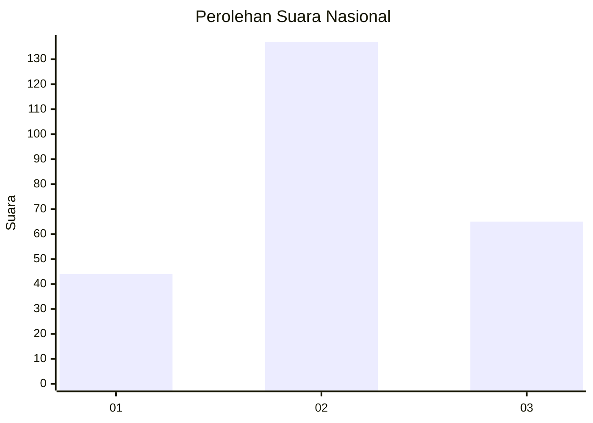
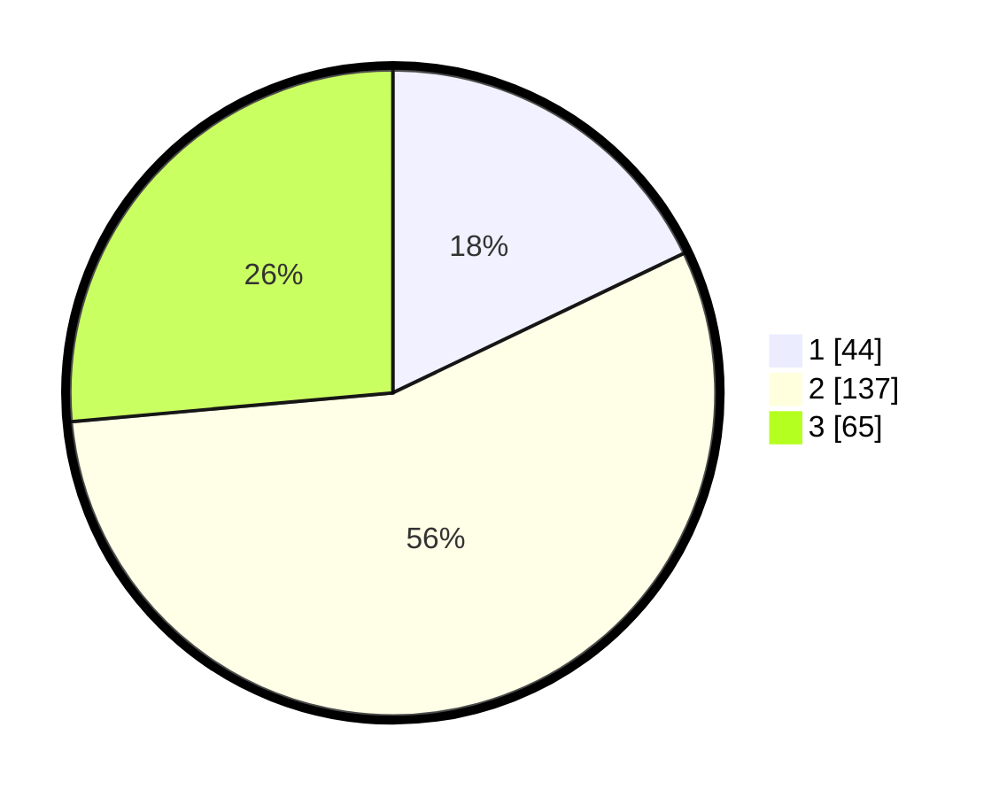

# Hasil

## Grafik

## Tabel

| No. | Nama Paslon    | Suara | Suara (raw) | Persentase |
|:--- |:-------------- | -----:| -----------:| ----------:|
| 1   | ANIES MUHAIMIN | 44    | [44][p-1]   | 17,89      |
| 2   | PRABOWO GIBRAN | 137   | [137][p-2]  | 55,69      |
| 3   | GANJAR MAHFUD  | 65    | [65][p-3]   | 26,42      |

[p-1]: https://github.com/gigit-pemilu/pemilu-2024/blob/main/pilpres/hitung-suara/sub/34-di-yogyakarta/sub/04-sleman/sub/13-sleman/sub/2004-pandowoharjo/sub/034-tps/sub/paslon-1.txt
[p-2]: https://github.com/gigit-pemilu/pemilu-2024/blob/main/pilpres/hitung-suara/sub/34-di-yogyakarta/sub/04-sleman/sub/13-sleman/sub/2004-pandowoharjo/sub/034-tps/sub/paslon-2.txt
[p-3]: https://github.com/gigit-pemilu/pemilu-2024/blob/main/pilpres/hitung-suara/sub/34-di-yogyakarta/sub/04-sleman/sub/13-sleman/sub/2004-pandowoharjo/sub/034-tps/sub/paslon-3.txt

## Foto C Plano

https://sirekap-obj-formc.kpu.go.id/a0bc/pemilu/ppwp/34/04/13/20/04/3404132004034-20240215-002253--91803f0e-b396-4feb-b1f4-833dd0e43f36.jpg

https://sirekap-obj-formc.kpu.go.id/a0bc/pemilu/ppwp/34/04/13/20/04/3404132004034-20240215-002359--c1586e05-30e4-458c-94ef-85a6a1817a3b.jpg

https://sirekap-obj-formc.kpu.go.id/a0bc/pemilu/ppwp/34/04/13/20/04/3404132004034-20240215-002456--7794e1cb-6de5-43d7-804d-858cc955b50a.jpg

## Metadata

| Key        | Value               |
| ---------- | ------------------- |
| Time Stamp | 2024-02-25 14:00:00 |

