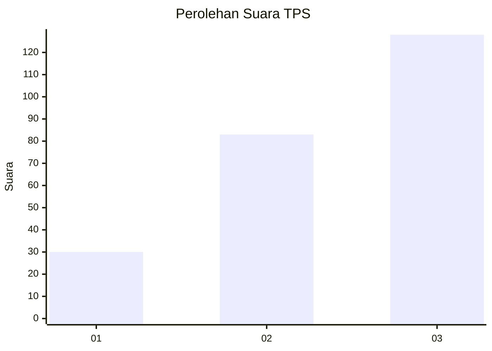
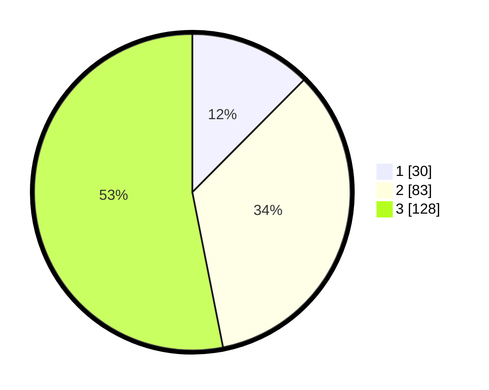

# Hasil

## Grafik

## Tabel

| No. | Nama Paslon    | Suara | Suara (raw) | Persentase |
|:--- |:-------------- | -----:| -----------:| ----------:|
| 1   | ANIES MUHAIMIN | 30    | [30][p-1]   | 12,45      |
| 2   | PRABOWO GIBRAN | 83    | [83][p-2]   | 34,44      |
| 3   | GANJAR MAHFUD  | 128   | [128][p-3]  | 53,11      |

[p-1]: https://github.com/gigit-pemilu/pemilu-2024-34-di-yogyakarta/blob/main/pilpres/hitung-suara/sub/34-di-yogyakarta/sub/04-sleman/sub/13-sleman/sub/2005-trimulyo/sub/001-tps/sub/paslon-1.txt
[p-2]: https://github.com/gigit-pemilu/pemilu-2024-34-di-yogyakarta/blob/main/pilpres/hitung-suara/sub/34-di-yogyakarta/sub/04-sleman/sub/13-sleman/sub/2005-trimulyo/sub/001-tps/sub/paslon-2.txt
[p-3]: https://github.com/gigit-pemilu/pemilu-2024-34-di-yogyakarta/blob/main/pilpres/hitung-suara/sub/34-di-yogyakarta/sub/04-sleman/sub/13-sleman/sub/2005-trimulyo/sub/001-tps/sub/paslon-3.txt

## Foto C Plano

https://sirekap-obj-formc.kpu.go.id/f477/pemilu/ppwp/34/04/13/20/05/3404132005001-20240215-003708--a8d49614-4526-443d-b040-f5fbfcfe2356.jpg

https://sirekap-obj-formc.kpu.go.id/f477/pemilu/ppwp/34/04/13/20/05/3404132005001-20240215-003933--cdb4f0cf-1cb5-4f8c-bd62-a183b9ce6a39.jpg

https://sirekap-obj-formc.kpu.go.id/f477/pemilu/ppwp/34/04/13/20/05/3404132005001-20240215-004110--e57e65f3-e781-48ae-8cd7-19abaa88eb20.jpg

## Metadata

| Key        | Value               |
| ---------- | ------------------- |
| Time Stamp | 2024-02-15 15:00:29 |

