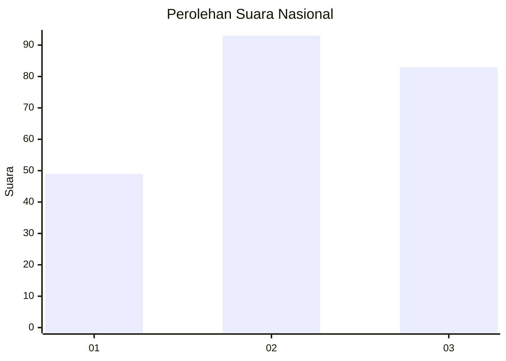
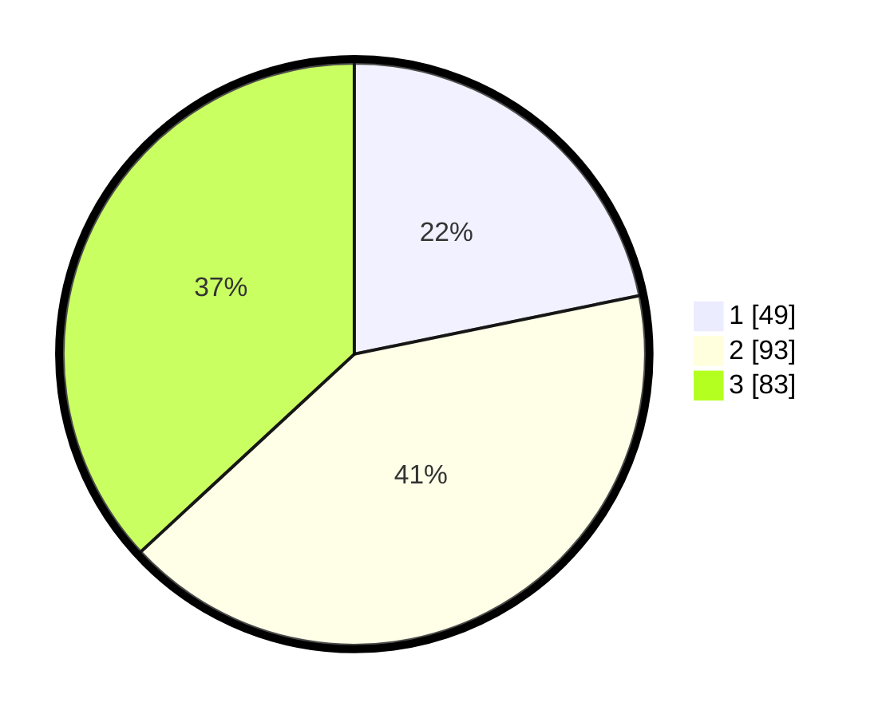

# Hasil

## Grafik

## Tabel

| No. | Nama Paslon    | Suara | Suara (raw) | Persentase |
|:--- |:-------------- | -----:| -----------:| ----------:|
| 1   | ANIES MUHAIMIN | 49    | [49][p-1]   | 21,78      |
| 2   | PRABOWO GIBRAN | 93    | [93][p-2]   | 41,33      |
| 3   | GANJAR MAHFUD  | 83    | [83][p-3]   | 36,89      |

[p-1]: https://github.com/gigit-pemilu/pemilu-2024/blob/main/pilpres/hitung-suara/sub/34-di-yogyakarta/sub/04-sleman/sub/13-sleman/sub/2005-trimulyo/sub/006-tps/sub/paslon-1.txt
[p-2]: https://github.com/gigit-pemilu/pemilu-2024/blob/main/pilpres/hitung-suara/sub/34-di-yogyakarta/sub/04-sleman/sub/13-sleman/sub/2005-trimulyo/sub/006-tps/sub/paslon-2.txt
[p-3]: https://github.com/gigit-pemilu/pemilu-2024/blob/main/pilpres/hitung-suara/sub/34-di-yogyakarta/sub/04-sleman/sub/13-sleman/sub/2005-trimulyo/sub/006-tps/sub/paslon-3.txt

## Foto C Plano

https://sirekap-obj-formc.kpu.go.id/c98e/pemilu/ppwp/34/04/13/20/05/3404132005006-20240214-214438--0b43a93e-7a4a-42f2-affc-91f030b418a3.jpg

https://sirekap-obj-formc.kpu.go.id/c98e/pemilu/ppwp/34/04/13/20/05/3404132005006-20240214-214528--bf474ff3-f26a-4a46-a837-4c543131501e.jpg

https://sirekap-obj-formc.kpu.go.id/c98e/pemilu/ppwp/34/04/13/20/05/3404132005006-20240214-214614--1fc53423-db42-4bd3-857e-48dff22da19e.jpg

## Metadata

| Key        | Value               |
| ---------- | ------------------- |
| Time Stamp | 2024-02-24 22:31:28 |

