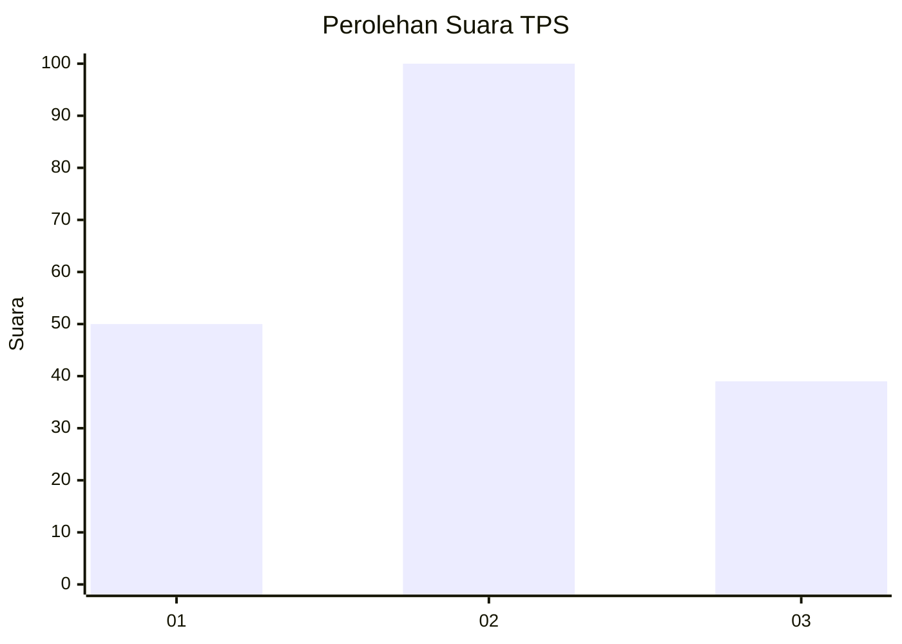
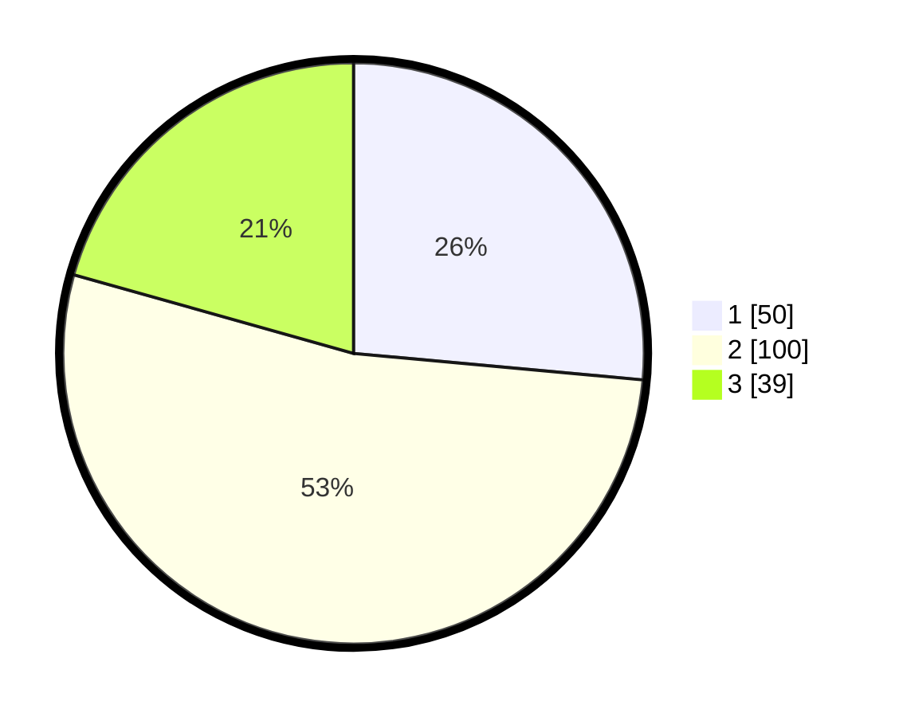

# Hasil

## Grafik

## Tabel

| No. | Nama Paslon    | Suara | Suara (raw) | Persentase |
|:--- |:-------------- | -----:| -----------:| ----------:|
| 1   | ANIES MUHAIMIN | 50    | [50][p-1]   | 26,46      |
| 2   | PRABOWO GIBRAN | 100   | [100][p-2]  | 52,91      |
| 3   | GANJAR MAHFUD  | 39    | [39][p-3]   | 20,63      |

[p-1]: https://github.com/gigit-pemilu/pemilu-2024-34-di-yogyakarta/blob/main/pilpres/hitung-suara/sub/34-di-yogyakarta/sub/04-sleman/sub/13-sleman/sub/2005-trimulyo/sub/015-tps/sub/paslon-1.txt
[p-2]: https://github.com/gigit-pemilu/pemilu-2024-34-di-yogyakarta/blob/main/pilpres/hitung-suara/sub/34-di-yogyakarta/sub/04-sleman/sub/13-sleman/sub/2005-trimulyo/sub/015-tps/sub/paslon-2.txt
[p-3]: https://github.com/gigit-pemilu/pemilu-2024-34-di-yogyakarta/blob/main/pilpres/hitung-suara/sub/34-di-yogyakarta/sub/04-sleman/sub/13-sleman/sub/2005-trimulyo/sub/015-tps/sub/paslon-3.txt

## Foto C Plano

https://sirekap-obj-formc.kpu.go.id/1462/pemilu/ppwp/34/04/13/20/05/3404132005015-20240214-210207--1f1c47b0-bdfa-4036-8b35-99d6e492a23f.jpg

https://sirekap-obj-formc.kpu.go.id/1462/pemilu/ppwp/34/04/13/20/05/3404132005015-20240214-210222--1eb228ba-93b3-4e3a-8a1d-499ff7a76537.jpg

https://sirekap-obj-formc.kpu.go.id/1462/pemilu/ppwp/34/04/13/20/05/3404132005015-20240214-210230--ab56bfab-8c95-4d9f-83a2-c9237afa0a16.jpg

## Metadata

| Key        | Value               |
| ---------- | ------------------- |
| Time Stamp | 2024-02-15 15:00:29 |

