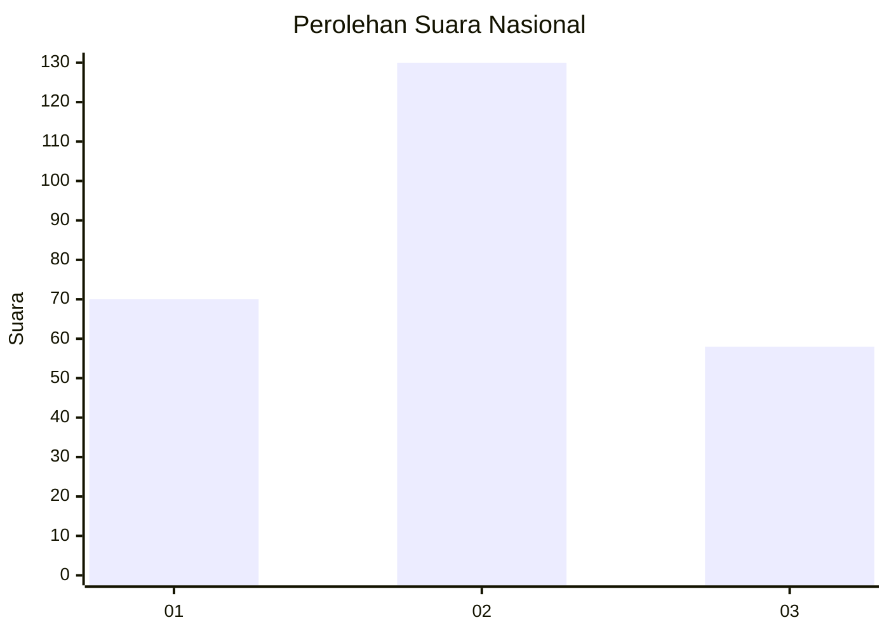
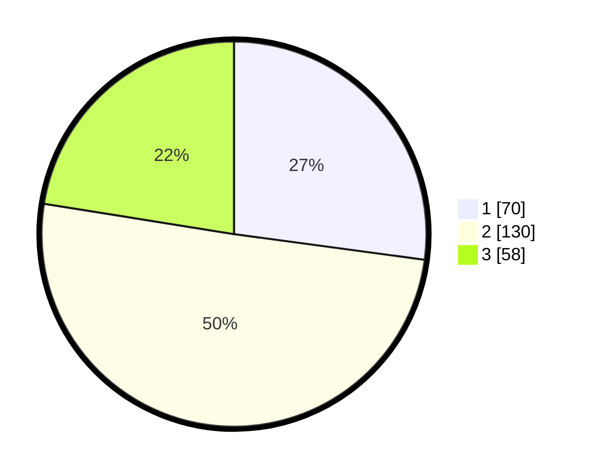

# Hasil

## Grafik

## Tabel

| No. | Nama Paslon    | Suara | Suara (raw) | Persentase |
|:--- |:-------------- | -----:| -----------:| ----------:|
| 1   | ANIES MUHAIMIN | 70    | [70][p-1]   | 27,13      |
| 2   | PRABOWO GIBRAN | 130   | [130][p-2]  | 50,39      |
| 3   | GANJAR MAHFUD  | 58    | [58][p-3]   | 22,48      |

[p-1]: https://github.com/gigit-pemilu/pemilu-2024/blob/main/pilpres/hitung-suara/sub/34-di-yogyakarta/sub/04-sleman/sub/13-sleman/sub/2005-trimulyo/sub/025-tps/sub/paslon-1.txt
[p-2]: https://github.com/gigit-pemilu/pemilu-2024/blob/main/pilpres/hitung-suara/sub/34-di-yogyakarta/sub/04-sleman/sub/13-sleman/sub/2005-trimulyo/sub/025-tps/sub/paslon-2.txt
[p-3]: https://github.com/gigit-pemilu/pemilu-2024/blob/main/pilpres/hitung-suara/sub/34-di-yogyakarta/sub/04-sleman/sub/13-sleman/sub/2005-trimulyo/sub/025-tps/sub/paslon-3.txt

## Foto C Plano

https://sirekap-obj-formc.kpu.go.id/a9dc/pemilu/ppwp/34/04/13/20/05/3404132005025-20240215-014944--4e31cd39-2958-4144-8040-9e25cad8bb95.jpg

https://sirekap-obj-formc.kpu.go.id/a9dc/pemilu/ppwp/34/04/13/20/05/3404132005025-20240215-015012--4b98c30a-e22a-40e6-86b1-3c6f26a0b089.jpg

https://sirekap-obj-formc.kpu.go.id/a9dc/pemilu/ppwp/34/04/13/20/05/3404132005025-20240215-015034--017a5dee-6865-40a8-99b8-2e6a2228d502.jpg

## Metadata

| Key        | Value               |
| ---------- | ------------------- |
| Time Stamp | 2024-02-15 15:00:29 |

