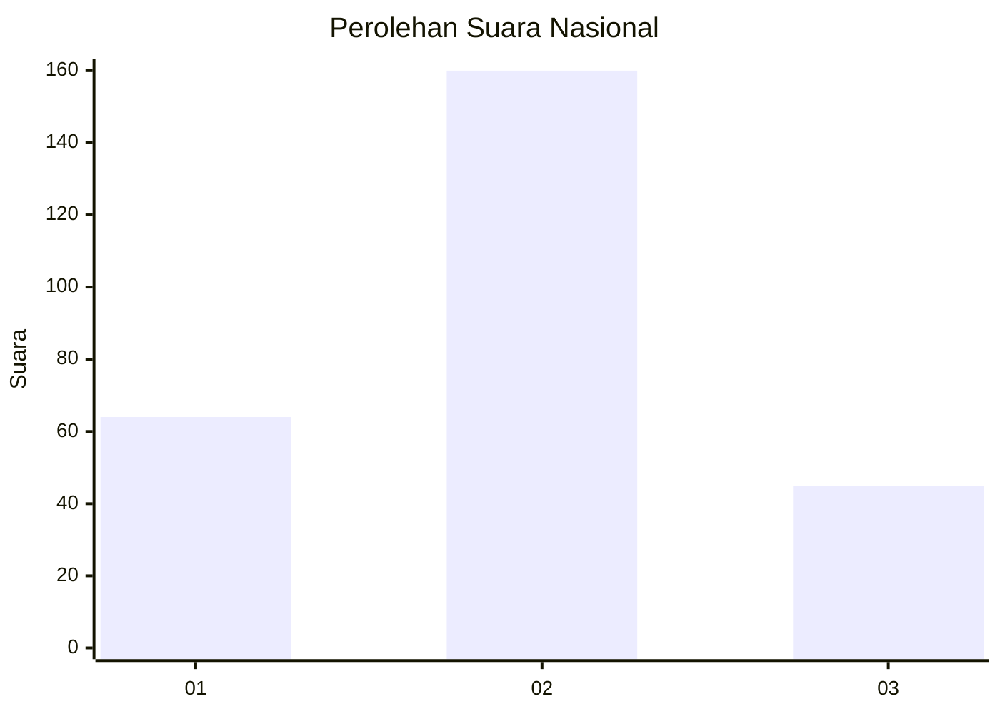

# Hasil

## Grafik

## Tabel

| No. | Nama Paslon    | Suara | Suara (raw) | Persentase |
|:--- |:-------------- | -----:| -----------:| ----------:|
| 1   | ANIES MUHAIMIN | 64    | [64][p-1]   | 23,79      |
| 2   | PRABOWO GIBRAN | 160   | [160][p-2]  | 59,48      |
| 3   | GANJAR MAHFUD  | 45    | [45][p-3]   | 16,73      |

[p-1]: https://github.com/gigit-pemilu/pemilu-2024/blob/main/pilpres/hitung-suara/sub/34-di-yogyakarta/sub/04-sleman/sub/14-tempel/sub/2001-banyurejo/sub/001-tps/sub/paslon-1.txt
[p-2]: https://github.com/gigit-pemilu/pemilu-2024/blob/main/pilpres/hitung-suara/sub/34-di-yogyakarta/sub/04-sleman/sub/14-tempel/sub/2001-banyurejo/sub/001-tps/sub/paslon-2.txt
[p-3]: https://github.com/gigit-pemilu/pemilu-2024/blob/main/pilpres/hitung-suara/sub/34-di-yogyakarta/sub/04-sleman/sub/14-tempel/sub/2001-banyurejo/sub/001-tps/sub/paslon-3.txt

## Foto C Plano

https://sirekap-obj-formc.kpu.go.id/2834/pemilu/ppwp/34/04/14/20/01/3404142001001-20240214-193338--88ff128b-d41e-40a0-9d43-72b95832aabf.jpg

https://sirekap-obj-formc.kpu.go.id/2834/pemilu/ppwp/34/04/14/20/01/3404142001001-20240214-193557--47e87f33-b817-4672-a1c5-d0b88b722a0a.jpg

https://sirekap-obj-formc.kpu.go.id/2834/pemilu/ppwp/34/04/14/20/01/3404142001001-20240214-193738--3602a343-59d2-4f5d-8195-e2dd21c6a22e.jpg

## Metadata

| Key        | Value               |
| ---------- | ------------------- |
| Time Stamp | 2024-02-15 00:41:44 |

