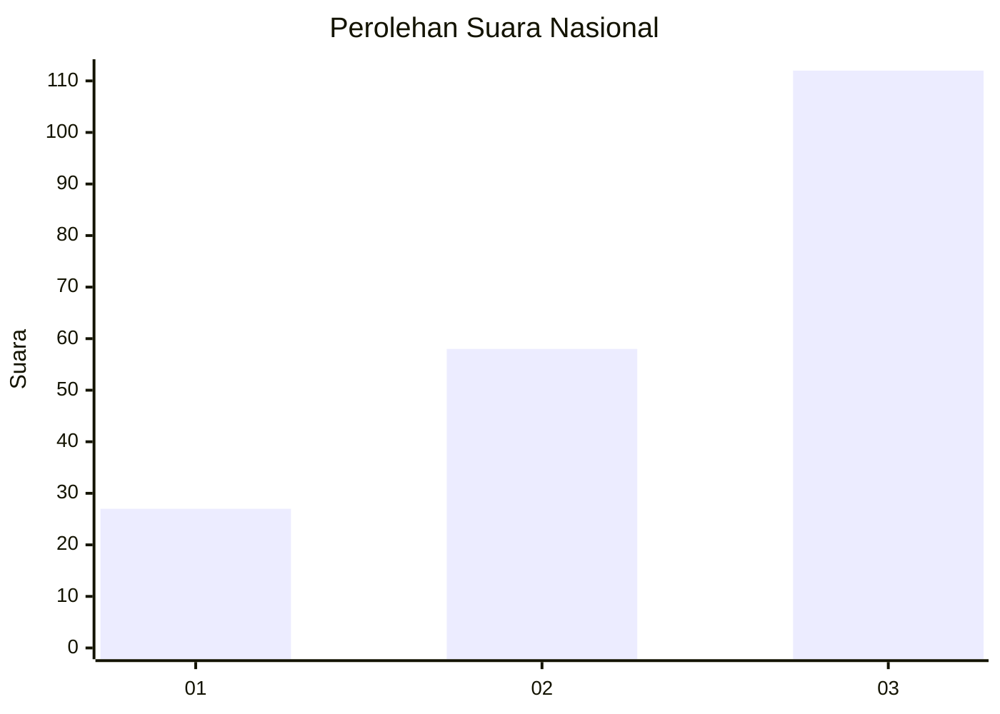
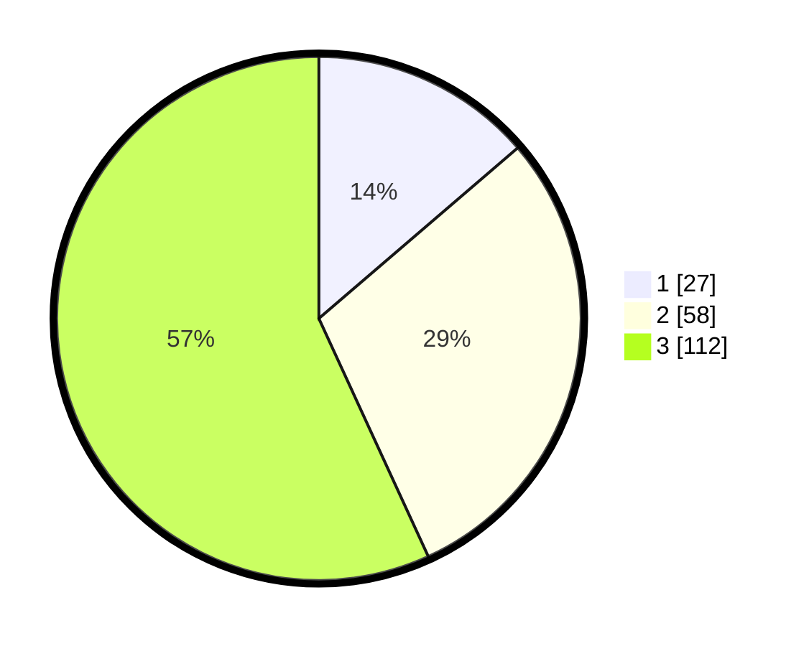

# Hasil

## Grafik

## Tabel

| No. | Nama Paslon    | Suara | Suara (raw) | Persentase |
|:--- |:-------------- | -----:| -----------:| ----------:|
| 1   | ANIES MUHAIMIN | 27    | [27][p-1]   | 13,71      |
| 2   | PRABOWO GIBRAN | 58    | [58][p-2]   | 29,44      |
| 3   | GANJAR MAHFUD  | 112   | [112][p-3]  | 56,85      |

[p-1]: https://github.com/gigit-pemilu/pemilu-2024/blob/main/pilpres/hitung-suara/sub/34-di-yogyakarta/sub/04-sleman/sub/14-tempel/sub/2001-banyurejo/sub/007-tps/sub/paslon-1.txt
[p-2]: https://github.com/gigit-pemilu/pemilu-2024/blob/main/pilpres/hitung-suara/sub/34-di-yogyakarta/sub/04-sleman/sub/14-tempel/sub/2001-banyurejo/sub/007-tps/sub/paslon-2.txt
[p-3]: https://github.com/gigit-pemilu/pemilu-2024/blob/main/pilpres/hitung-suara/sub/34-di-yogyakarta/sub/04-sleman/sub/14-tempel/sub/2001-banyurejo/sub/007-tps/sub/paslon-3.txt

## Foto C Plano

https://sirekap-obj-formc.kpu.go.id/8dc6/pemilu/ppwp/34/04/14/20/01/3404142001007-20240214-224947--7e63b366-3f57-438d-84d7-944f5e05b4d8.jpg

https://sirekap-obj-formc.kpu.go.id/8dc6/pemilu/ppwp/34/04/14/20/01/3404142001007-20240214-224947--a567fb6a-6d1c-47bf-abc1-4b98da03f6b2.jpg

https://sirekap-obj-formc.kpu.go.id/8dc6/pemilu/ppwp/34/04/14/20/01/3404142001007-20240214-225024--7e058ea0-6e34-47cb-b422-b3cf68edb0e3.jpg

## Metadata

| Key        | Value               |
| ---------- | ------------------- |
| Time Stamp | 2024-02-16 11:00:29 |

