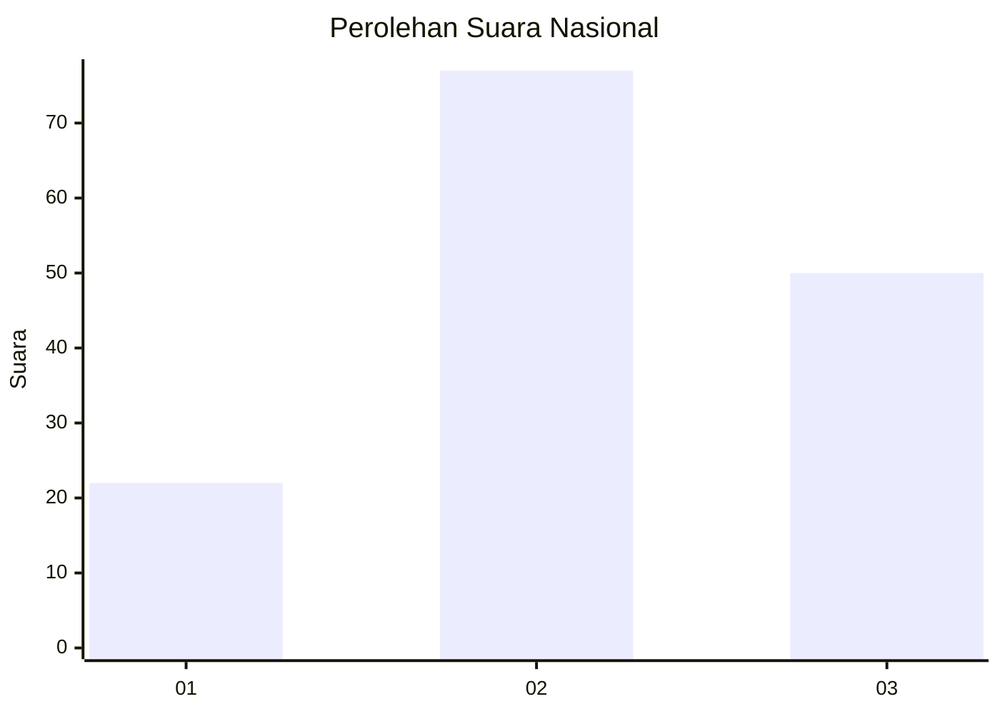
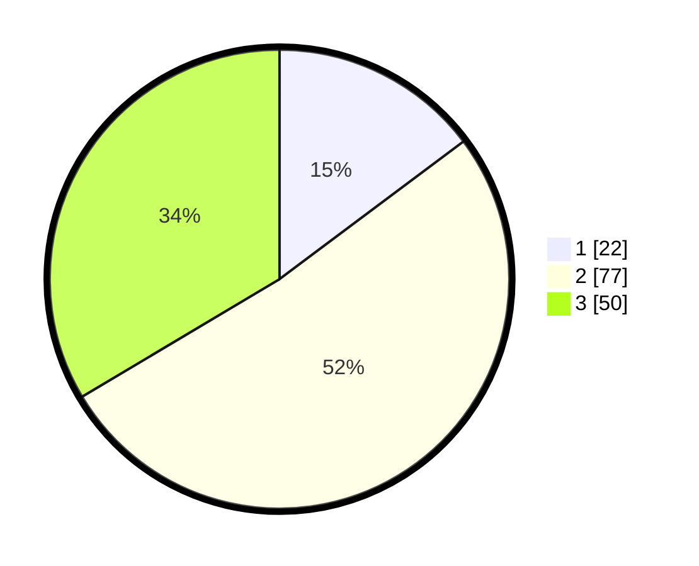

# Hasil

## Grafik

## Tabel

| No. | Nama Paslon    | Suara | Suara (raw) | Persentase |
|:--- |:-------------- | -----:| -----------:| ----------:|
| 1   | ANIES MUHAIMIN | 22    | [22][p-1]   | 14,77      |
| 2   | PRABOWO GIBRAN | 77    | [77][p-2]   | 51,68      |
| 3   | GANJAR MAHFUD  | 50    | [50][p-3]   | 33,56      |

[p-1]: https://github.com/gigit-pemilu/pemilu-2024/blob/main/pilpres/hitung-suara/sub/34-di-yogyakarta/sub/04-sleman/sub/14-tempel/sub/2001-banyurejo/sub/011-tps/sub/paslon-1.txt
[p-2]: https://github.com/gigit-pemilu/pemilu-2024/blob/main/pilpres/hitung-suara/sub/34-di-yogyakarta/sub/04-sleman/sub/14-tempel/sub/2001-banyurejo/sub/011-tps/sub/paslon-2.txt
[p-3]: https://github.com/gigit-pemilu/pemilu-2024/blob/main/pilpres/hitung-suara/sub/34-di-yogyakarta/sub/04-sleman/sub/14-tempel/sub/2001-banyurejo/sub/011-tps/sub/paslon-3.txt

## Foto C Plano

https://sirekap-obj-formc.kpu.go.id/4bba/pemilu/ppwp/34/04/14/20/01/3404142001011-20240214-231354--cd04bed0-7ce5-42f8-b16d-6df76a105879.jpg

https://sirekap-obj-formc.kpu.go.id/4bba/pemilu/ppwp/34/04/14/20/01/3404142001011-20240214-231750--dc803742-4881-4d90-9a98-5b5d9d6ab8be.jpg

https://sirekap-obj-formc.kpu.go.id/4bba/pemilu/ppwp/34/04/14/20/01/3404142001011-20240214-231902--940bc3a8-06de-4d57-8611-d3297755fbe3.jpg

## Metadata

| Key        | Value               |
| ---------- | ------------------- |
| Time Stamp | 2024-02-16 11:00:29 |

