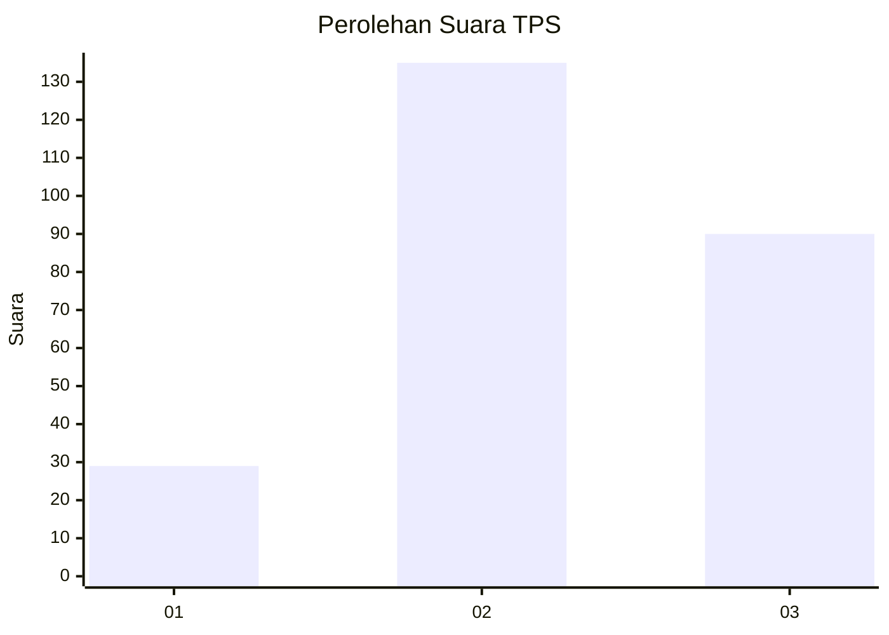
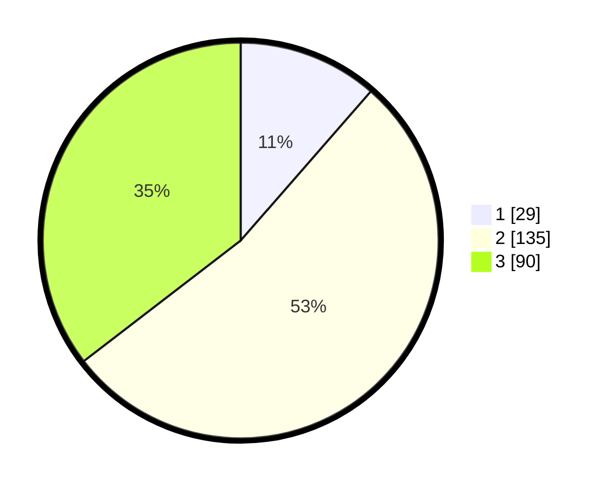

# Hasil

## Grafik

## Tabel

| No. | Nama Paslon    | Suara | Suara (raw) | Persentase |
|:--- |:-------------- | -----:| -----------:| ----------:|
| 1   | ANIES MUHAIMIN | 29    | [29][p-1]   | 11,42      |
| 2   | PRABOWO GIBRAN | 135   | [135][p-2]  | 53,15      |
| 3   | GANJAR MAHFUD  | 90    | [90][p-3]   | 35,43      |

[p-1]: https://github.com/gigit-pemilu/pemilu-2024-34-di-yogyakarta/blob/main/pilpres/hitung-suara/sub/34-di-yogyakarta/sub/04-sleman/sub/14-tempel/sub/2001-banyurejo/sub/013-tps/sub/paslon-1.txt
[p-2]: https://github.com/gigit-pemilu/pemilu-2024-34-di-yogyakarta/blob/main/pilpres/hitung-suara/sub/34-di-yogyakarta/sub/04-sleman/sub/14-tempel/sub/2001-banyurejo/sub/013-tps/sub/paslon-2.txt
[p-3]: https://github.com/gigit-pemilu/pemilu-2024-34-di-yogyakarta/blob/main/pilpres/hitung-suara/sub/34-di-yogyakarta/sub/04-sleman/sub/14-tempel/sub/2001-banyurejo/sub/013-tps/sub/paslon-3.txt

## Foto C Plano

https://sirekap-obj-formc.kpu.go.id/b0f7/pemilu/ppwp/34/04/14/20/01/3404142001013-20240214-213035--affa9dc8-d675-4db3-8301-7a47e13651fe.jpg

https://sirekap-obj-formc.kpu.go.id/b0f7/pemilu/ppwp/34/04/14/20/01/3404142001013-20240214-213121--c74d1f18-0090-48c3-9142-289672036724.jpg

https://sirekap-obj-formc.kpu.go.id/b0f7/pemilu/ppwp/34/04/14/20/01/3404142001013-20240214-213204--0b9b3b57-20e3-467b-9a96-b62f45ea26be.jpg

## Metadata

| Key        | Value               |
| ---------- | ------------------- |
| Time Stamp | 2024-02-15 12:00:28 |

