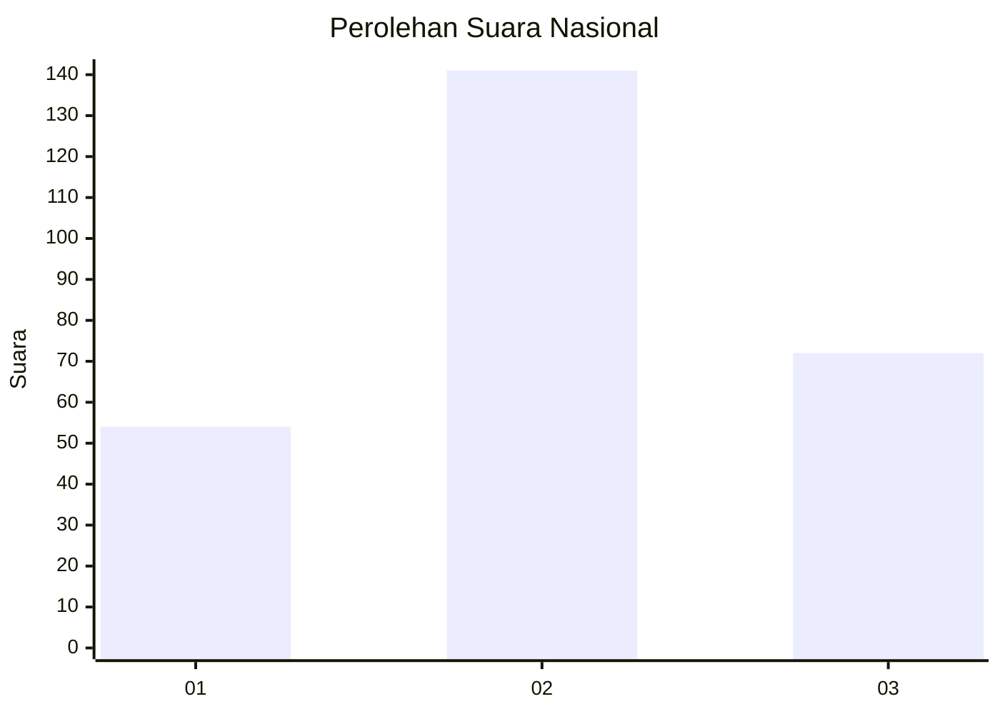
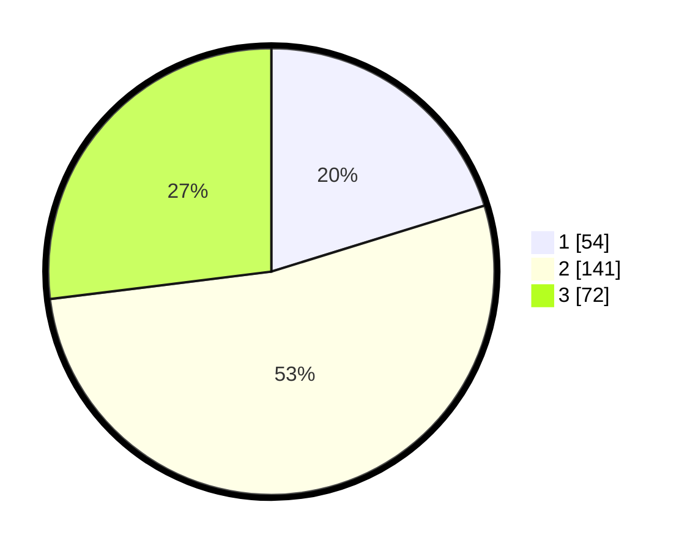

# Hasil

## Grafik

## Tabel

| No. | Nama Paslon    | Suara | Suara (raw) | Persentase |
|:--- |:-------------- | -----:| -----------:| ----------:|
| 1   | ANIES MUHAIMIN | 54    | [54][p-1]   | 20,22      |
| 2   | PRABOWO GIBRAN | 141   | [141][p-2]  | 52,81      |
| 3   | GANJAR MAHFUD  | 72    | [72][p-3]   | 26,97      |

[p-1]: https://github.com/gigit-pemilu/pemilu-2024/blob/main/pilpres/hitung-suara/sub/34-di-yogyakarta/sub/04-sleman/sub/14-tempel/sub/2001-banyurejo/sub/018-tps/sub/paslon-1.txt
[p-2]: https://github.com/gigit-pemilu/pemilu-2024/blob/main/pilpres/hitung-suara/sub/34-di-yogyakarta/sub/04-sleman/sub/14-tempel/sub/2001-banyurejo/sub/018-tps/sub/paslon-2.txt
[p-3]: https://github.com/gigit-pemilu/pemilu-2024/blob/main/pilpres/hitung-suara/sub/34-di-yogyakarta/sub/04-sleman/sub/14-tempel/sub/2001-banyurejo/sub/018-tps/sub/paslon-3.txt

## Foto C Plano

https://sirekap-obj-formc.kpu.go.id/6fc1/pemilu/ppwp/34/04/14/20/01/3404142001018-20240216-135625--397bbdfb-4ad3-4ca3-9b30-c25beca53c25.jpg

https://sirekap-obj-formc.kpu.go.id/6fc1/pemilu/ppwp/34/04/14/20/01/3404142001018-20240216-140303--f9412f0e-d965-424b-80f7-9d5f12808f33.jpg

https://sirekap-obj-formc.kpu.go.id/6fc1/pemilu/ppwp/34/04/14/20/01/3404142001018-20240216-140455--01591930-3db1-4724-b6e0-7044fa8107f1.jpg

## Metadata

| Key        | Value               |
| ---------- | ------------------- |
| Time Stamp | 2024-02-16 14:30:33 |

## DATA PEMILIH TETAP

Jumlah pemilih dalam DPT: **289**.
 * L: **143**.
 * P: **146**.

## DATA PENGGUNA HAK PILIH

Jumlah pengguna hak pilih dalam DPT: **268**.
 * L: **129**.
 * P: **139**.

Jumlah pengguna hak pilih dalam DPTb: **9**.
 * L: **4**.
 * P: **0**.

Jumlah pengguna hak pilih dalam DPK: **2**.
 * L: **1**.
 * P: **1**.

Jumlah pengguna hak pilih: **274**.
 * L: **134**.
 * P: **140**.

## JUMLAH SUARA SAH DAN TIDAK SAH

JUMLAH SELURUH SUARA SAH: **267**.

JUMLAH SUARA TIDAK SAH: **7**.

JUMLAH SELURUH SUARA SAH DAN SUARA TIDAK SAH: **274**.

