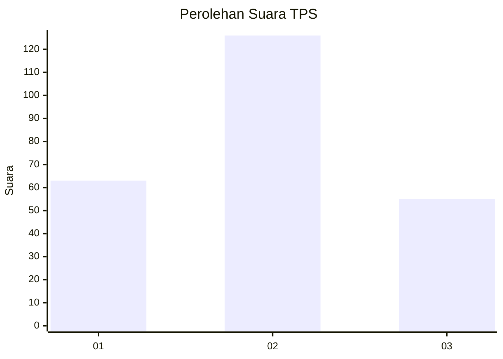
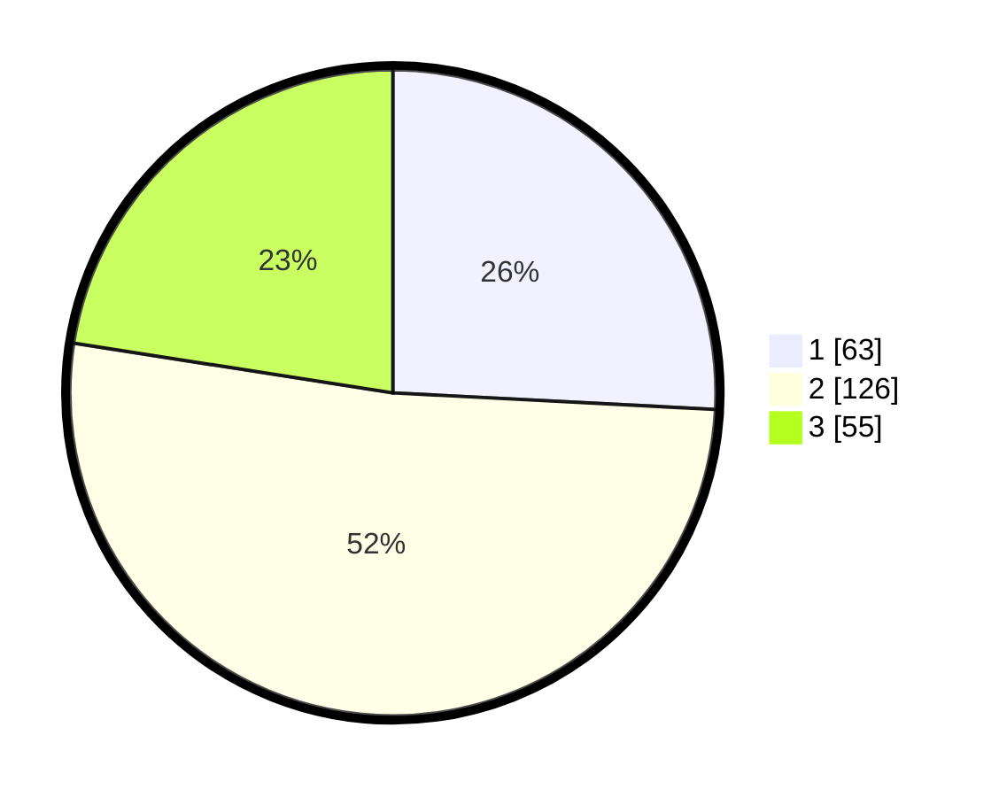

# Hasil

## Grafik

## Tabel

| No. | Nama Paslon    | Suara | Suara (raw) | Persentase |
|:--- |:-------------- | -----:| -----------:| ----------:|
| 1   | ANIES MUHAIMIN | 63    | [63][p-1]   | 25,82      |
| 2   | PRABOWO GIBRAN | 126   | [126][p-2]  | 51,64      |
| 3   | GANJAR MAHFUD  | 55    | [55][p-3]   | 22,54      |

[p-1]: https://github.com/gigit-pemilu/pemilu-2024-34-di-yogyakarta/blob/main/pilpres/hitung-suara/sub/34-di-yogyakarta/sub/04-sleman/sub/14-tempel/sub/2001-banyurejo/sub/020-tps/sub/paslon-1.txt
[p-2]: https://github.com/gigit-pemilu/pemilu-2024-34-di-yogyakarta/blob/main/pilpres/hitung-suara/sub/34-di-yogyakarta/sub/04-sleman/sub/14-tempel/sub/2001-banyurejo/sub/020-tps/sub/paslon-2.txt
[p-3]: https://github.com/gigit-pemilu/pemilu-2024-34-di-yogyakarta/blob/main/pilpres/hitung-suara/sub/34-di-yogyakarta/sub/04-sleman/sub/14-tempel/sub/2001-banyurejo/sub/020-tps/sub/paslon-3.txt

## Foto C Plano

https://sirekap-obj-formc.kpu.go.id/aa19/pemilu/ppwp/34/04/14/20/01/3404142001020-20240215-010205--7793481e-fafc-4529-a7e7-f0fa49153f3e.jpg

https://sirekap-obj-formc.kpu.go.id/aa19/pemilu/ppwp/34/04/14/20/01/3404142001020-20240215-010011--ecff230f-c6a6-4861-8e61-c91c67779631.jpg

https://sirekap-obj-formc.kpu.go.id/aa19/pemilu/ppwp/34/04/14/20/01/3404142001020-20240215-010256--4588afc9-238f-417d-837c-9756e27c0354.jpg

## Metadata

| Key        | Value               |
| ---------- | ------------------- |
| Time Stamp | 2024-02-24 22:31:28 |

