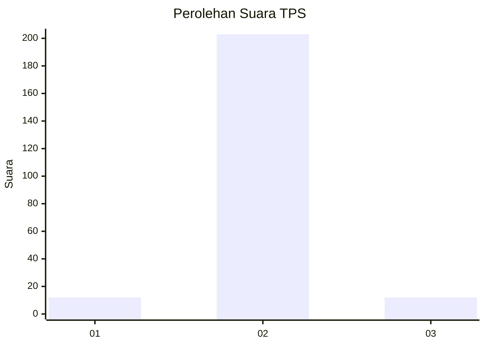
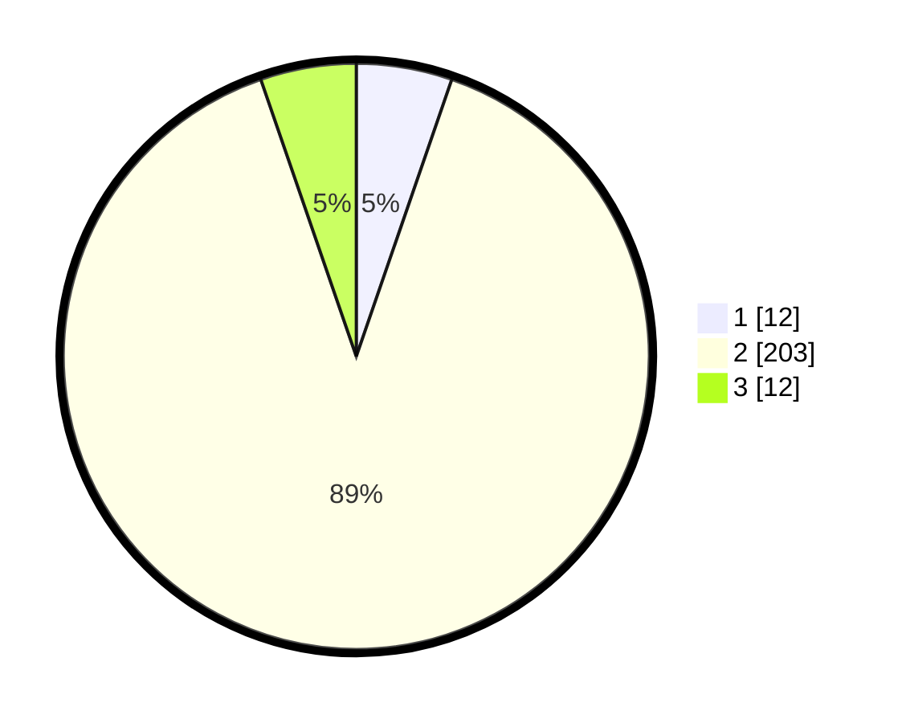

# Hasil

## Grafik

## Tabel

| No. | Nama Paslon    | Suara | Suara (raw) | Persentase |
|:--- |:-------------- | -----:| -----------:| ----------:|
| 1   | ANIES MUHAIMIN | 12    | [12][p-1]   | 5,29       |
| 2   | PRABOWO GIBRAN | 203   | [203][p-2]  | 89,43      |
| 3   | GANJAR MAHFUD  | 12    | [12][p-3]   | 5,29       |

[p-1]: https://github.com/gigit-pemilu/pemilu-2024-34-di-yogyakarta/blob/main/pilpres/hitung-suara/sub/34-di-yogyakarta/sub/04-sleman/sub/14-tempel/sub/2001-banyurejo/sub/021-tps/sub/paslon-1.txt
[p-2]: https://github.com/gigit-pemilu/pemilu-2024-34-di-yogyakarta/blob/main/pilpres/hitung-suara/sub/34-di-yogyakarta/sub/04-sleman/sub/14-tempel/sub/2001-banyurejo/sub/021-tps/sub/paslon-2.txt
[p-3]: https://github.com/gigit-pemilu/pemilu-2024-34-di-yogyakarta/blob/main/pilpres/hitung-suara/sub/34-di-yogyakarta/sub/04-sleman/sub/14-tempel/sub/2001-banyurejo/sub/021-tps/sub/paslon-3.txt

## Foto C Plano

https://sirekap-obj-formc.kpu.go.id/5b91/pemilu/ppwp/34/04/14/20/01/3404142001021-20240215-010423--f8257a1d-31ad-49fd-b38a-c7dd7cfe856f.jpg

https://sirekap-obj-formc.kpu.go.id/5b91/pemilu/ppwp/34/04/14/20/01/3404142001021-20240215-011009--84c26bd6-c518-4c8e-9e7c-550f8e816172.jpg

https://sirekap-obj-formc.kpu.go.id/5b91/pemilu/ppwp/34/04/14/20/01/3404142001021-20240215-011111--3684b81f-a4d4-4aff-8a07-795fc938000b.jpg

## Metadata

| Key        | Value               |
| ---------- | ------------------- |
| Time Stamp | 2024-02-24 22:31:28 |

