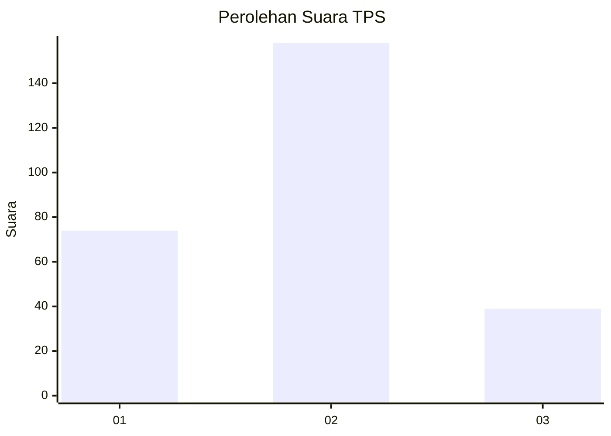
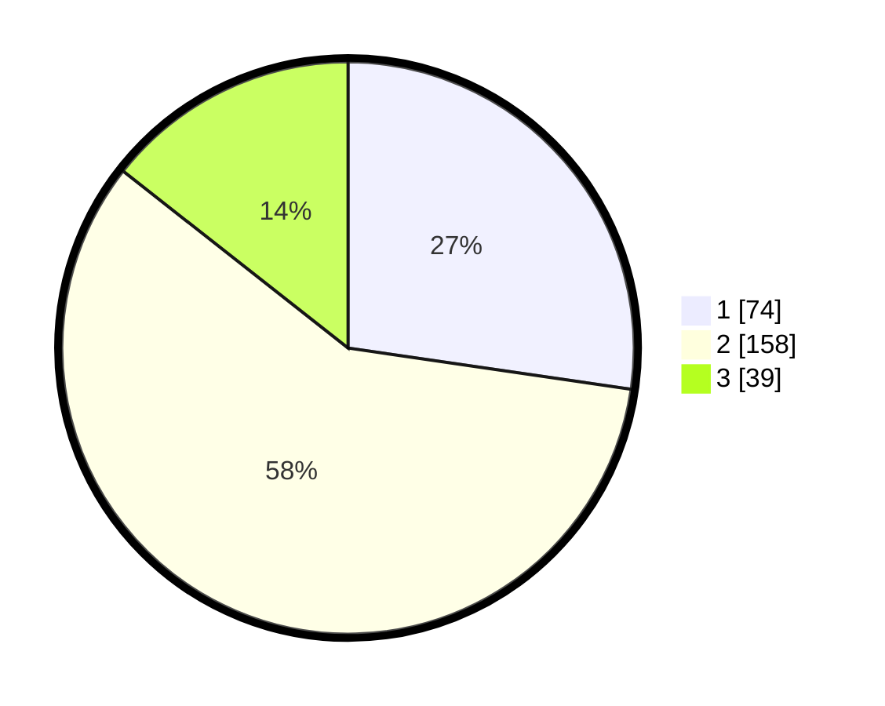

# Hasil

## Grafik

## Tabel

| No. | Nama Paslon    | Suara | Suara (raw) | Persentase |
|:--- |:-------------- | -----:| -----------:| ----------:|
| 1   | ANIES MUHAIMIN | 74    | [74][p-1]   | 27,31      |
| 2   | PRABOWO GIBRAN | 158   | [158][p-2]  | 58,30      |
| 3   | GANJAR MAHFUD  | 39    | [39][p-3]   | 14,39      |

[p-1]: https://github.com/gigit-pemilu/pemilu-2024-34-di-yogyakarta/blob/main/pilpres/hitung-suara/sub/34-di-yogyakarta/sub/04-sleman/sub/14-tempel/sub/2001-banyurejo/sub/022-tps/sub/paslon-1.txt
[p-2]: https://github.com/gigit-pemilu/pemilu-2024-34-di-yogyakarta/blob/main/pilpres/hitung-suara/sub/34-di-yogyakarta/sub/04-sleman/sub/14-tempel/sub/2001-banyurejo/sub/022-tps/sub/paslon-2.txt
[p-3]: https://github.com/gigit-pemilu/pemilu-2024-34-di-yogyakarta/blob/main/pilpres/hitung-suara/sub/34-di-yogyakarta/sub/04-sleman/sub/14-tempel/sub/2001-banyurejo/sub/022-tps/sub/paslon-3.txt

## Foto C Plano

https://sirekap-obj-formc.kpu.go.id/83f7/pemilu/ppwp/34/04/14/20/01/3404142001022-20240215-012052--7d43f837-dea4-4921-974c-67bf0892653c.jpg

https://sirekap-obj-formc.kpu.go.id/83f7/pemilu/ppwp/34/04/14/20/01/3404142001022-20240215-012142--f9744e32-b850-4427-b7f8-1f0470109164.jpg

https://sirekap-obj-formc.kpu.go.id/83f7/pemilu/ppwp/34/04/14/20/01/3404142001022-20240215-012209--7d1d743b-010b-404e-805f-4c7704f9c197.jpg

## Metadata

| Key        | Value               |
| ---------- | ------------------- |
| Time Stamp | 2024-02-15 15:00:29 |

