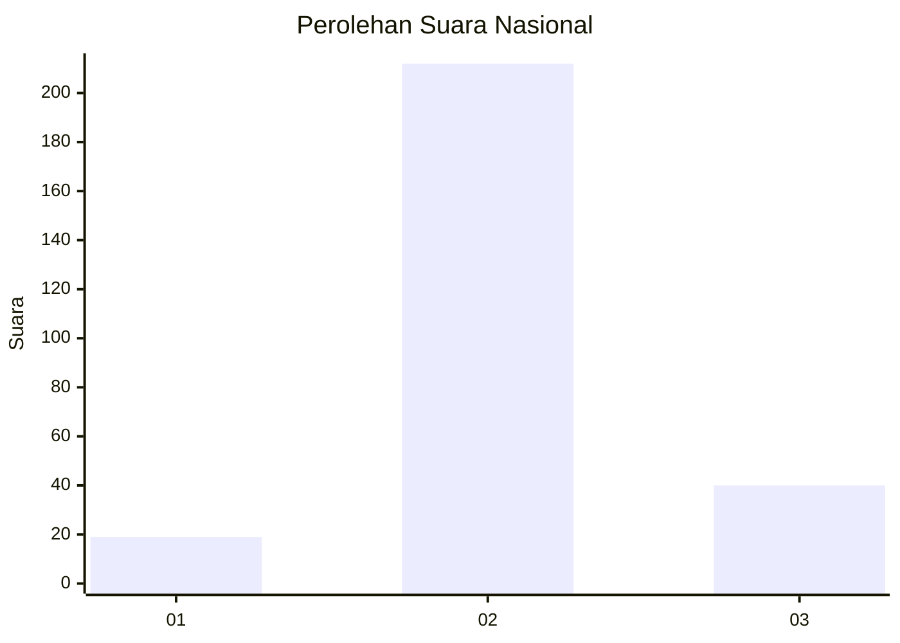

# Hasil

## Grafik

## Tabel

| No. | Nama Paslon    | Suara | Suara (raw) | Persentase |
|:--- |:-------------- | -----:| -----------:| ----------:|
| 1   | ANIES MUHAIMIN | 19    | [19][p-1]   | 7,01       |
| 2   | PRABOWO GIBRAN | 212   | [212][p-2]  | 78,23      |
| 3   | GANJAR MAHFUD  | 40    | [40][p-3]   | 14,76      |

[p-1]: https://github.com/gigit-pemilu/pemilu-2024/blob/main/pilpres/hitung-suara/sub/34-di-yogyakarta/sub/04-sleman/sub/14-tempel/sub/2002-tambakrejo/sub/003-tps/sub/paslon-1.txt
[p-2]: https://github.com/gigit-pemilu/pemilu-2024/blob/main/pilpres/hitung-suara/sub/34-di-yogyakarta/sub/04-sleman/sub/14-tempel/sub/2002-tambakrejo/sub/003-tps/sub/paslon-2.txt
[p-3]: https://github.com/gigit-pemilu/pemilu-2024/blob/main/pilpres/hitung-suara/sub/34-di-yogyakarta/sub/04-sleman/sub/14-tempel/sub/2002-tambakrejo/sub/003-tps/sub/paslon-3.txt

## Foto C Plano

https://sirekap-obj-formc.kpu.go.id/6416/pemilu/ppwp/34/04/14/20/02/3404142002003-20240215-032341--2f428882-59ff-45d2-99ad-bd46bbd85684.jpg

https://sirekap-obj-formc.kpu.go.id/6416/pemilu/ppwp/34/04/14/20/02/3404142002003-20240216-210447--db2f9ffb-d14b-466e-9d3a-2708cd69700f.jpg

https://sirekap-obj-formc.kpu.go.id/6416/pemilu/ppwp/34/04/14/20/02/3404142002003-20240216-211120--5bd6643c-16d7-4aa0-b9c2-92cc7a5c0d92.jpg

## Metadata

| Key        | Value               |
| ---------- | ------------------- |
| Time Stamp | 2024-02-17 11:00:02 |

