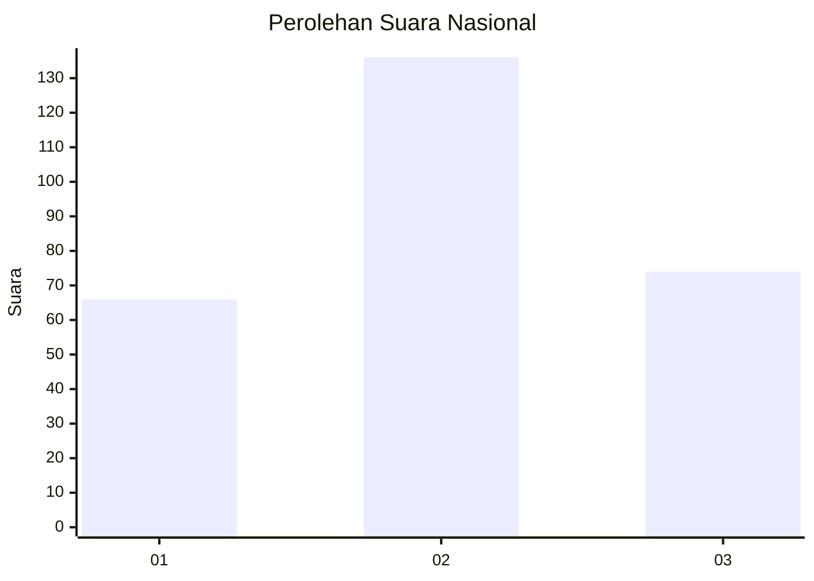
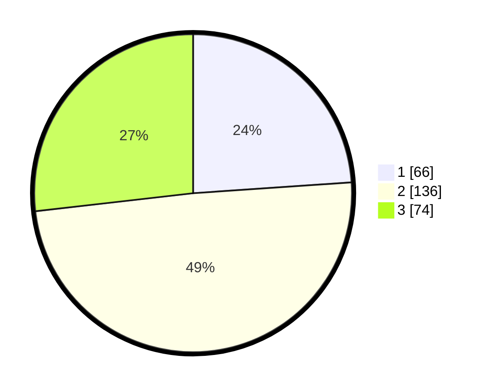

# Hasil

## Grafik

## Tabel

| No. | Nama Paslon    | Suara | Suara (raw) | Persentase |
|:--- |:-------------- | -----:| -----------:| ----------:|
| 1   | ANIES MUHAIMIN | 66    | [66][p-1]   | 23,91      |
| 2   | PRABOWO GIBRAN | 136   | [136][p-2]  | 49,28      |
| 3   | GANJAR MAHFUD  | 74    | [74][p-3]   | 26,81      |

[p-1]: https://github.com/gigit-pemilu/pemilu-2024/blob/main/pilpres/hitung-suara/sub/34-di-yogyakarta/sub/04-sleman/sub/14-tempel/sub/2002-tambakrejo/sub/008-tps/sub/paslon-1.txt
[p-2]: https://github.com/gigit-pemilu/pemilu-2024/blob/main/pilpres/hitung-suara/sub/34-di-yogyakarta/sub/04-sleman/sub/14-tempel/sub/2002-tambakrejo/sub/008-tps/sub/paslon-2.txt
[p-3]: https://github.com/gigit-pemilu/pemilu-2024/blob/main/pilpres/hitung-suara/sub/34-di-yogyakarta/sub/04-sleman/sub/14-tempel/sub/2002-tambakrejo/sub/008-tps/sub/paslon-3.txt

## Foto C Plano

https://sirekap-obj-formc.kpu.go.id/73ed/pemilu/ppwp/34/04/14/20/02/3404142002008-20240216-200800--30104142-0e3e-41fc-a747-fde9d15baefc.jpg

https://sirekap-obj-formc.kpu.go.id/73ed/pemilu/ppwp/34/04/14/20/02/3404142002008-20240216-201047--25c7822f-c2f0-4207-a1d9-b1fa05f42395.jpg

https://sirekap-obj-formc.kpu.go.id/73ed/pemilu/ppwp/34/04/14/20/02/3404142002008-20240216-201430--e3390b34-5e98-4fa8-a6c5-7fec1c982993.jpg

## Metadata

| Key        | Value               |
| ---------- | ------------------- |
| Time Stamp | 2024-02-19 06:16:00 |

