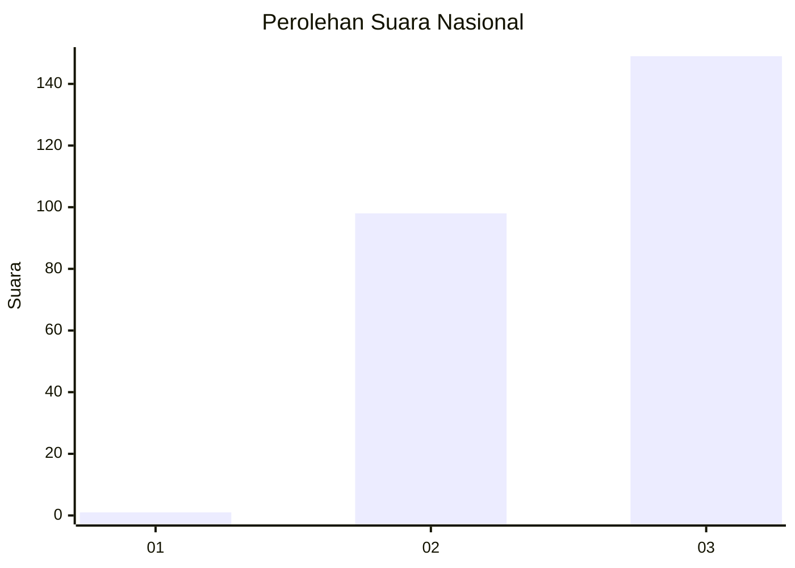
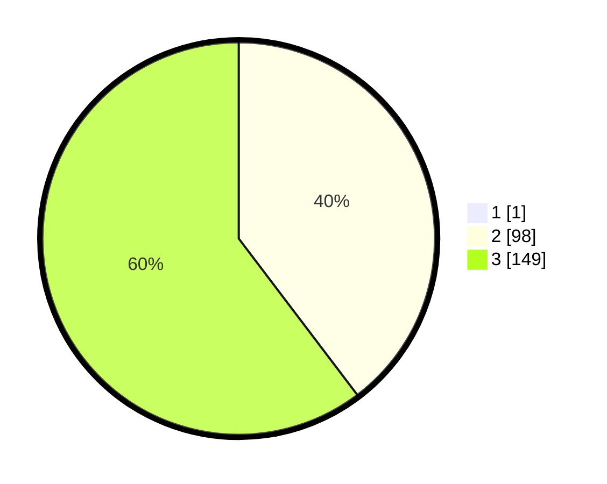

# Hasil

## Grafik

## Tabel

| No. | Nama Paslon    | Suara | Suara (raw) | Persentase |
|:--- |:-------------- | -----:| -----------:| ----------:|
| 1   | ANIES MUHAIMIN | 1     | [1][p-1]    | 0,40       |
| 2   | PRABOWO GIBRAN | 98    | [98][p-2]   | 39,52      |
| 3   | GANJAR MAHFUD  | 149   | [149][p-3]  | 60,08      |

[p-1]: https://github.com/gigit-pemilu/pemilu-2024/blob/main/pilpres/hitung-suara/sub/34-di-yogyakarta/sub/04-sleman/sub/14-tempel/sub/2002-tambakrejo/sub/009-tps/sub/paslon-1.txt
[p-2]: https://github.com/gigit-pemilu/pemilu-2024/blob/main/pilpres/hitung-suara/sub/34-di-yogyakarta/sub/04-sleman/sub/14-tempel/sub/2002-tambakrejo/sub/009-tps/sub/paslon-2.txt
[p-3]: https://github.com/gigit-pemilu/pemilu-2024/blob/main/pilpres/hitung-suara/sub/34-di-yogyakarta/sub/04-sleman/sub/14-tempel/sub/2002-tambakrejo/sub/009-tps/sub/paslon-3.txt

## Foto C Plano

https://sirekap-obj-formc.kpu.go.id/0ef9/pemilu/ppwp/34/04/14/20/02/3404142002009-20240216-210824--9efd19f8-93be-4065-9707-06295e9bd248.jpg

https://sirekap-obj-formc.kpu.go.id/0ef9/pemilu/ppwp/34/04/14/20/02/3404142002009-20240214-221512--c5febd0a-70a8-4b13-b25e-33e08f4ca5d0.jpg

https://sirekap-obj-formc.kpu.go.id/0ef9/pemilu/ppwp/34/04/14/20/02/3404142002009-20240214-221659--42d82c90-0e7f-40d9-baac-ba7dfb486f35.jpg

## Metadata

| Key        | Value               |
| ---------- | ------------------- |
| Time Stamp | 2024-02-24 22:31:28 |

