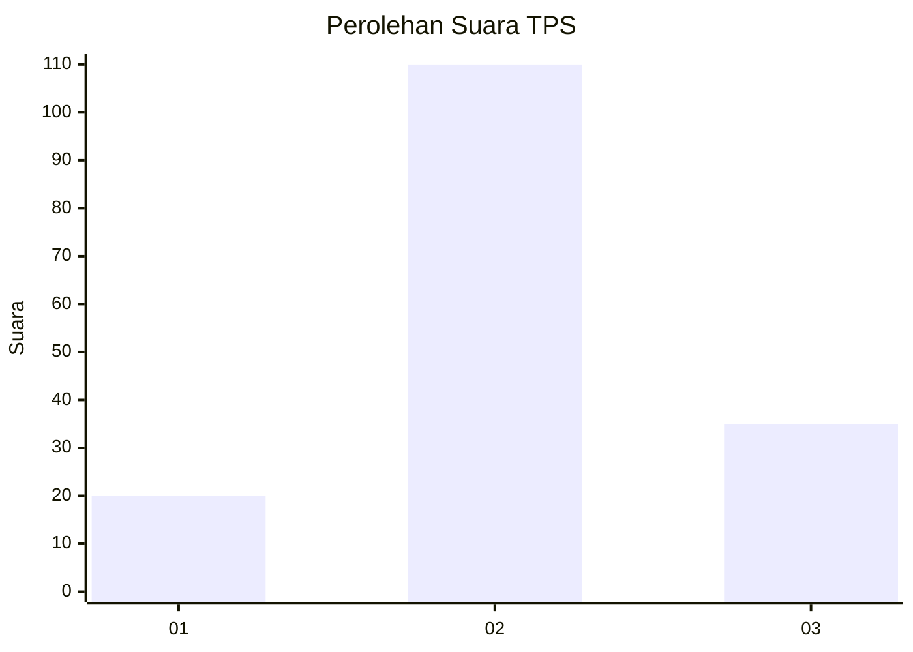
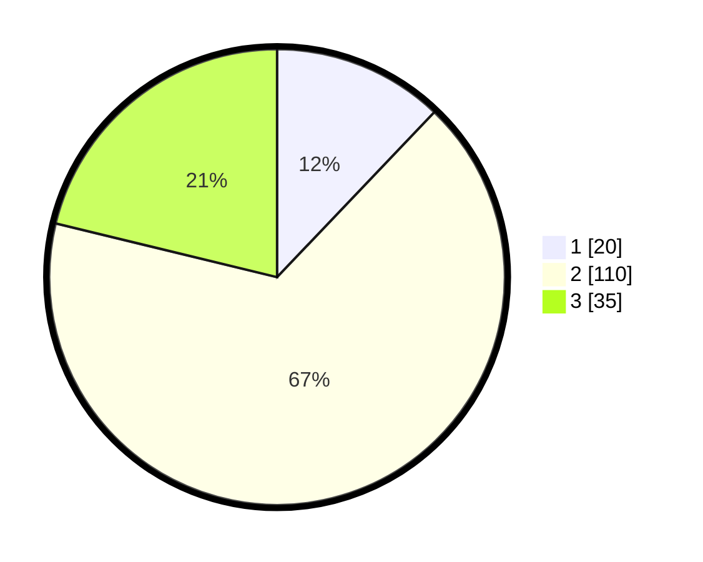

# Hasil

## Grafik

## Tabel

| No. | Nama Paslon    | Suara | Suara (raw) | Persentase |
|:--- |:-------------- | -----:| -----------:| ----------:|
| 1   | ANIES MUHAIMIN | 20    | [20][p-1]   | 12,12      |
| 2   | PRABOWO GIBRAN | 110   | [110][p-2]  | 66,67      |
| 3   | GANJAR MAHFUD  | 35    | [35][p-3]   | 21,21      |

[p-1]: https://github.com/gigit-pemilu/pemilu-2024-34-di-yogyakarta/blob/main/pilpres/hitung-suara/sub/34-di-yogyakarta/sub/04-sleman/sub/14-tempel/sub/2002-tambakrejo/sub/011-tps/sub/paslon-1.txt
[p-2]: https://github.com/gigit-pemilu/pemilu-2024-34-di-yogyakarta/blob/main/pilpres/hitung-suara/sub/34-di-yogyakarta/sub/04-sleman/sub/14-tempel/sub/2002-tambakrejo/sub/011-tps/sub/paslon-2.txt
[p-3]: https://github.com/gigit-pemilu/pemilu-2024-34-di-yogyakarta/blob/main/pilpres/hitung-suara/sub/34-di-yogyakarta/sub/04-sleman/sub/14-tempel/sub/2002-tambakrejo/sub/011-tps/sub/paslon-3.txt

## Foto C Plano

https://sirekap-obj-formc.kpu.go.id/f7ec/pemilu/ppwp/34/04/14/20/02/3404142002011-20240216-233307--456034ae-46d3-4b4e-a995-009a394dd9d1.jpg

https://sirekap-obj-formc.kpu.go.id/f7ec/pemilu/ppwp/34/04/14/20/02/3404142002011-20240214-224906--c936b60a-e6fc-4575-b1e2-956dcb835b0f.jpg

https://sirekap-obj-formc.kpu.go.id/f7ec/pemilu/ppwp/34/04/14/20/02/3404142002011-20240214-224833--c7880682-873b-4216-8551-3f41972b9f3e.jpg

## Metadata

| Key        | Value               |
| ---------- | ------------------- |
| Time Stamp | 2024-02-16 23:45:47 |

