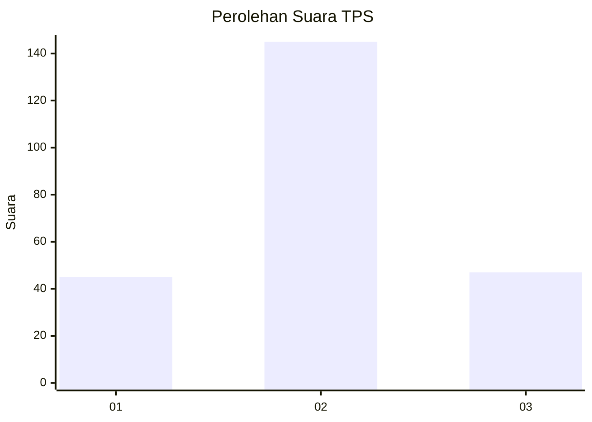
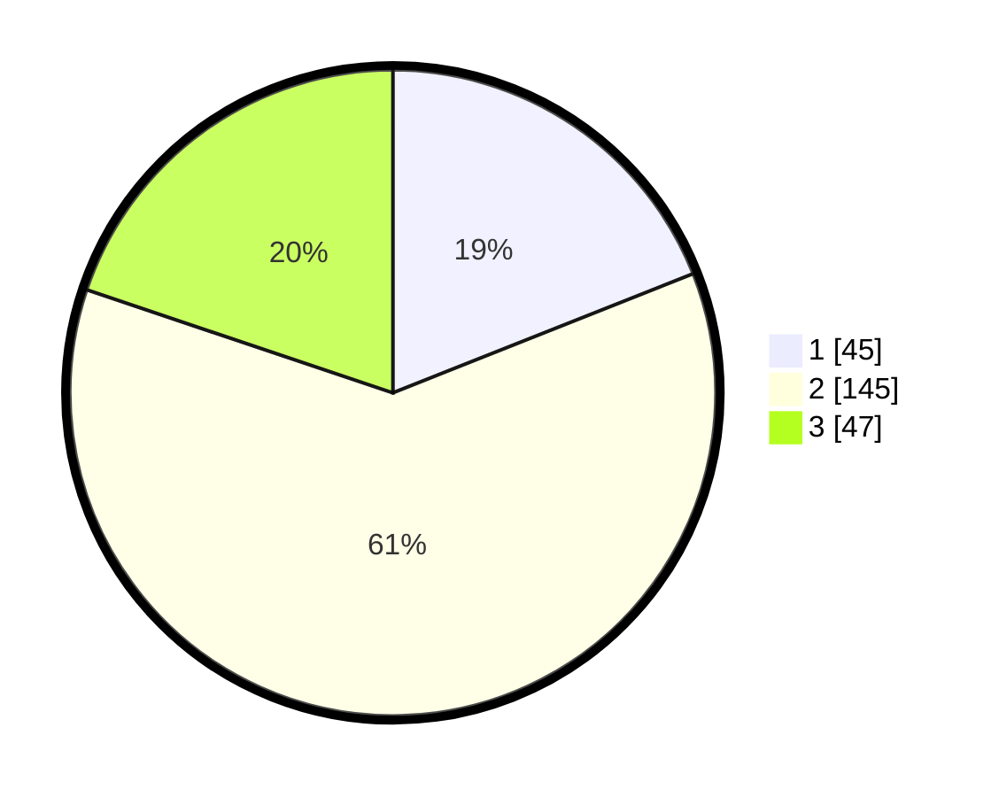

# Hasil

## Grafik

## Tabel

| No. | Nama Paslon    | Suara | Suara (raw) | Persentase |
|:--- |:-------------- | -----:| -----------:| ----------:|
| 1   | ANIES MUHAIMIN | 45    | [45][p-1]   | 18,99      |
| 2   | PRABOWO GIBRAN | 145   | [145][p-2]  | 61,18      |
| 3   | GANJAR MAHFUD  | 47    | [47][p-3]   | 19,83      |

[p-1]: https://github.com/gigit-pemilu/pemilu-2024-34-di-yogyakarta/blob/main/pilpres/hitung-suara/sub/34-di-yogyakarta/sub/04-sleman/sub/14-tempel/sub/2002-tambakrejo/sub/012-tps/sub/paslon-1.txt
[p-2]: https://github.com/gigit-pemilu/pemilu-2024-34-di-yogyakarta/blob/main/pilpres/hitung-suara/sub/34-di-yogyakarta/sub/04-sleman/sub/14-tempel/sub/2002-tambakrejo/sub/012-tps/sub/paslon-2.txt
[p-3]: https://github.com/gigit-pemilu/pemilu-2024-34-di-yogyakarta/blob/main/pilpres/hitung-suara/sub/34-di-yogyakarta/sub/04-sleman/sub/14-tempel/sub/2002-tambakrejo/sub/012-tps/sub/paslon-3.txt

## Foto C Plano

https://sirekap-obj-formc.kpu.go.id/0718/pemilu/ppwp/34/04/14/20/02/3404142002012-20240215-034502--deac10a7-7ab0-48de-ae31-2c4d2c28dd29.jpg

https://sirekap-obj-formc.kpu.go.id/0718/pemilu/ppwp/34/04/14/20/02/3404142002012-20240215-034639--1f0fcd5d-3fe5-40af-9181-6e843aad5154.jpg

https://sirekap-obj-formc.kpu.go.id/0718/pemilu/ppwp/34/04/14/20/02/3404142002012-20240215-034736--66256d0b-0391-41c0-882c-858f604dc704.jpg

## Metadata

| Key        | Value               |
| ---------- | ------------------- |
| Time Stamp | 2024-02-15 12:00:28 |

