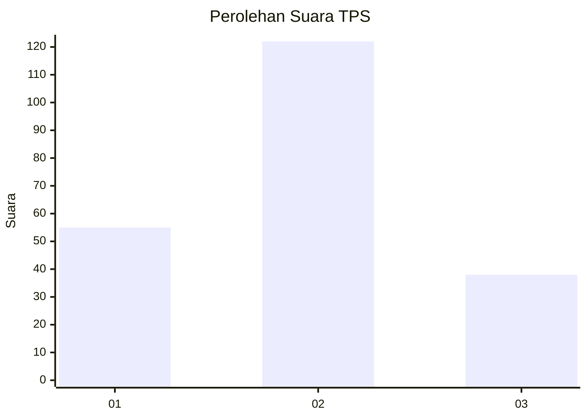
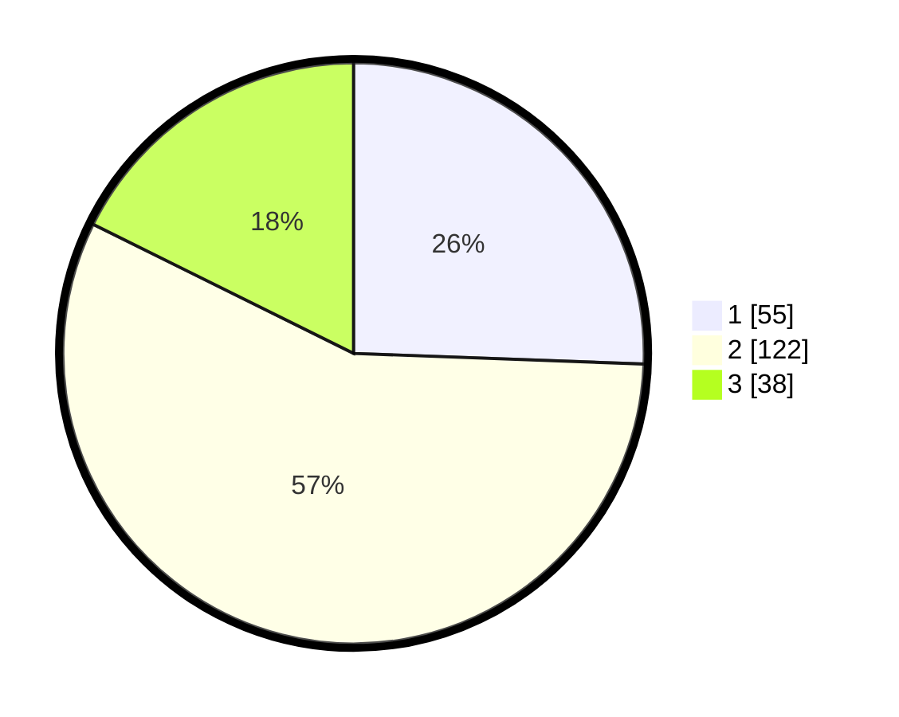

# Hasil

## Grafik

## Tabel

| No. | Nama Paslon    | Suara | Suara (raw) | Persentase |
|:--- |:-------------- | -----:| -----------:| ----------:|
| 1   | ANIES MUHAIMIN | 55    | [55][p-1]   | 25,58      |
| 2   | PRABOWO GIBRAN | 122   | [122][p-2]  | 56,74      |
| 3   | GANJAR MAHFUD  | 38    | [38][p-3]   | 17,67      |

[p-1]: https://github.com/gigit-pemilu/pemilu-2024-34-di-yogyakarta/blob/main/pilpres/hitung-suara/sub/34-di-yogyakarta/sub/04-sleman/sub/14-tempel/sub/2002-tambakrejo/sub/015-tps/sub/paslon-1.txt
[p-2]: https://github.com/gigit-pemilu/pemilu-2024-34-di-yogyakarta/blob/main/pilpres/hitung-suara/sub/34-di-yogyakarta/sub/04-sleman/sub/14-tempel/sub/2002-tambakrejo/sub/015-tps/sub/paslon-2.txt
[p-3]: https://github.com/gigit-pemilu/pemilu-2024-34-di-yogyakarta/blob/main/pilpres/hitung-suara/sub/34-di-yogyakarta/sub/04-sleman/sub/14-tempel/sub/2002-tambakrejo/sub/015-tps/sub/paslon-3.txt

## Foto C Plano

https://sirekap-obj-formc.kpu.go.id/21f8/pemilu/ppwp/34/04/14/20/02/3404142002015-20240215-010437--6dfdf348-1e9d-49f0-9c61-d5498865a429.jpg

https://sirekap-obj-formc.kpu.go.id/21f8/pemilu/ppwp/34/04/14/20/02/3404142002015-20240215-010600--b06caa7f-2fd8-47d2-b6c1-e51a99c09ba6.jpg

https://sirekap-obj-formc.kpu.go.id/21f8/pemilu/ppwp/34/04/14/20/02/3404142002015-20240215-010733--15d1b3a0-a28f-4be6-96b1-74da8d64358c.jpg

## Metadata

| Key        | Value               |
| ---------- | ------------------- |
| Time Stamp | 2024-02-15 12:00:28 |

