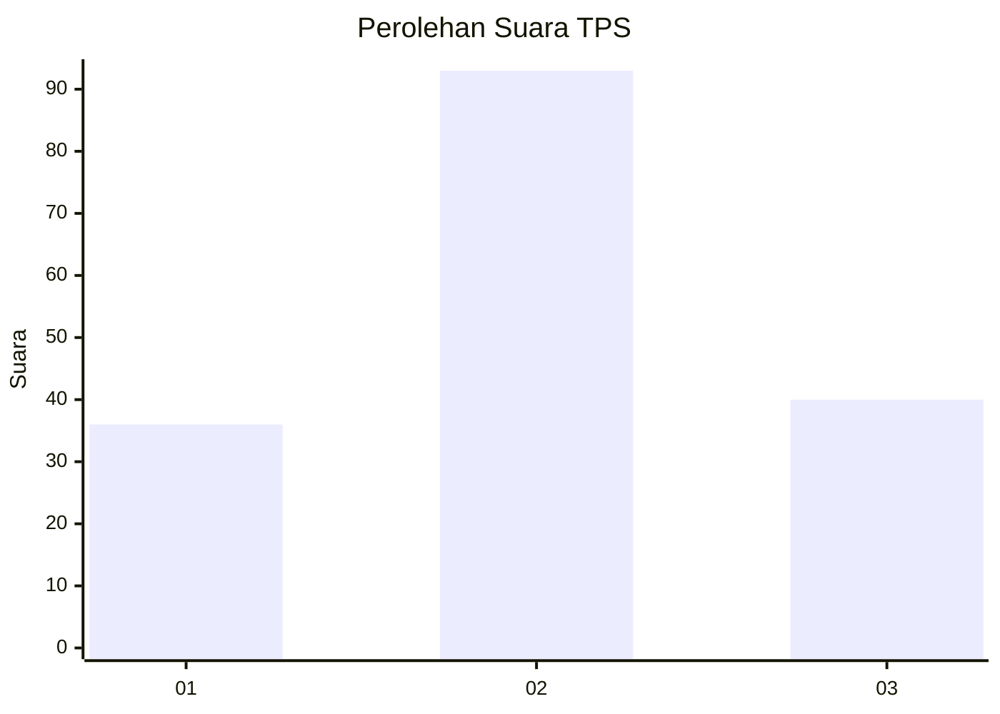
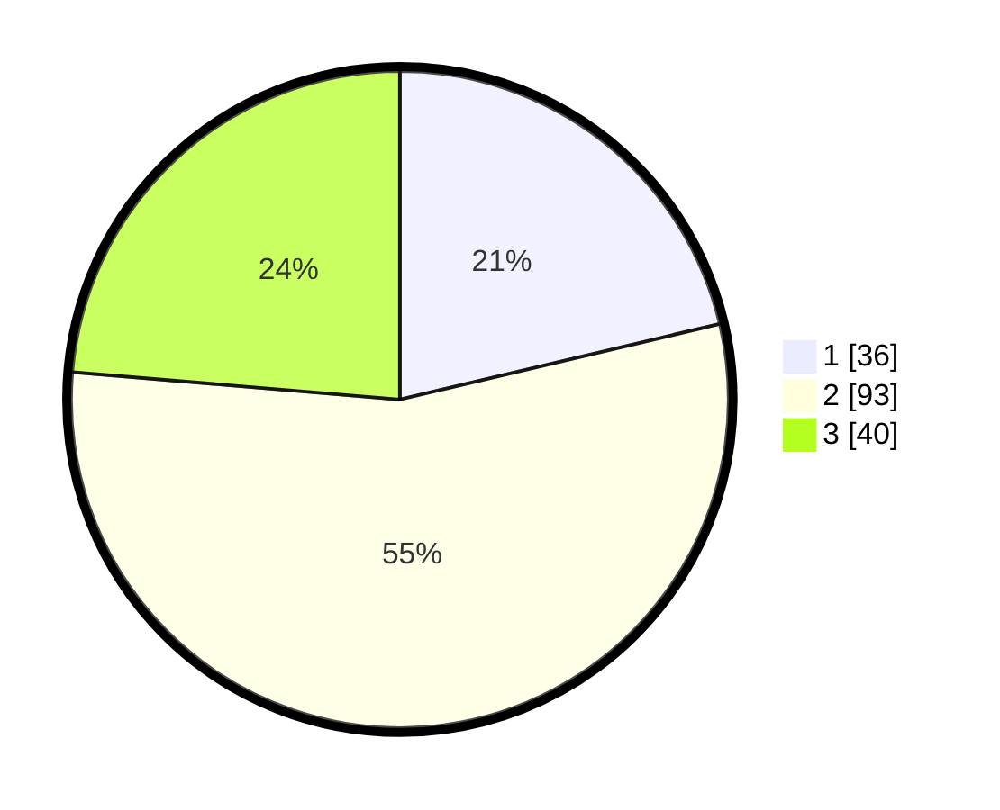

# Hasil

## Grafik

## Tabel

| No. | Nama Paslon    | Suara | Suara (raw) | Persentase |
|:--- |:-------------- | -----:| -----------:| ----------:|
| 1   | ANIES MUHAIMIN | 36    | [36][p-1]   | 21,30      |
| 2   | PRABOWO GIBRAN | 93    | [93][p-2]   | 55,03      |
| 3   | GANJAR MAHFUD  | 40    | [40][p-3]   | 23,67      |

[p-1]: https://github.com/gigit-pemilu/pemilu-2024-34-di-yogyakarta/blob/main/pilpres/hitung-suara/sub/34-di-yogyakarta/sub/04-sleman/sub/14-tempel/sub/2003-sumberrejo/sub/011-tps/sub/paslon-1.txt
[p-2]: https://github.com/gigit-pemilu/pemilu-2024-34-di-yogyakarta/blob/main/pilpres/hitung-suara/sub/34-di-yogyakarta/sub/04-sleman/sub/14-tempel/sub/2003-sumberrejo/sub/011-tps/sub/paslon-2.txt
[p-3]: https://github.com/gigit-pemilu/pemilu-2024-34-di-yogyakarta/blob/main/pilpres/hitung-suara/sub/34-di-yogyakarta/sub/04-sleman/sub/14-tempel/sub/2003-sumberrejo/sub/011-tps/sub/paslon-3.txt

## Foto C Plano

https://sirekap-obj-formc.kpu.go.id/4c03/pemilu/ppwp/34/04/14/20/03/3404142003011-20240214-141856--b8200f12-5203-4b68-a76c-c2ff65eaab4d.jpg

https://sirekap-obj-formc.kpu.go.id/4c03/pemilu/ppwp/34/04/14/20/03/3404142003011-20240214-214841--4a6e3e9c-79d2-4549-88f0-a68efc522b1d.jpg

https://sirekap-obj-formc.kpu.go.id/4c03/pemilu/ppwp/34/04/14/20/03/3404142003011-20240214-141738--bc3f9710-c914-4283-bebd-dda2abb7a204.jpg

## Metadata

| Key        | Value               |
| ---------- | ------------------- |
| Time Stamp | 2024-02-15 15:00:29 |

