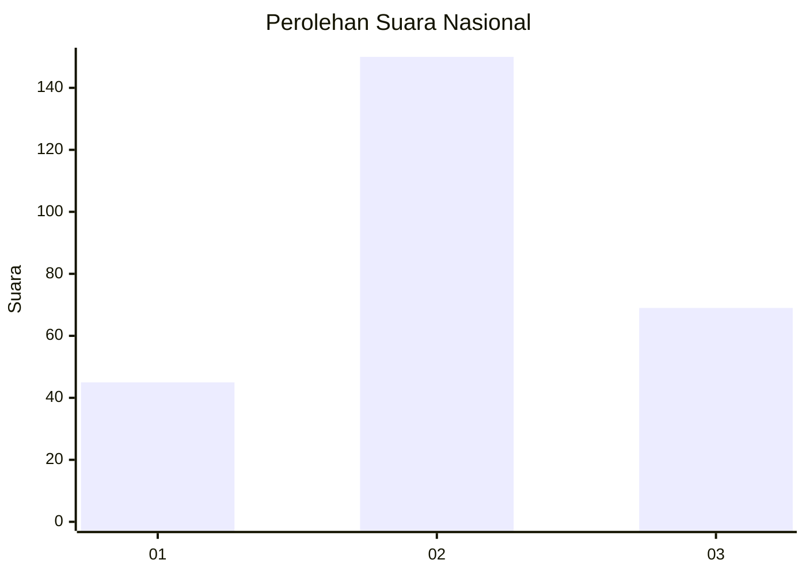
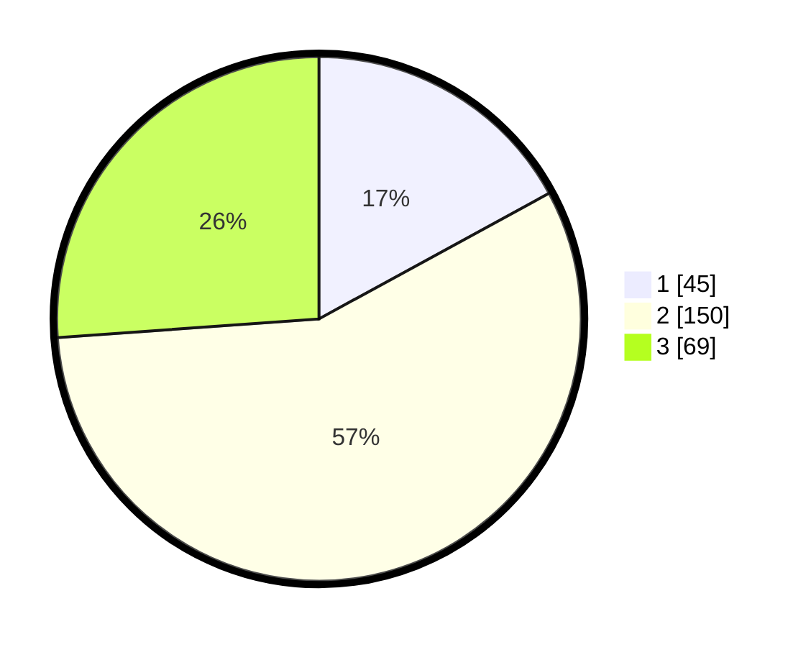

# Hasil

## Grafik

## Tabel

| No. | Nama Paslon    | Suara | Suara (raw) | Persentase |
|:--- |:-------------- | -----:| -----------:| ----------:|
| 1   | ANIES MUHAIMIN | 45    | [45][p-1]   | 17,05      |
| 2   | PRABOWO GIBRAN | 150   | [150][p-2]  | 56,82      |
| 3   | GANJAR MAHFUD  | 69    | [69][p-3]   | 26,14      |

[p-1]: https://github.com/gigit-pemilu/pemilu-2024/blob/main/pilpres/hitung-suara/sub/34-di-yogyakarta/sub/04-sleman/sub/14-tempel/sub/2004-pondokrejo/sub/001-tps/sub/paslon-1.txt
[p-2]: https://github.com/gigit-pemilu/pemilu-2024/blob/main/pilpres/hitung-suara/sub/34-di-yogyakarta/sub/04-sleman/sub/14-tempel/sub/2004-pondokrejo/sub/001-tps/sub/paslon-2.txt
[p-3]: https://github.com/gigit-pemilu/pemilu-2024/blob/main/pilpres/hitung-suara/sub/34-di-yogyakarta/sub/04-sleman/sub/14-tempel/sub/2004-pondokrejo/sub/001-tps/sub/paslon-3.txt

## Foto C Plano

https://sirekap-obj-formc.kpu.go.id/af09/pemilu/ppwp/34/04/14/20/04/3404142004001-20240215-000927--4bbcc897-fb08-4081-aab7-6002faf26275.jpg

https://sirekap-obj-formc.kpu.go.id/af09/pemilu/ppwp/34/04/14/20/04/3404142004001-20240215-001323--cbb65441-4b51-4eef-834e-0dcf54db9ff6.jpg

https://sirekap-obj-formc.kpu.go.id/af09/pemilu/ppwp/34/04/14/20/04/3404142004001-20240215-001238--d81d8910-ef14-4b12-8808-ff586dd79aa9.jpg

## Metadata

| Key        | Value               |
| ---------- | ------------------- |
| Time Stamp | 2024-02-24 22:31:28 |

