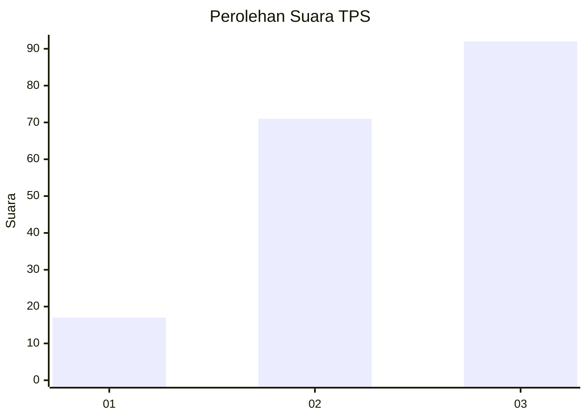
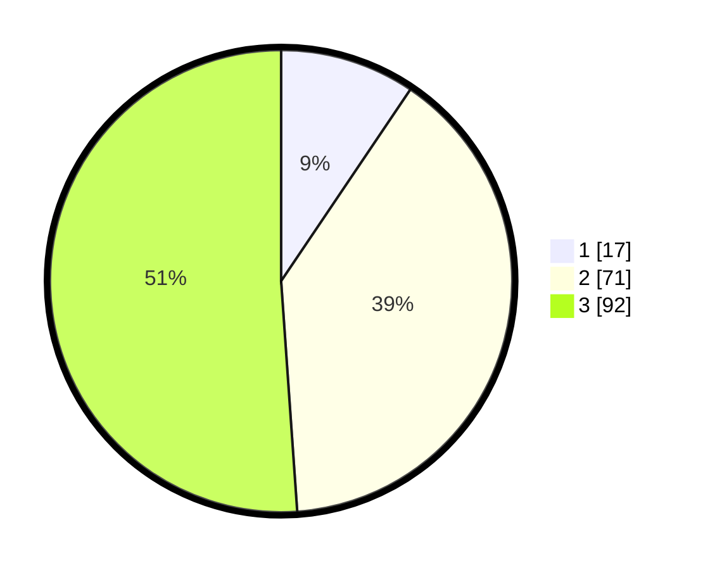

# Hasil

## Grafik

## Tabel

| No. | Nama Paslon    | Suara | Suara (raw) | Persentase |
|:--- |:-------------- | -----:| -----------:| ----------:|
| 1   | ANIES MUHAIMIN | 17    | [17][p-1]   | 9,44       |
| 2   | PRABOWO GIBRAN | 71    | [71][p-2]   | 39,44      |
| 3   | GANJAR MAHFUD  | 92    | [92][p-3]   | 51,11      |

[p-1]: https://github.com/gigit-pemilu/pemilu-2024-34-di-yogyakarta/blob/main/pilpres/hitung-suara/sub/34-di-yogyakarta/sub/04-sleman/sub/14-tempel/sub/2004-pondokrejo/sub/007-tps/sub/paslon-1.txt
[p-2]: https://github.com/gigit-pemilu/pemilu-2024-34-di-yogyakarta/blob/main/pilpres/hitung-suara/sub/34-di-yogyakarta/sub/04-sleman/sub/14-tempel/sub/2004-pondokrejo/sub/007-tps/sub/paslon-2.txt
[p-3]: https://github.com/gigit-pemilu/pemilu-2024-34-di-yogyakarta/blob/main/pilpres/hitung-suara/sub/34-di-yogyakarta/sub/04-sleman/sub/14-tempel/sub/2004-pondokrejo/sub/007-tps/sub/paslon-3.txt

## Foto C Plano

https://sirekap-obj-formc.kpu.go.id/cf86/pemilu/ppwp/34/04/14/20/04/3404142004007-20240214-210231--6fd9c44f-807b-4bfd-98e8-c0b56eb283a7.jpg

https://sirekap-obj-formc.kpu.go.id/cf86/pemilu/ppwp/34/04/14/20/04/3404142004007-20240214-203036--d2757905-c87c-4250-aae2-14a76d9b4c08.jpg

https://sirekap-obj-formc.kpu.go.id/cf86/pemilu/ppwp/34/04/14/20/04/3404142004007-20240214-203417--c2c7959b-b469-4e29-bb24-4c4e3dd7f686.jpg

## Metadata

| Key        | Value               |
| ---------- | ------------------- |
| Time Stamp | 2024-02-15 15:00:29 |

