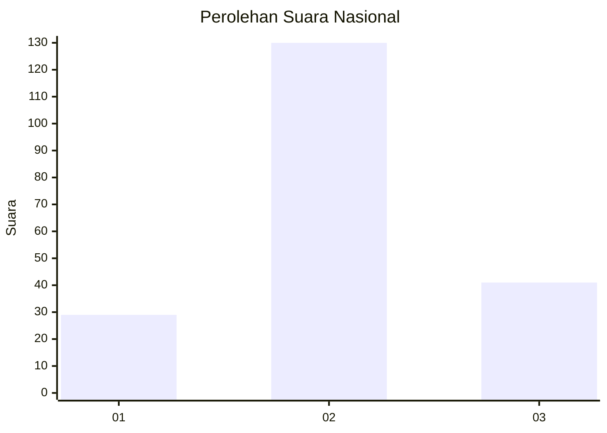
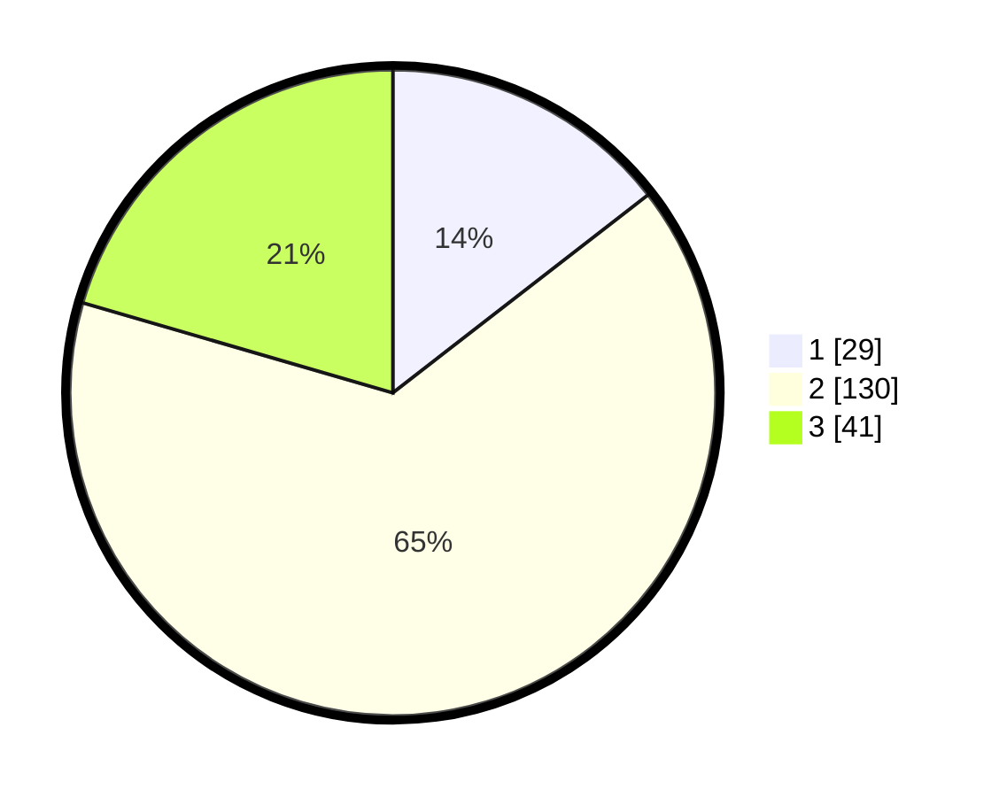

# Hasil

## Grafik

## Tabel

| No. | Nama Paslon    | Suara | Suara (raw) | Persentase |
|:--- |:-------------- | -----:| -----------:| ----------:|
| 1   | ANIES MUHAIMIN | 29    | [29][p-1]   | 14,50      |
| 2   | PRABOWO GIBRAN | 130   | [130][p-2]  | 65,00      |
| 3   | GANJAR MAHFUD  | 41    | [41][p-3]   | 20,50      |

[p-1]: https://github.com/gigit-pemilu/pemilu-2024/blob/main/pilpres/hitung-suara/sub/34-di-yogyakarta/sub/04-sleman/sub/14-tempel/sub/2004-pondokrejo/sub/009-tps/sub/paslon-1.txt
[p-2]: https://github.com/gigit-pemilu/pemilu-2024/blob/main/pilpres/hitung-suara/sub/34-di-yogyakarta/sub/04-sleman/sub/14-tempel/sub/2004-pondokrejo/sub/009-tps/sub/paslon-2.txt
[p-3]: https://github.com/gigit-pemilu/pemilu-2024/blob/main/pilpres/hitung-suara/sub/34-di-yogyakarta/sub/04-sleman/sub/14-tempel/sub/2004-pondokrejo/sub/009-tps/sub/paslon-3.txt

## Foto C Plano

https://sirekap-obj-formc.kpu.go.id/31e7/pemilu/ppwp/34/04/14/20/04/3404142004009-20240217-012813--475408c8-45bf-4383-a73d-f59d0e798560.jpg

https://sirekap-obj-formc.kpu.go.id/31e7/pemilu/ppwp/34/04/14/20/04/3404142004009-20240217-012815--a1e30c22-48f8-4c8b-b2c7-d6f6c08c1c46.jpg

https://sirekap-obj-formc.kpu.go.id/31e7/pemilu/ppwp/34/04/14/20/04/3404142004009-20240217-012821--bbe90a70-6a66-429c-98bf-f91b8af41c22.jpg

## Metadata

| Key        | Value               |
| ---------- | ------------------- |
| Time Stamp | 2024-02-17 02:00:02 |

## DATA PEMILIH TETAP

Jumlah pemilih dalam DPT: **225**.
 * L: **115**.
 * P: **111**.

## DATA PENGGUNA HAK PILIH

Jumlah pengguna hak pilih dalam DPT: **700**.
 * L: **102**.
 * P: **20**.

Jumlah pengguna hak pilih dalam DPTb: **1**.
 * L: **0**.
 * P: **1**.

Jumlah pengguna hak pilih dalam DPK: **1**.
 * L: **1**.
 * P: **0**.

Jumlah pengguna hak pilih: **202**.
 * L: **107**.
 * P: **99**.

## JUMLAH SUARA SAH DAN TIDAK SAH

JUMLAH SELURUH SUARA SAH: **7**.

JUMLAH SUARA TIDAK SAH: **2**.

JUMLAH SELURUH SUARA SAH DAN SUARA TIDAK SAH: **0**.

