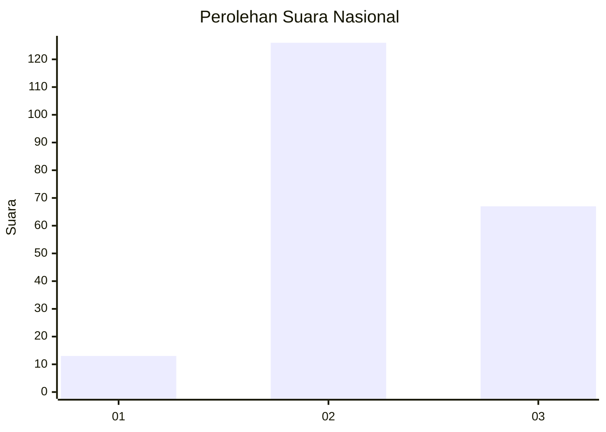
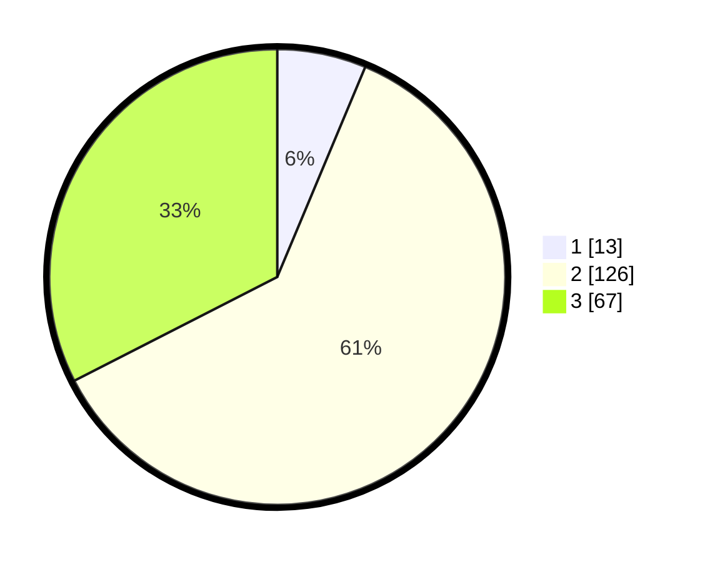

# Hasil

## Grafik

## Tabel

| No. | Nama Paslon    | Suara | Suara (raw) | Persentase |
|:--- |:-------------- | -----:| -----------:| ----------:|
| 1   | ANIES MUHAIMIN | 13    | [13][p-1]   | 6,31       |
| 2   | PRABOWO GIBRAN | 126   | [126][p-2]  | 61,17      |
| 3   | GANJAR MAHFUD  | 67    | [67][p-3]   | 32,52      |

[p-1]: https://github.com/gigit-pemilu/pemilu-2024/blob/main/pilpres/hitung-suara/sub/34-di-yogyakarta/sub/04-sleman/sub/14-tempel/sub/2004-pondokrejo/sub/014-tps/sub/paslon-1.txt
[p-2]: https://github.com/gigit-pemilu/pemilu-2024/blob/main/pilpres/hitung-suara/sub/34-di-yogyakarta/sub/04-sleman/sub/14-tempel/sub/2004-pondokrejo/sub/014-tps/sub/paslon-2.txt
[p-3]: https://github.com/gigit-pemilu/pemilu-2024/blob/main/pilpres/hitung-suara/sub/34-di-yogyakarta/sub/04-sleman/sub/14-tempel/sub/2004-pondokrejo/sub/014-tps/sub/paslon-3.txt

## Foto C Plano

https://sirekap-obj-formc.kpu.go.id/b047/pemilu/ppwp/34/04/14/20/04/3404142004014-20240215-003822--f2f25db0-0521-4d75-b4f6-6cd7744f9351.jpg

https://sirekap-obj-formc.kpu.go.id/b047/pemilu/ppwp/34/04/14/20/04/3404142004014-20240215-004211--b7ae41c2-0424-403a-bc07-d09b9bfc22c7.jpg

https://sirekap-obj-formc.kpu.go.id/b047/pemilu/ppwp/34/04/14/20/04/3404142004014-20240215-004441--edd61ea3-a7d8-4a5e-bd82-489cae4173ee.jpg

## Metadata

| Key        | Value               |
| ---------- | ------------------- |
| Time Stamp | 2024-02-15 15:00:29 |

