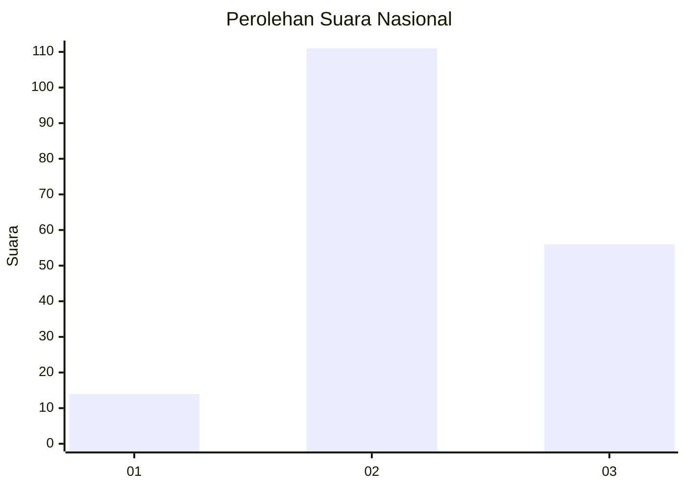
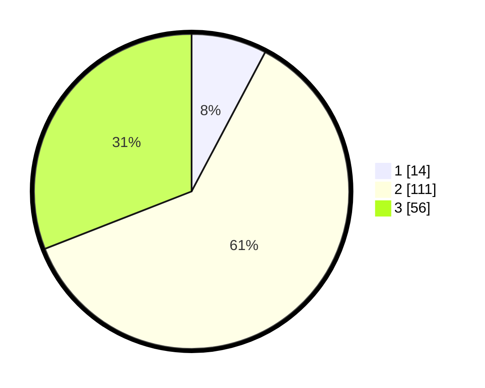

# Hasil

## Grafik

## Tabel

| No. | Nama Paslon    | Suara | Suara (raw) | Persentase |
|:--- |:-------------- | -----:| -----------:| ----------:|
| 1   | ANIES MUHAIMIN | 14    | [14][p-1]   | 7,73       |
| 2   | PRABOWO GIBRAN | 111   | [111][p-2]  | 61,33      |
| 3   | GANJAR MAHFUD  | 56    | [56][p-3]   | 30,94      |

[p-1]: https://github.com/gigit-pemilu/pemilu-2024/blob/main/pilpres/hitung-suara/sub/34-di-yogyakarta/sub/04-sleman/sub/14-tempel/sub/2004-pondokrejo/sub/021-tps/sub/paslon-1.txt
[p-2]: https://github.com/gigit-pemilu/pemilu-2024/blob/main/pilpres/hitung-suara/sub/34-di-yogyakarta/sub/04-sleman/sub/14-tempel/sub/2004-pondokrejo/sub/021-tps/sub/paslon-2.txt
[p-3]: https://github.com/gigit-pemilu/pemilu-2024/blob/main/pilpres/hitung-suara/sub/34-di-yogyakarta/sub/04-sleman/sub/14-tempel/sub/2004-pondokrejo/sub/021-tps/sub/paslon-3.txt

## Foto C Plano

https://sirekap-obj-formc.kpu.go.id/23f8/pemilu/ppwp/34/04/14/20/04/3404142004021-20240215-033040--1d987385-d4b1-4c20-8cc0-cf2e583cc4c2.jpg

https://sirekap-obj-formc.kpu.go.id/23f8/pemilu/ppwp/34/04/14/20/04/3404142004021-20240215-033047--62120b9d-2fc7-47f4-b1ae-9a666eadb1fa.jpg

https://sirekap-obj-formc.kpu.go.id/23f8/pemilu/ppwp/34/04/14/20/04/3404142004021-20240215-033053--678903b1-fb0c-42f8-9fc0-b76fa086e280.jpg

## Metadata

| Key        | Value               |
| ---------- | ------------------- |
| Time Stamp | 2024-02-15 12:00:28 |

