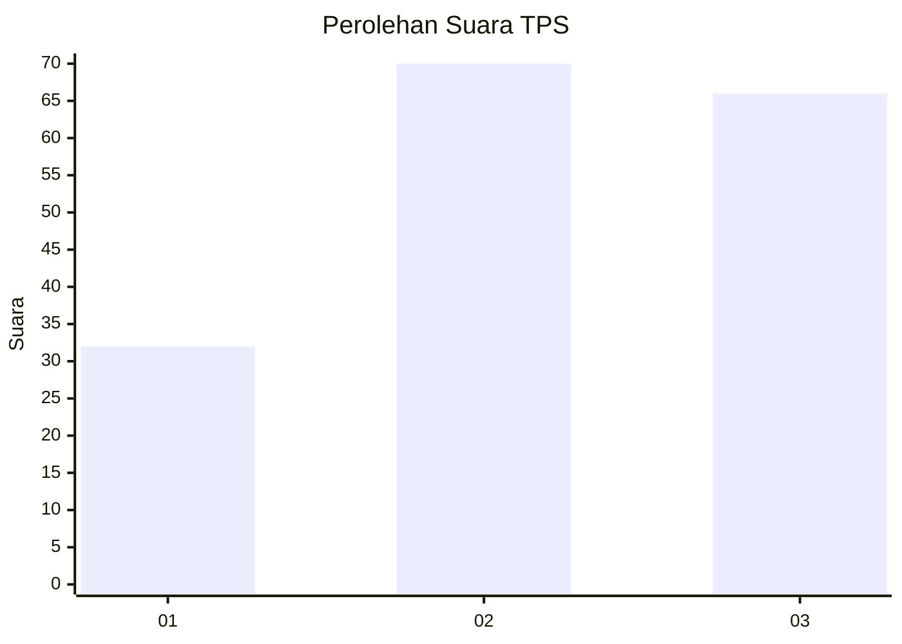
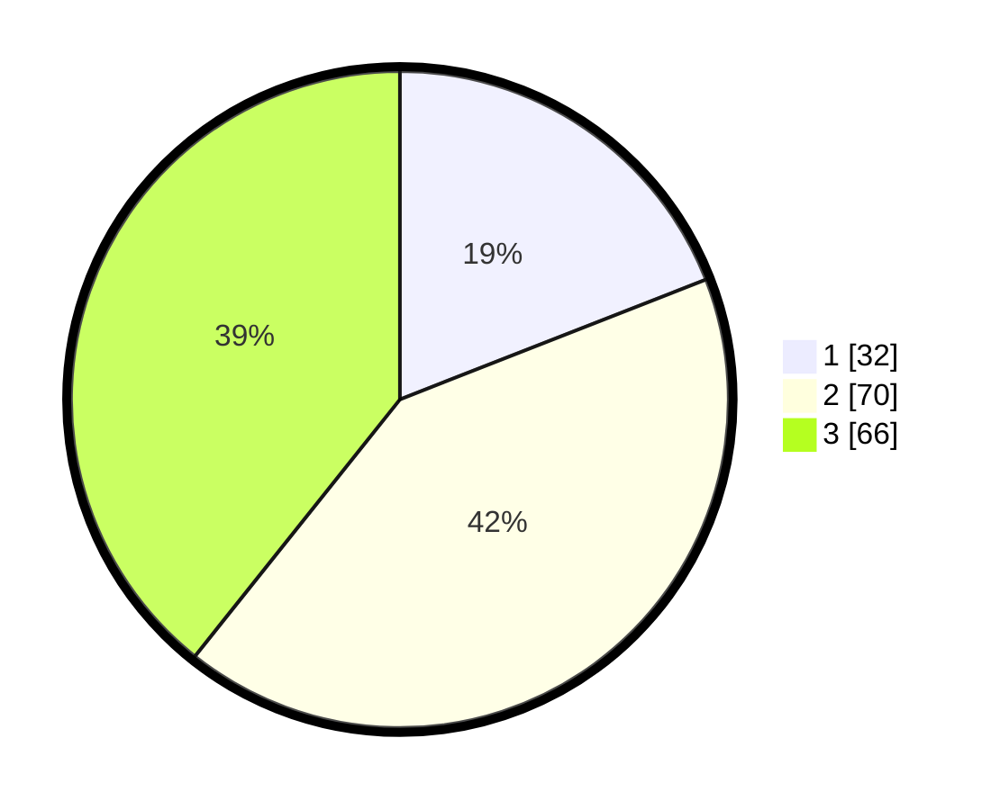

# Hasil

## Grafik

## Tabel

| No. | Nama Paslon    | Suara | Suara (raw) | Persentase |
|:--- |:-------------- | -----:| -----------:| ----------:|
| 1   | ANIES MUHAIMIN | 32    | [32][p-1]   | 19,05      |
| 2   | PRABOWO GIBRAN | 70    | [70][p-2]   | 41,67      |
| 3   | GANJAR MAHFUD  | 66    | [66][p-3]   | 39,29      |

[p-1]: https://github.com/gigit-pemilu/pemilu-2024-34-di-yogyakarta/blob/main/pilpres/hitung-suara/sub/34-di-yogyakarta/sub/04-sleman/sub/14-tempel/sub/2006-margorejo/sub/005-tps/sub/paslon-1.txt
[p-2]: https://github.com/gigit-pemilu/pemilu-2024-34-di-yogyakarta/blob/main/pilpres/hitung-suara/sub/34-di-yogyakarta/sub/04-sleman/sub/14-tempel/sub/2006-margorejo/sub/005-tps/sub/paslon-2.txt
[p-3]: https://github.com/gigit-pemilu/pemilu-2024-34-di-yogyakarta/blob/main/pilpres/hitung-suara/sub/34-di-yogyakarta/sub/04-sleman/sub/14-tempel/sub/2006-margorejo/sub/005-tps/sub/paslon-3.txt

## Foto C Plano

https://sirekap-obj-formc.kpu.go.id/95ad/pemilu/ppwp/34/04/14/20/06/3404142006005-20240214-220852--b7ee0af7-80c2-4b33-97f7-77a51d03c522.jpg

https://sirekap-obj-formc.kpu.go.id/95ad/pemilu/ppwp/34/04/14/20/06/3404142006005-20240214-220951--9fd3ab39-45f2-4956-bad0-f8a429f16b55.jpg

https://sirekap-obj-formc.kpu.go.id/95ad/pemilu/ppwp/34/04/14/20/06/3404142006005-20240214-220949--ca4fd9f7-58fc-43b2-b56c-aa149971dbcf.jpg

## Metadata

| Key        | Value               |
| ---------- | ------------------- |
| Time Stamp | 2024-02-25 14:00:00 |

