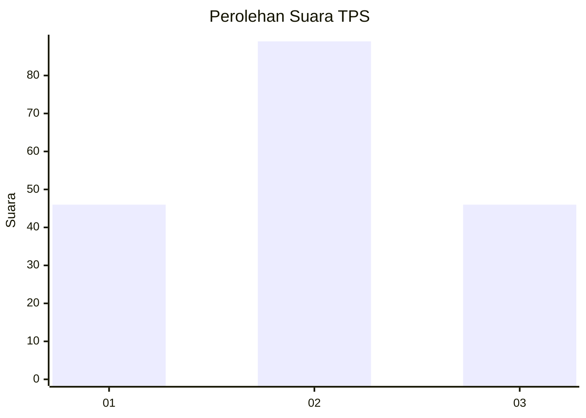
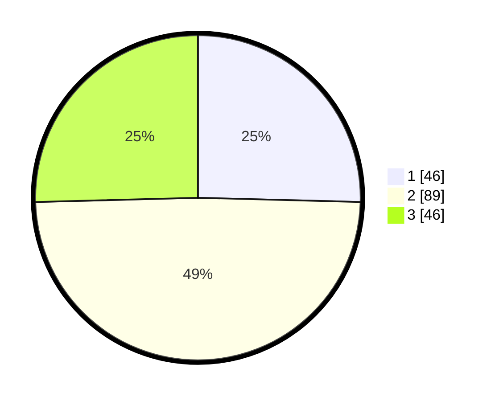

# Hasil

## Grafik

## Tabel

| No. | Nama Paslon    | Suara | Suara (raw) | Persentase |
|:--- |:-------------- | -----:| -----------:| ----------:|
| 1   | ANIES MUHAIMIN | 46    | [46][p-1]   | 25,41      |
| 2   | PRABOWO GIBRAN | 89    | [89][p-2]   | 49,17      |
| 3   | GANJAR MAHFUD  | 46    | [46][p-3]   | 25,41      |

[p-1]: https://github.com/gigit-pemilu/pemilu-2024-34-di-yogyakarta/blob/main/pilpres/hitung-suara/sub/34-di-yogyakarta/sub/04-sleman/sub/14-tempel/sub/2006-margorejo/sub/006-tps/sub/paslon-1.txt
[p-2]: https://github.com/gigit-pemilu/pemilu-2024-34-di-yogyakarta/blob/main/pilpres/hitung-suara/sub/34-di-yogyakarta/sub/04-sleman/sub/14-tempel/sub/2006-margorejo/sub/006-tps/sub/paslon-2.txt
[p-3]: https://github.com/gigit-pemilu/pemilu-2024-34-di-yogyakarta/blob/main/pilpres/hitung-suara/sub/34-di-yogyakarta/sub/04-sleman/sub/14-tempel/sub/2006-margorejo/sub/006-tps/sub/paslon-3.txt

## Foto C Plano

https://sirekap-obj-formc.kpu.go.id/a20c/pemilu/ppwp/34/04/14/20/06/3404142006006-20240214-191708--11ea6ef3-5d4d-4e9f-aa3e-53bb0f66f31d.jpg

https://sirekap-obj-formc.kpu.go.id/a20c/pemilu/ppwp/34/04/14/20/06/3404142006006-20240214-191732--039cb8fa-4808-4b73-b920-cd8175dc5067.jpg

https://sirekap-obj-formc.kpu.go.id/a20c/pemilu/ppwp/34/04/14/20/06/3404142006006-20240214-214328--d8d23c1c-18c6-4027-9d91-1997dca0d442.jpg

## Metadata

| Key        | Value               |
| ---------- | ------------------- |
| Time Stamp | 2024-02-15 04:00:24 |

