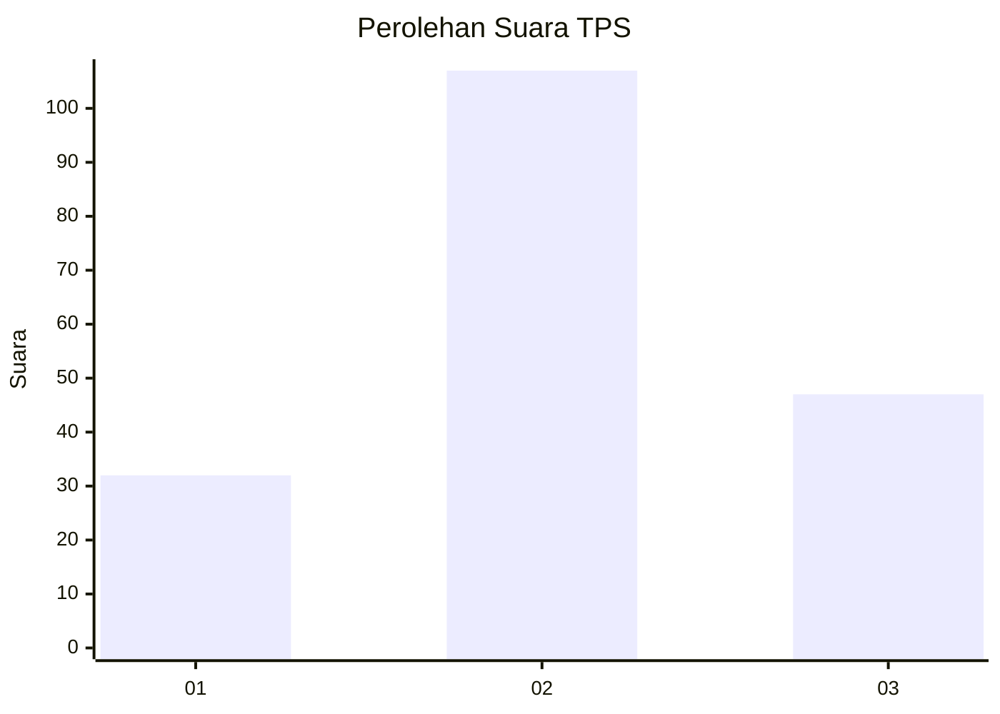
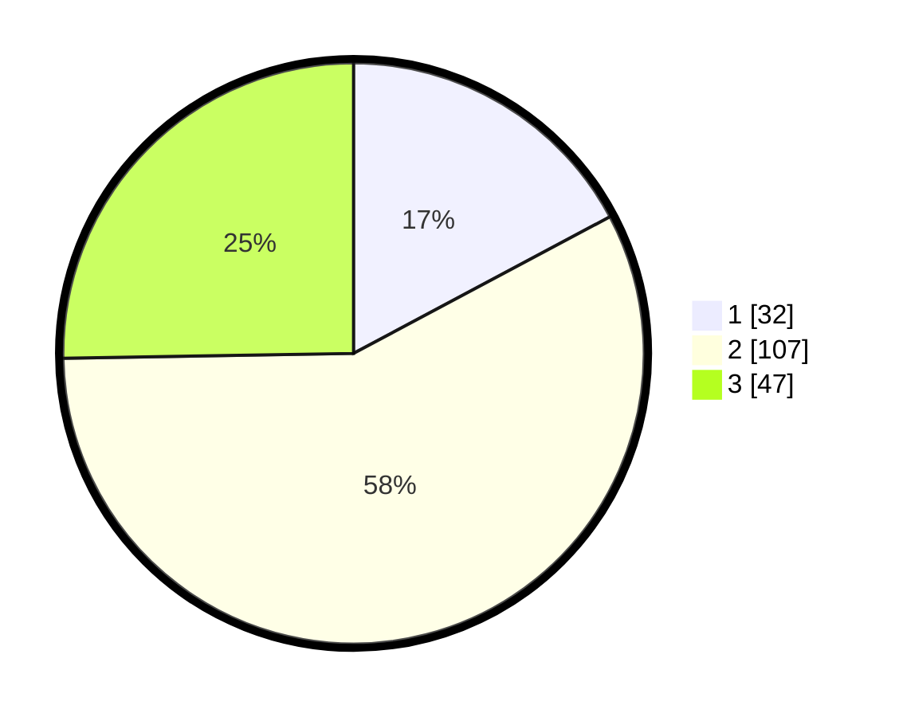

# Hasil

## Grafik

## Tabel

| No. | Nama Paslon    | Suara | Suara (raw) | Persentase |
|:--- |:-------------- | -----:| -----------:| ----------:|
| 1   | ANIES MUHAIMIN | 32    | [32][p-1]   | 17,20      |
| 2   | PRABOWO GIBRAN | 107   | [107][p-2]  | 57,53      |
| 3   | GANJAR MAHFUD  | 47    | [47][p-3]   | 25,27      |

[p-1]: https://github.com/gigit-pemilu/pemilu-2024-34-di-yogyakarta/blob/main/pilpres/hitung-suara/sub/34-di-yogyakarta/sub/04-sleman/sub/14-tempel/sub/2006-margorejo/sub/019-tps/sub/paslon-1.txt
[p-2]: https://github.com/gigit-pemilu/pemilu-2024-34-di-yogyakarta/blob/main/pilpres/hitung-suara/sub/34-di-yogyakarta/sub/04-sleman/sub/14-tempel/sub/2006-margorejo/sub/019-tps/sub/paslon-2.txt
[p-3]: https://github.com/gigit-pemilu/pemilu-2024-34-di-yogyakarta/blob/main/pilpres/hitung-suara/sub/34-di-yogyakarta/sub/04-sleman/sub/14-tempel/sub/2006-margorejo/sub/019-tps/sub/paslon-3.txt

## Foto C Plano

https://sirekap-obj-formc.kpu.go.id/6311/pemilu/ppwp/34/04/14/20/06/3404142006019-20240214-214139--410f9f98-2c24-4900-9619-a17177ceae8e.jpg

https://sirekap-obj-formc.kpu.go.id/6311/pemilu/ppwp/34/04/14/20/06/3404142006019-20240214-214308--90b37ca9-99df-4692-ac59-66d093680457.jpg

https://sirekap-obj-formc.kpu.go.id/6311/pemilu/ppwp/34/04/14/20/06/3404142006019-20240214-214354--40eeffaf-cc61-4a45-9cc8-ad977406e195.jpg

## Metadata

| Key        | Value               |
| ---------- | ------------------- |
| Time Stamp | 2024-02-15 15:00:29 |

