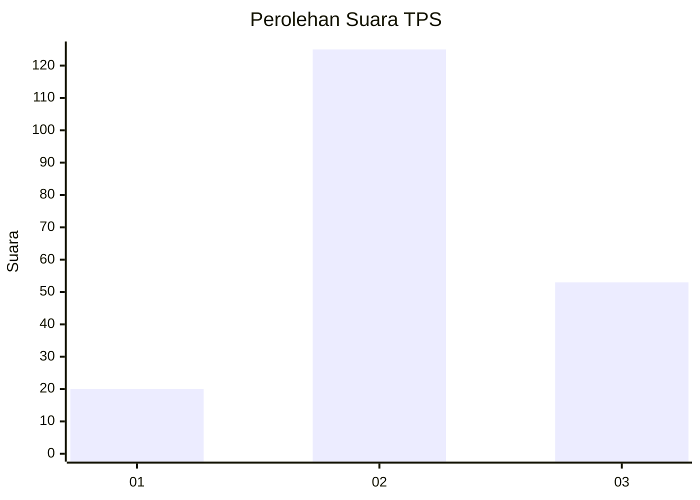
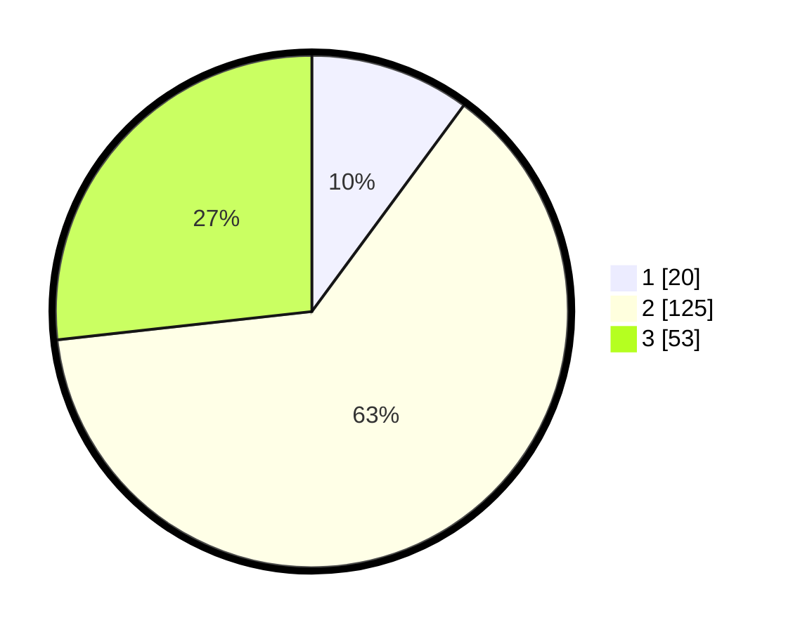

# Hasil

## Grafik

## Tabel

| No. | Nama Paslon    | Suara | Suara (raw) | Persentase |
|:--- |:-------------- | -----:| -----------:| ----------:|
| 1   | ANIES MUHAIMIN | 20    | [20][p-1]   | 10,10      |
| 2   | PRABOWO GIBRAN | 125   | [125][p-2]  | 63,13      |
| 3   | GANJAR MAHFUD  | 53    | [53][p-3]   | 26,77      |

[p-1]: https://github.com/gigit-pemilu/pemilu-2024-34-di-yogyakarta/blob/main/pilpres/hitung-suara/sub/34-di-yogyakarta/sub/04-sleman/sub/14-tempel/sub/2006-margorejo/sub/024-tps/sub/paslon-1.txt
[p-2]: https://github.com/gigit-pemilu/pemilu-2024-34-di-yogyakarta/blob/main/pilpres/hitung-suara/sub/34-di-yogyakarta/sub/04-sleman/sub/14-tempel/sub/2006-margorejo/sub/024-tps/sub/paslon-2.txt
[p-3]: https://github.com/gigit-pemilu/pemilu-2024-34-di-yogyakarta/blob/main/pilpres/hitung-suara/sub/34-di-yogyakarta/sub/04-sleman/sub/14-tempel/sub/2006-margorejo/sub/024-tps/sub/paslon-3.txt

## Foto C Plano

https://sirekap-obj-formc.kpu.go.id/2505/pemilu/ppwp/34/04/14/20/06/3404142006024-20240214-220701--8045dd3f-1203-46e7-be4b-38fba9e5f650.jpg

https://sirekap-obj-formc.kpu.go.id/2505/pemilu/ppwp/34/04/14/20/06/3404142006024-20240214-220817--79028bdc-a9b0-4ea2-b952-69c070bab5b8.jpg

https://sirekap-obj-formc.kpu.go.id/2505/pemilu/ppwp/34/04/14/20/06/3404142006024-20240214-220959--5850fe0c-dd5f-4200-92b0-68e4e7b5f8a8.jpg

## Metadata

| Key        | Value               |
| ---------- | ------------------- |
| Time Stamp | 2024-02-15 21:30:27 |

