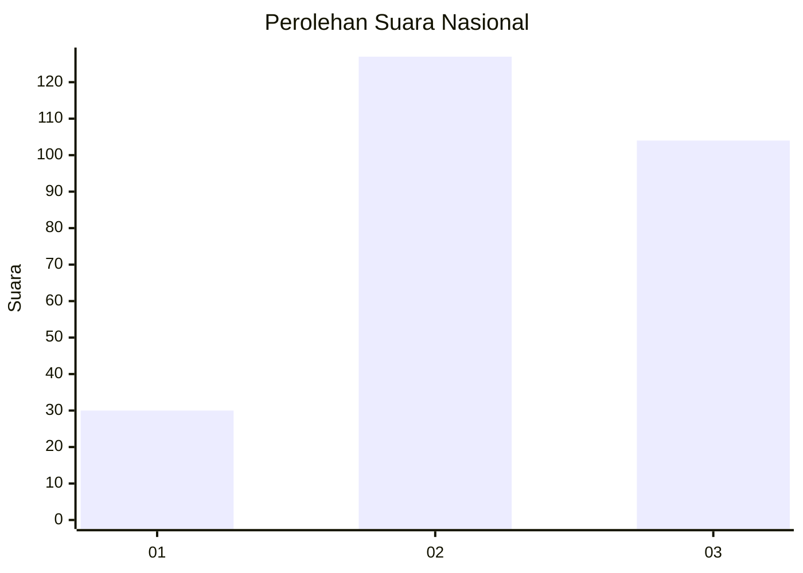
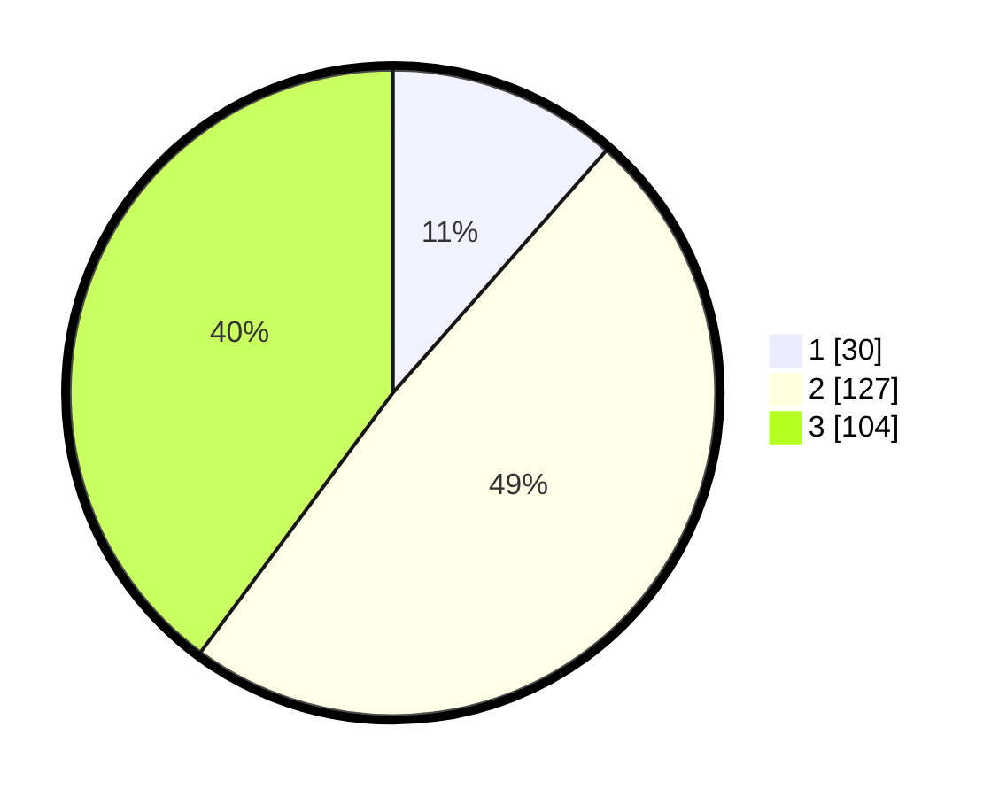

# Hasil

## Grafik

## Tabel

| No. | Nama Paslon    | Suara | Suara (raw) | Persentase |
|:--- |:-------------- | -----:| -----------:| ----------:|
| 1   | ANIES MUHAIMIN | 30    | [30][p-1]   | 11,49      |
| 2   | PRABOWO GIBRAN | 127   | [127][p-2]  | 48,66      |
| 3   | GANJAR MAHFUD  | 104   | [104][p-3]  | 39,85      |

[p-1]: https://github.com/gigit-pemilu/pemilu-2024/blob/main/pilpres/hitung-suara/sub/34-di-yogyakarta/sub/04-sleman/sub/14-tempel/sub/2007-lumbungrejo/sub/002-tps/sub/paslon-1.txt
[p-2]: https://github.com/gigit-pemilu/pemilu-2024/blob/main/pilpres/hitung-suara/sub/34-di-yogyakarta/sub/04-sleman/sub/14-tempel/sub/2007-lumbungrejo/sub/002-tps/sub/paslon-2.txt
[p-3]: https://github.com/gigit-pemilu/pemilu-2024/blob/main/pilpres/hitung-suara/sub/34-di-yogyakarta/sub/04-sleman/sub/14-tempel/sub/2007-lumbungrejo/sub/002-tps/sub/paslon-3.txt

## Foto C Plano

https://sirekap-obj-formc.kpu.go.id/f3d0/pemilu/ppwp/34/04/14/20/07/3404142007002-20240215-011623--cea9a592-49a9-4630-a24d-221bbf984c8a.jpg

https://sirekap-obj-formc.kpu.go.id/f3d0/pemilu/ppwp/34/04/14/20/07/3404142007002-20240215-011710--b98bf92c-eafa-4709-9649-46c2b8db6f68.jpg

https://sirekap-obj-formc.kpu.go.id/f3d0/pemilu/ppwp/34/04/14/20/07/3404142007002-20240215-031656--a209b8dc-8024-438d-a9bb-c80f695ee4f0.jpg

## Metadata

| Key        | Value               |
| ---------- | ------------------- |
| Time Stamp | 2024-02-15 15:00:29 |

