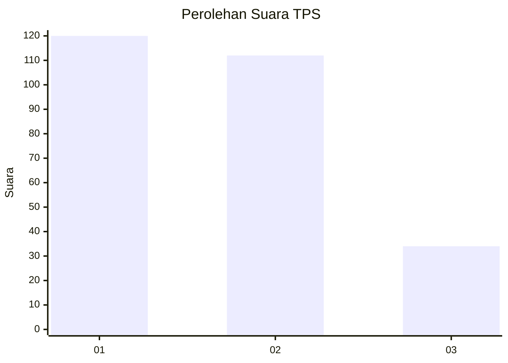
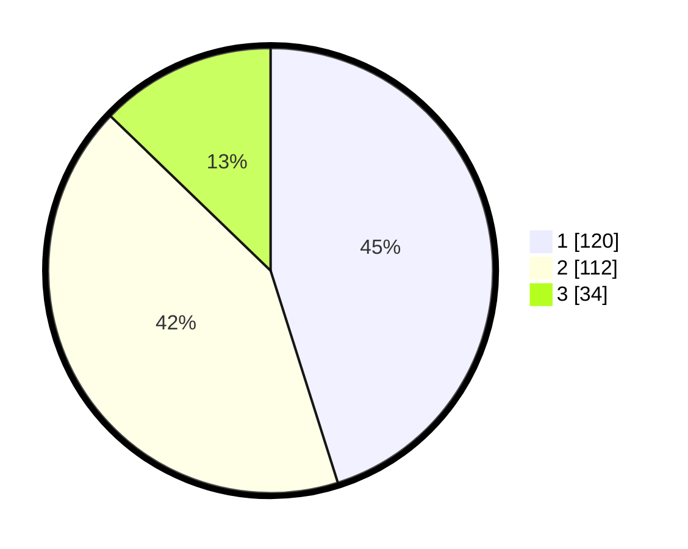

# Hasil

## Grafik

## Tabel

| No. | Nama Paslon    | Suara | Suara (raw) | Persentase |
|:--- |:-------------- | -----:| -----------:| ----------:|
| 1   | ANIES MUHAIMIN | 120   | [120][p-1]  | 45,11      |
| 2   | PRABOWO GIBRAN | 112   | [112][p-2]  | 42,11      |
| 3   | GANJAR MAHFUD  | 34    | [34][p-3]   | 12,78      |

[p-1]: https://github.com/gigit-pemilu/pemilu-2024-34-di-yogyakarta/blob/main/pilpres/hitung-suara/sub/34-di-yogyakarta/sub/04-sleman/sub/14-tempel/sub/2007-lumbungrejo/sub/015-tps/sub/paslon-1.txt
[p-2]: https://github.com/gigit-pemilu/pemilu-2024-34-di-yogyakarta/blob/main/pilpres/hitung-suara/sub/34-di-yogyakarta/sub/04-sleman/sub/14-tempel/sub/2007-lumbungrejo/sub/015-tps/sub/paslon-2.txt
[p-3]: https://github.com/gigit-pemilu/pemilu-2024-34-di-yogyakarta/blob/main/pilpres/hitung-suara/sub/34-di-yogyakarta/sub/04-sleman/sub/14-tempel/sub/2007-lumbungrejo/sub/015-tps/sub/paslon-3.txt

## Foto C Plano

https://sirekap-obj-formc.kpu.go.id/a020/pemilu/ppwp/34/04/14/20/07/3404142007015-20240215-010341--6dd7249c-4b82-4cd7-8b52-f07782f55cad.jpg

https://sirekap-obj-formc.kpu.go.id/a020/pemilu/ppwp/34/04/14/20/07/3404142007015-20240215-010459--5764b481-5fff-4d09-a898-9f498cd4452a.jpg

https://sirekap-obj-formc.kpu.go.id/a020/pemilu/ppwp/34/04/14/20/07/3404142007015-20240215-010554--e082e90f-c332-40ad-af7d-d82e672341f0.jpg

## Metadata

| Key        | Value               |
| ---------- | ------------------- |
| Time Stamp | 2024-02-15 12:00:28 |

