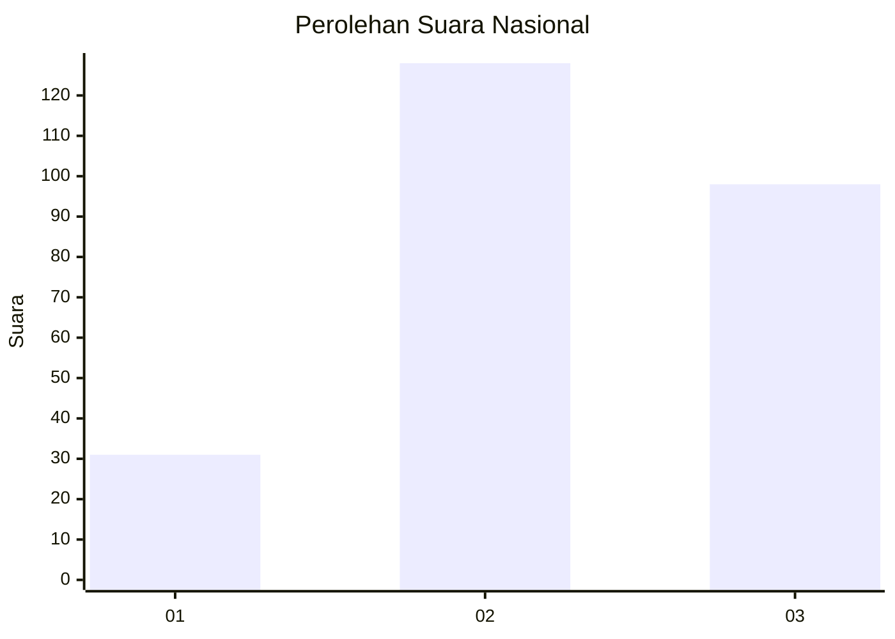
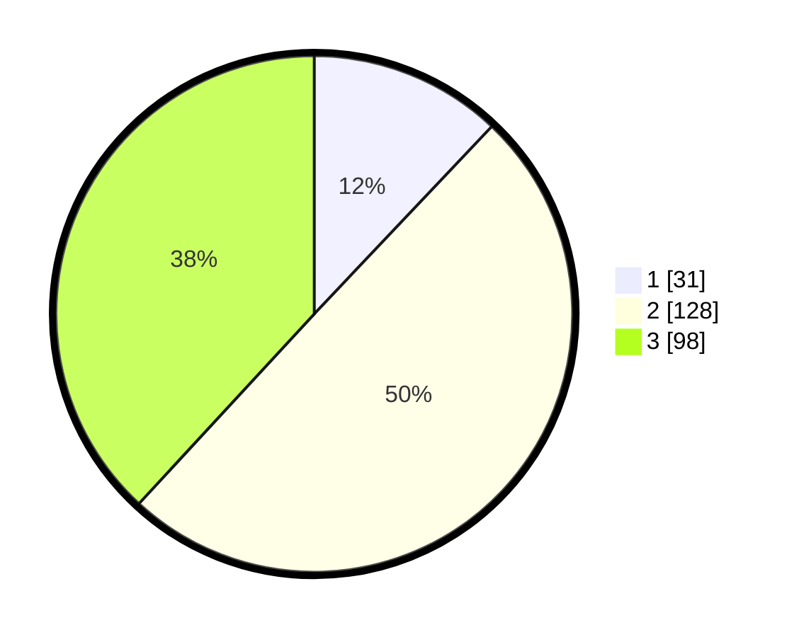

# Hasil

## Grafik

## Tabel

| No. | Nama Paslon    | Suara | Suara (raw) | Persentase |
|:--- |:-------------- | -----:| -----------:| ----------:|
| 1   | ANIES MUHAIMIN | 31    | [31][p-1]   | 12,06      |
| 2   | PRABOWO GIBRAN | 128   | [128][p-2]  | 49,81      |
| 3   | GANJAR MAHFUD  | 98    | [98][p-3]   | 38,13      |

[p-1]: https://github.com/gigit-pemilu/pemilu-2024/blob/main/pilpres/hitung-suara/sub/34-di-yogyakarta/sub/04-sleman/sub/14-tempel/sub/2007-lumbungrejo/sub/017-tps/sub/paslon-1.txt
[p-2]: https://github.com/gigit-pemilu/pemilu-2024/blob/main/pilpres/hitung-suara/sub/34-di-yogyakarta/sub/04-sleman/sub/14-tempel/sub/2007-lumbungrejo/sub/017-tps/sub/paslon-2.txt
[p-3]: https://github.com/gigit-pemilu/pemilu-2024/blob/main/pilpres/hitung-suara/sub/34-di-yogyakarta/sub/04-sleman/sub/14-tempel/sub/2007-lumbungrejo/sub/017-tps/sub/paslon-3.txt

## Foto C Plano

https://sirekap-obj-formc.kpu.go.id/565e/pemilu/ppwp/34/04/14/20/07/3404142007017-20240217-211441--504064cb-34d3-4f1a-8081-623f8a3987e5.jpg

https://sirekap-obj-formc.kpu.go.id/565e/pemilu/ppwp/34/04/14/20/07/3404142007017-20240215-012023--f2123836-9c8c-4688-acd2-dba271bf24a4.jpg

https://sirekap-obj-formc.kpu.go.id/565e/pemilu/ppwp/34/04/14/20/07/3404142007017-20240215-012107--0726d737-5b05-4c66-9275-4a778b358ae9.jpg

## Metadata

| Key        | Value               |
| ---------- | ------------------- |
| Time Stamp | 2024-02-24 22:31:28 |

