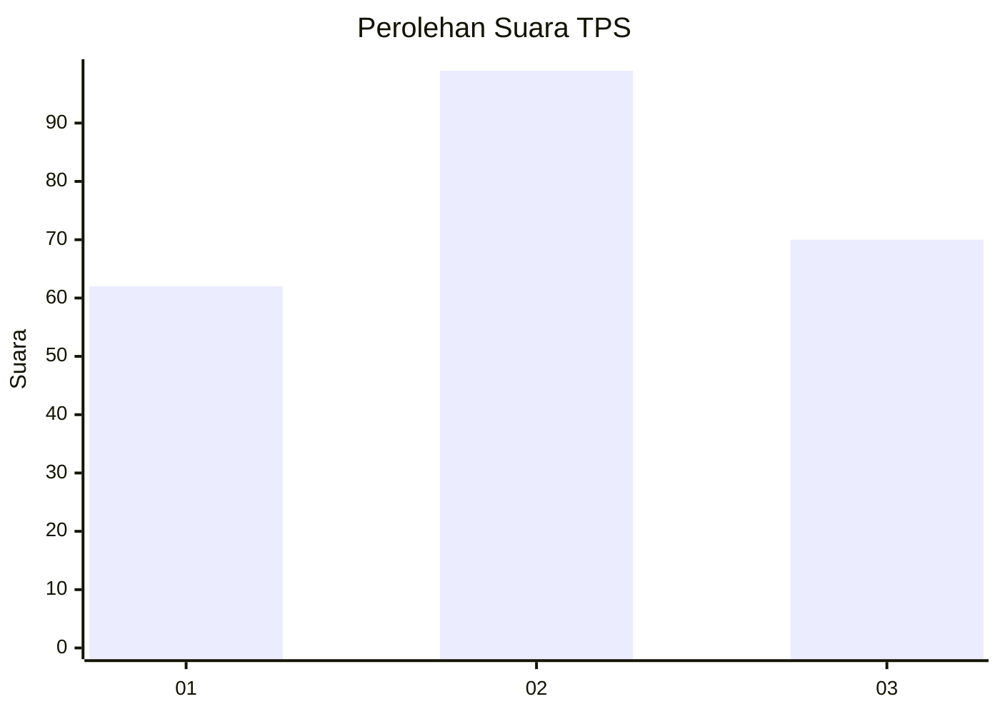
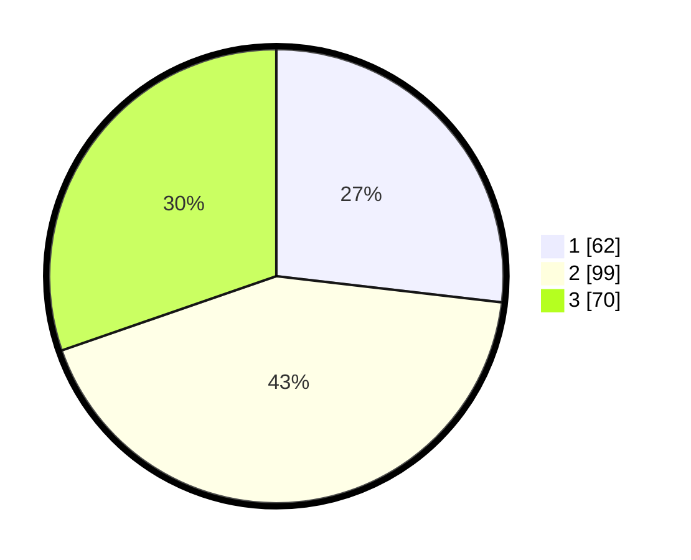

# Hasil

## Grafik

## Tabel

| No. | Nama Paslon    | Suara | Suara (raw) | Persentase |
|:--- |:-------------- | -----:| -----------:| ----------:|
| 1   | ANIES MUHAIMIN | 62    | [62][p-1]   | 26,84      |
| 2   | PRABOWO GIBRAN | 99    | [99][p-2]   | 42,86      |
| 3   | GANJAR MAHFUD  | 70    | [70][p-3]   | 30,30      |

[p-1]: https://github.com/gigit-pemilu/pemilu-2024-34-di-yogyakarta/blob/main/pilpres/hitung-suara/sub/34-di-yogyakarta/sub/04-sleman/sub/14-tempel/sub/2007-lumbungrejo/sub/023-tps/sub/paslon-1.txt
[p-2]: https://github.com/gigit-pemilu/pemilu-2024-34-di-yogyakarta/blob/main/pilpres/hitung-suara/sub/34-di-yogyakarta/sub/04-sleman/sub/14-tempel/sub/2007-lumbungrejo/sub/023-tps/sub/paslon-2.txt
[p-3]: https://github.com/gigit-pemilu/pemilu-2024-34-di-yogyakarta/blob/main/pilpres/hitung-suara/sub/34-di-yogyakarta/sub/04-sleman/sub/14-tempel/sub/2007-lumbungrejo/sub/023-tps/sub/paslon-3.txt

## Foto C Plano

https://sirekap-obj-formc.kpu.go.id/4415/pemilu/ppwp/34/04/14/20/07/3404142007023-20240214-221201--ba304e91-33d5-439f-9bb0-88641fb8f92f.jpg

https://sirekap-obj-formc.kpu.go.id/4415/pemilu/ppwp/34/04/14/20/07/3404142007023-20240214-221203--d7ef3227-22bf-42c0-9a2f-0ca6703f37cd.jpg

https://sirekap-obj-formc.kpu.go.id/4415/pemilu/ppwp/34/04/14/20/07/3404142007023-20240214-221209--1e00a557-5f66-4950-bc72-f0e9d7dc30a7.jpg

## Metadata

| Key        | Value               |
| ---------- | ------------------- |
| Time Stamp | 2024-02-15 12:00:28 |

