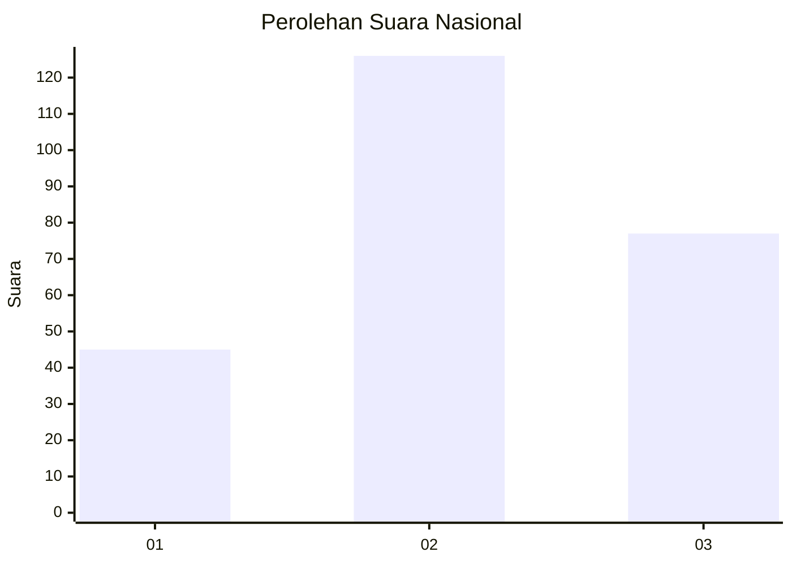
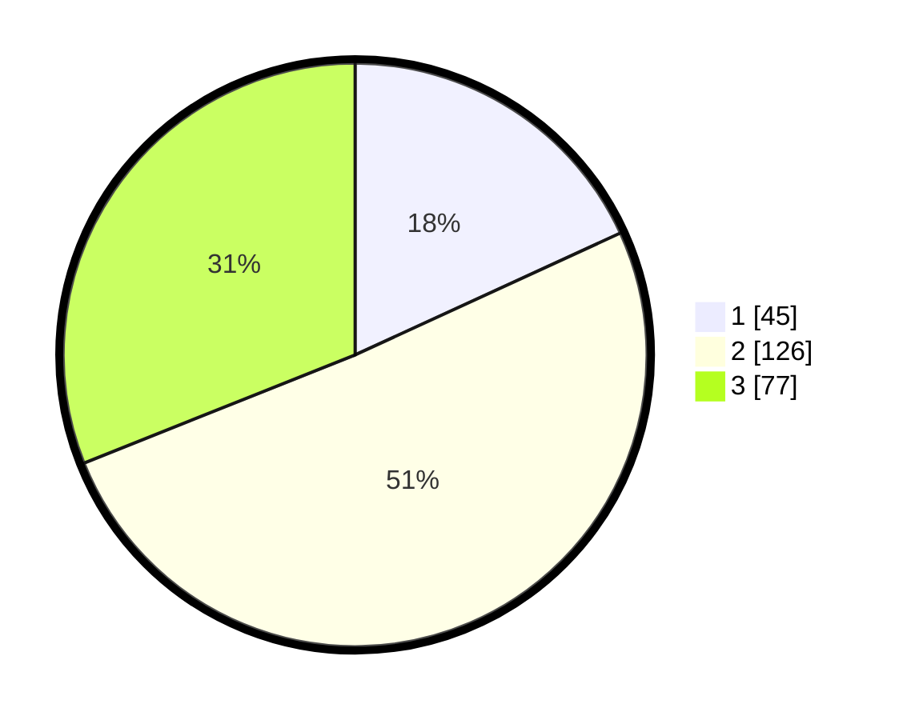

# Hasil

## Grafik

## Tabel

| No. | Nama Paslon    | Suara | Suara (raw) | Persentase |
|:--- |:-------------- | -----:| -----------:| ----------:|
| 1   | ANIES MUHAIMIN | 45    | [45][p-1]   | 18,15      |
| 2   | PRABOWO GIBRAN | 126   | [126][p-2]  | 50,81      |
| 3   | GANJAR MAHFUD  | 77    | [77][p-3]   | 31,05      |

[p-1]: https://github.com/gigit-pemilu/pemilu-2024/blob/main/pilpres/hitung-suara/sub/34-di-yogyakarta/sub/04-sleman/sub/14-tempel/sub/2008-merdikorejo/sub/010-tps/sub/paslon-1.txt
[p-2]: https://github.com/gigit-pemilu/pemilu-2024/blob/main/pilpres/hitung-suara/sub/34-di-yogyakarta/sub/04-sleman/sub/14-tempel/sub/2008-merdikorejo/sub/010-tps/sub/paslon-2.txt
[p-3]: https://github.com/gigit-pemilu/pemilu-2024/blob/main/pilpres/hitung-suara/sub/34-di-yogyakarta/sub/04-sleman/sub/14-tempel/sub/2008-merdikorejo/sub/010-tps/sub/paslon-3.txt

## Foto C Plano

https://sirekap-obj-formc.kpu.go.id/64a1/pemilu/ppwp/34/04/14/20/08/3404142008010-20240214-232504--33a5938d-87dc-4aac-9306-24a2c1a315eb.jpg

https://sirekap-obj-formc.kpu.go.id/64a1/pemilu/ppwp/34/04/14/20/08/3404142008010-20240214-232632--901f1ccf-9d89-453c-9967-6ac759ab6f39.jpg

https://sirekap-obj-formc.kpu.go.id/64a1/pemilu/ppwp/34/04/14/20/08/3404142008010-20240214-232701--ddff85a1-7383-4bd0-8797-8890d9c0bc9a.jpg

## Metadata

| Key        | Value               |
| ---------- | ------------------- |
| Time Stamp | 2024-02-15 18:00:26 |

