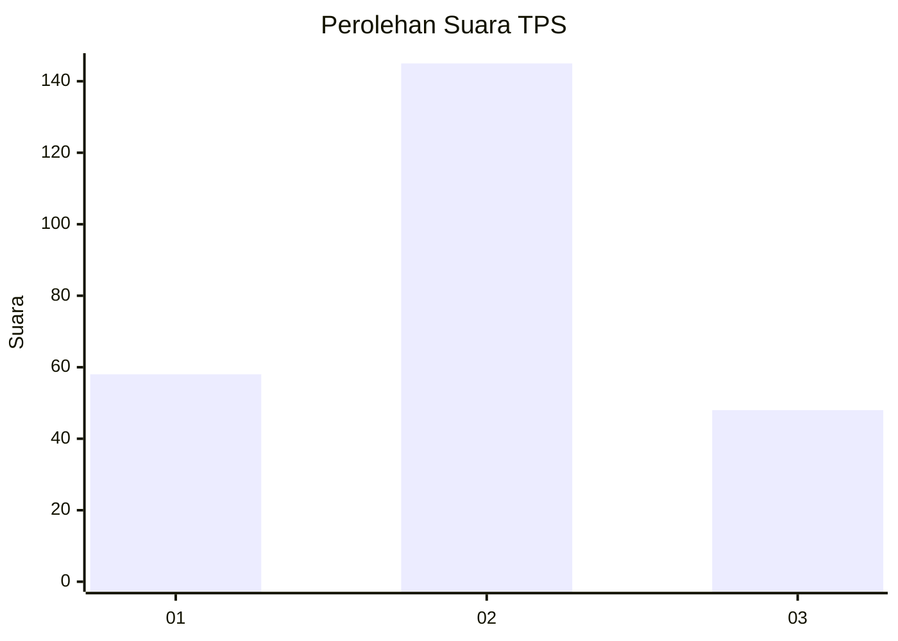
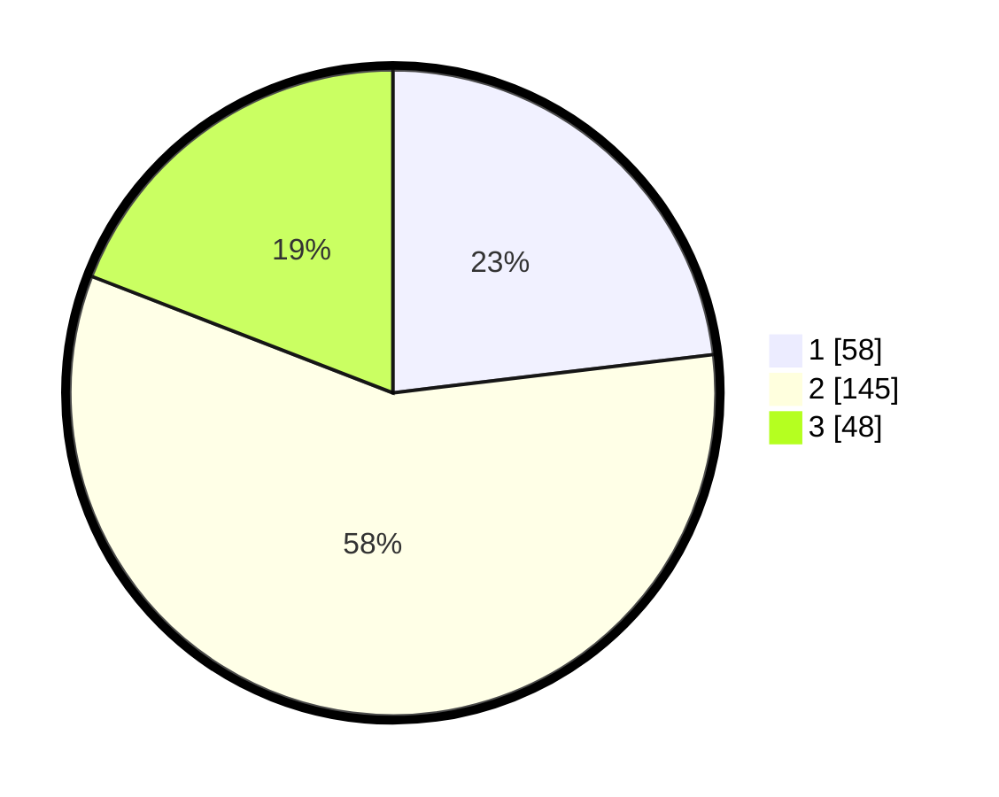

# Hasil

## Grafik

## Tabel

| No. | Nama Paslon    | Suara | Suara (raw) | Persentase |
|:--- |:-------------- | -----:| -----------:| ----------:|
| 1   | ANIES MUHAIMIN | 58    | [58][p-1]   | 23,11      |
| 2   | PRABOWO GIBRAN | 145   | [145][p-2]  | 57,77      |
| 3   | GANJAR MAHFUD  | 48    | [48][p-3]   | 19,12      |

[p-1]: https://github.com/gigit-pemilu/pemilu-2024-34-di-yogyakarta/blob/main/pilpres/hitung-suara/sub/34-di-yogyakarta/sub/04-sleman/sub/14-tempel/sub/2008-merdikorejo/sub/015-tps/sub/paslon-1.txt
[p-2]: https://github.com/gigit-pemilu/pemilu-2024-34-di-yogyakarta/blob/main/pilpres/hitung-suara/sub/34-di-yogyakarta/sub/04-sleman/sub/14-tempel/sub/2008-merdikorejo/sub/015-tps/sub/paslon-2.txt
[p-3]: https://github.com/gigit-pemilu/pemilu-2024-34-di-yogyakarta/blob/main/pilpres/hitung-suara/sub/34-di-yogyakarta/sub/04-sleman/sub/14-tempel/sub/2008-merdikorejo/sub/015-tps/sub/paslon-3.txt

## Foto C Plano

https://sirekap-obj-formc.kpu.go.id/5f1d/pemilu/ppwp/34/04/14/20/08/3404142008015-20240214-221118--bbec9129-ad7c-4188-9f3e-73a7442585b6.jpg

https://sirekap-obj-formc.kpu.go.id/5f1d/pemilu/ppwp/34/04/14/20/08/3404142008015-20240214-221201--bffd07de-60fb-4c77-be25-6681ed263a0e.jpg

https://sirekap-obj-formc.kpu.go.id/5f1d/pemilu/ppwp/34/04/14/20/08/3404142008015-20240214-221231--3e875f15-726e-41bd-acf1-19b2d8e71ab8.jpg

## Metadata

| Key        | Value               |
| ---------- | ------------------- |
| Time Stamp | 2024-02-15 12:00:28 |

