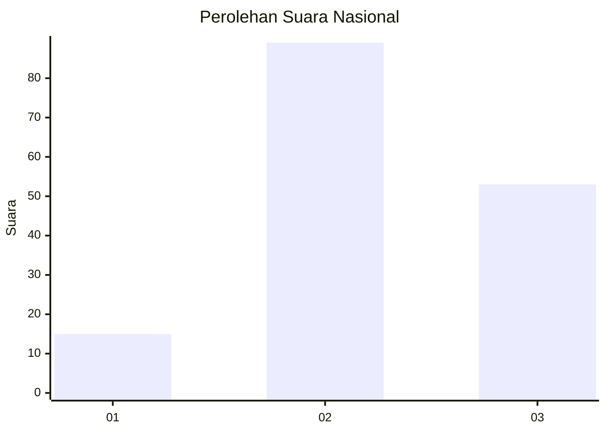
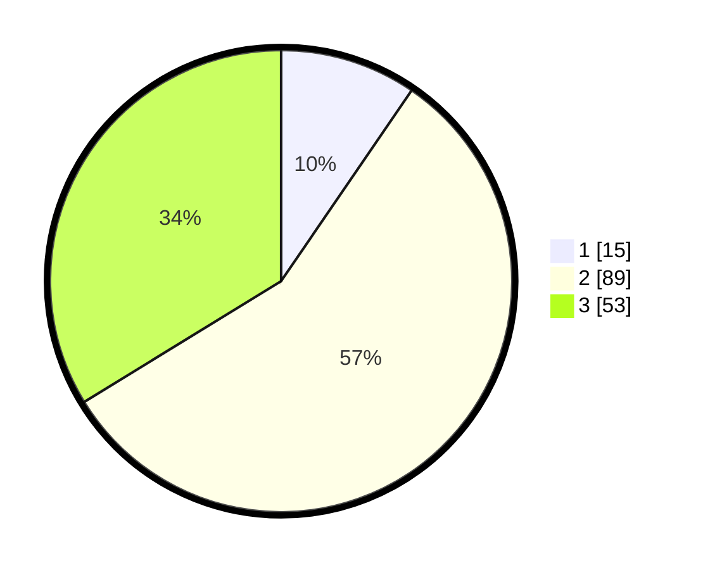

# Hasil

## Grafik

## Tabel

| No. | Nama Paslon    | Suara | Suara (raw) | Persentase |
|:--- |:-------------- | -----:| -----------:| ----------:|
| 1   | ANIES MUHAIMIN | 15    | [15][p-1]   | 9,55       |
| 2   | PRABOWO GIBRAN | 89    | [89][p-2]   | 56,69      |
| 3   | GANJAR MAHFUD  | 53    | [53][p-3]   | 33,76      |

[p-1]: https://github.com/gigit-pemilu/pemilu-2024/blob/main/pilpres/hitung-suara/sub/34-di-yogyakarta/sub/04-sleman/sub/14-tempel/sub/2008-merdikorejo/sub/022-tps/sub/paslon-1.txt
[p-2]: https://github.com/gigit-pemilu/pemilu-2024/blob/main/pilpres/hitung-suara/sub/34-di-yogyakarta/sub/04-sleman/sub/14-tempel/sub/2008-merdikorejo/sub/022-tps/sub/paslon-2.txt
[p-3]: https://github.com/gigit-pemilu/pemilu-2024/blob/main/pilpres/hitung-suara/sub/34-di-yogyakarta/sub/04-sleman/sub/14-tempel/sub/2008-merdikorejo/sub/022-tps/sub/paslon-3.txt

## Foto C Plano

https://sirekap-obj-formc.kpu.go.id/42e3/pemilu/ppwp/34/04/14/20/08/3404142008022-20240216-130020--abb2d6a0-d0ed-44d3-9da6-713e4d8f30a8.jpg

https://sirekap-obj-formc.kpu.go.id/42e3/pemilu/ppwp/34/04/14/20/08/3404142008022-20240216-130024--8092b5d8-ba60-4640-bfd0-1d29f68edbee.jpg

https://sirekap-obj-formc.kpu.go.id/42e3/pemilu/ppwp/34/04/14/20/08/3404142008022-20240216-130030--69c7375f-202f-49be-8ca2-cb3964db80f5.jpg

## Metadata

| Key        | Value               |
| ---------- | ------------------- |
| Time Stamp | 2024-02-25 12:00:00 |

