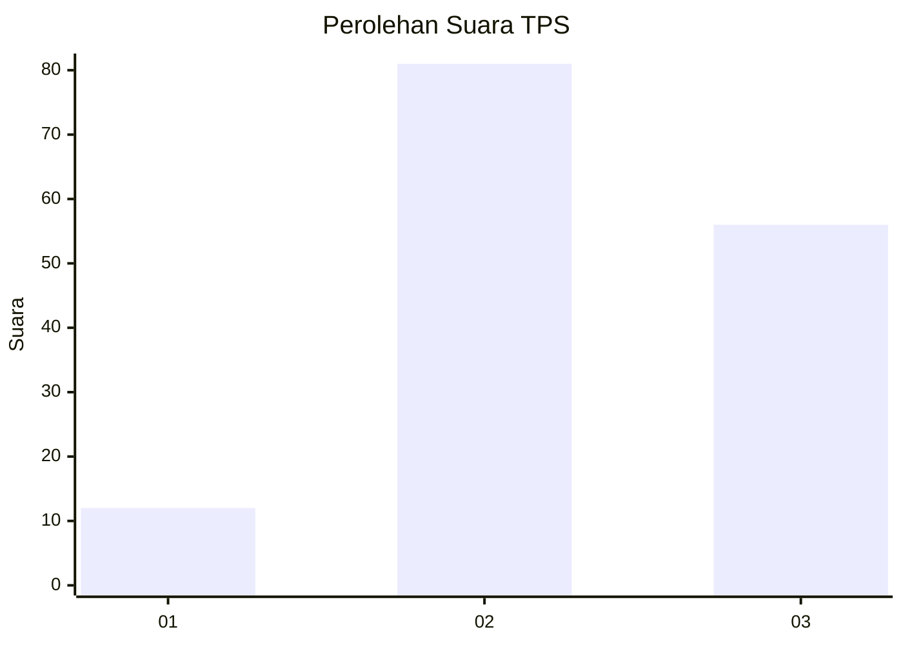
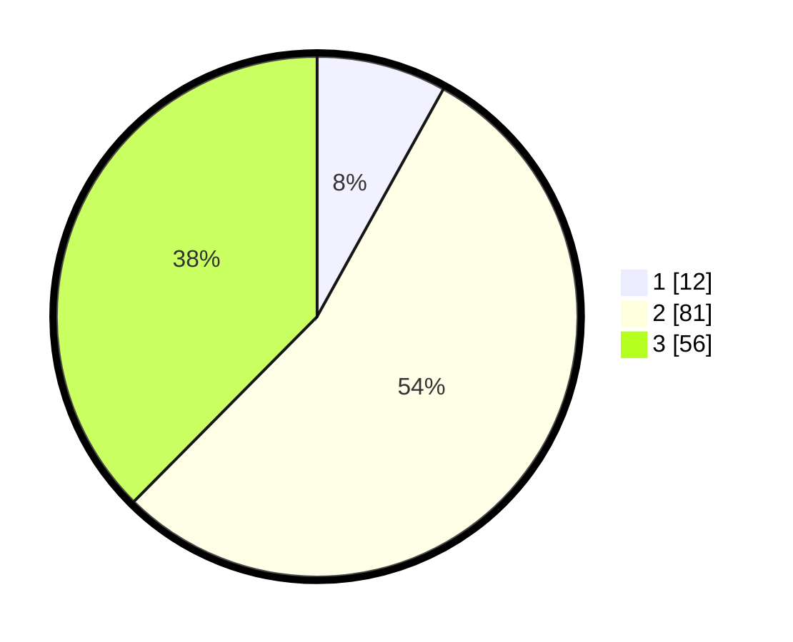

# Hasil

## Grafik

## Tabel

| No. | Nama Paslon    | Suara | Suara (raw) | Persentase |
|:--- |:-------------- | -----:| -----------:| ----------:|
| 1   | ANIES MUHAIMIN | 12    | [12][p-1]   | 8,05       |
| 2   | PRABOWO GIBRAN | 81    | [81][p-2]   | 54,36      |
| 3   | GANJAR MAHFUD  | 56    | [56][p-3]   | 37,58      |

[p-1]: https://github.com/gigit-pemilu/pemilu-2024-34-di-yogyakarta/blob/main/pilpres/hitung-suara/sub/34-di-yogyakarta/sub/04-sleman/sub/15-turi/sub/2001-bangunkerto/sub/002-tps/sub/paslon-1.txt
[p-2]: https://github.com/gigit-pemilu/pemilu-2024-34-di-yogyakarta/blob/main/pilpres/hitung-suara/sub/34-di-yogyakarta/sub/04-sleman/sub/15-turi/sub/2001-bangunkerto/sub/002-tps/sub/paslon-2.txt
[p-3]: https://github.com/gigit-pemilu/pemilu-2024-34-di-yogyakarta/blob/main/pilpres/hitung-suara/sub/34-di-yogyakarta/sub/04-sleman/sub/15-turi/sub/2001-bangunkerto/sub/002-tps/sub/paslon-3.txt

## Foto C Plano

https://sirekap-obj-formc.kpu.go.id/df98/pemilu/ppwp/34/04/15/20/01/3404152001002-20240214-224314--24b14892-e8df-457b-ba00-c67deced30b9.jpg

https://sirekap-obj-formc.kpu.go.id/df98/pemilu/ppwp/34/04/15/20/01/3404152001002-20240214-221948--c353ccc3-a27e-4411-bd81-c7b77ef5873b.jpg

https://sirekap-obj-formc.kpu.go.id/df98/pemilu/ppwp/34/04/15/20/01/3404152001002-20240214-222053--e2a312dc-cc06-4f9b-877e-2da178bf416c.jpg

## Metadata

| Key        | Value               |
| ---------- | ------------------- |
| Time Stamp | 2024-02-16 12:51:22 |

## DATA PEMILIH TETAP

Jumlah pemilih dalam DPT: **158**.
 * L: **82**.
 * P: **76**.

## DATA PENGGUNA HAK PILIH

Jumlah pengguna hak pilih dalam DPT: **145**.
 * L: **74**.
 * P: **71**.

Jumlah pengguna hak pilih dalam DPTb: **6**.
 * L: **3**.
 * P: **3**.

Jumlah pengguna hak pilih dalam DPK: **1**.
 * L: **1**.
 * P: **0**.

Jumlah pengguna hak pilih: **152**.
 * L: **78**.
 * P: **74**.

## JUMLAH SUARA SAH DAN TIDAK SAH

JUMLAH SELURUH SUARA SAH: **149**.

JUMLAH SUARA TIDAK SAH: **3**.

JUMLAH SELURUH SUARA SAH DAN SUARA TIDAK SAH: **152**.

