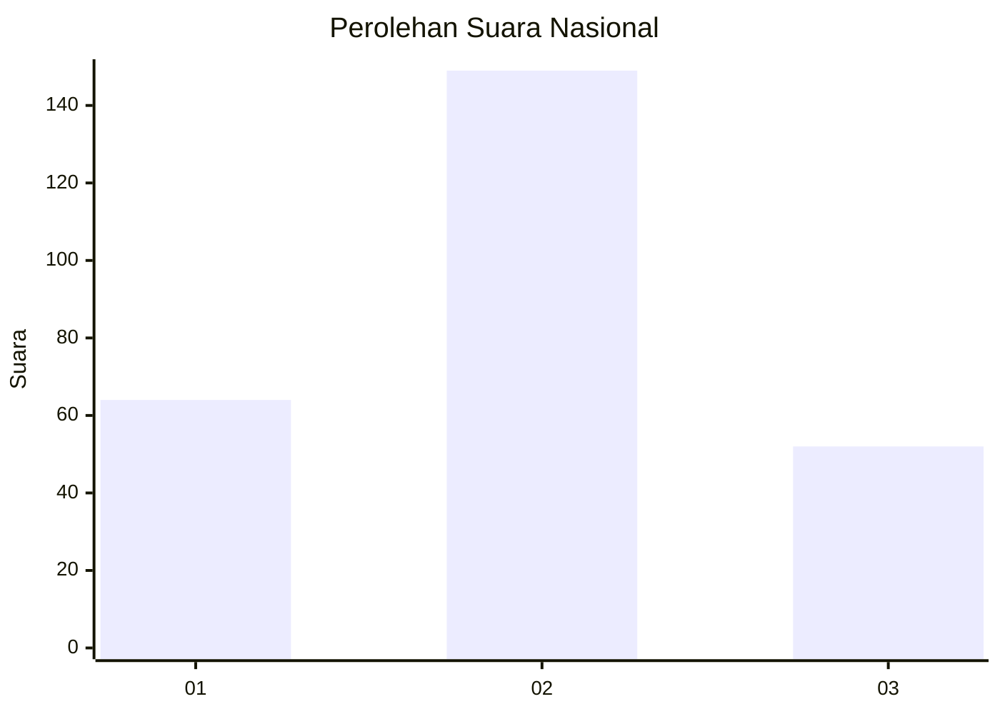
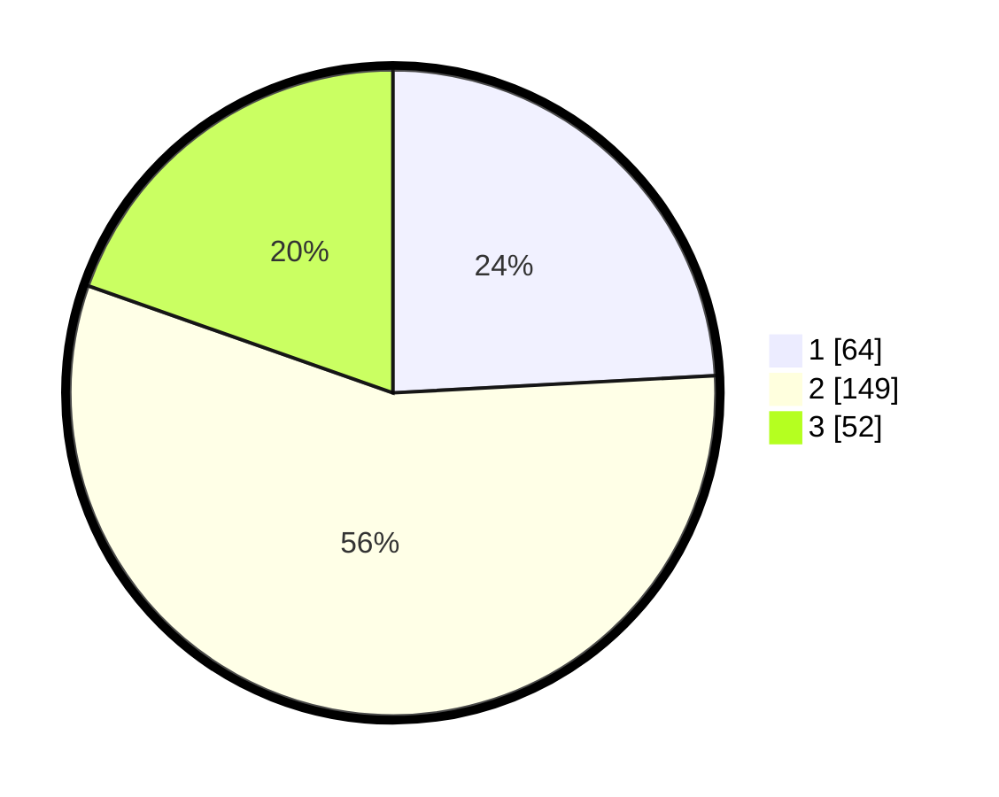

# Hasil

## Grafik

## Tabel

| No. | Nama Paslon    | Suara | Suara (raw) | Persentase |
|:--- |:-------------- | -----:| -----------:| ----------:|
| 1   | ANIES MUHAIMIN | 64    | [64][p-1]   | 24,15      |
| 2   | PRABOWO GIBRAN | 149   | [149][p-2]  | 56,23      |
| 3   | GANJAR MAHFUD  | 52    | [52][p-3]   | 19,62      |

[p-1]: https://github.com/gigit-pemilu/pemilu-2024/blob/main/pilpres/hitung-suara/sub/34-di-yogyakarta/sub/04-sleman/sub/15-turi/sub/2001-bangunkerto/sub/005-tps/sub/paslon-1.txt
[p-2]: https://github.com/gigit-pemilu/pemilu-2024/blob/main/pilpres/hitung-suara/sub/34-di-yogyakarta/sub/04-sleman/sub/15-turi/sub/2001-bangunkerto/sub/005-tps/sub/paslon-2.txt
[p-3]: https://github.com/gigit-pemilu/pemilu-2024/blob/main/pilpres/hitung-suara/sub/34-di-yogyakarta/sub/04-sleman/sub/15-turi/sub/2001-bangunkerto/sub/005-tps/sub/paslon-3.txt

## Foto C Plano

https://sirekap-obj-formc.kpu.go.id/564f/pemilu/ppwp/34/04/15/20/01/3404152001005-20240216-115319--124b3a8f-0ac6-431f-b5dd-a680b72501d7.jpg

https://sirekap-obj-formc.kpu.go.id/564f/pemilu/ppwp/34/04/15/20/01/3404152001005-20240216-120029--36452959-19b2-4651-bb7f-a3f58a8e096c.jpg

https://sirekap-obj-formc.kpu.go.id/564f/pemilu/ppwp/34/04/15/20/01/3404152001005-20240216-120139--d66e68dd-4001-485a-991f-b5fcc30a5c0f.jpg

## Metadata

| Key        | Value               |
| ---------- | ------------------- |
| Time Stamp | 2024-02-16 13:30:32 |

## DATA PEMILIH TETAP

Jumlah pemilih dalam DPT: **277**.
 * L: **147**.
 * P: **130**.

## DATA PENGGUNA HAK PILIH

Jumlah pengguna hak pilih dalam DPT: **261**.
 * L: **138**.
 * P: **123**.

Jumlah pengguna hak pilih dalam DPTb: **7**.
 * L: **3**.
 * P: **4**.

Jumlah pengguna hak pilih dalam DPK: **0**.
 * L: **0**.
 * P: **0**.

Jumlah pengguna hak pilih: **268**.
 * L: **141**.
 * P: **127**.

## JUMLAH SUARA SAH DAN TIDAK SAH

JUMLAH SELURUH SUARA SAH: **265**.

JUMLAH SUARA TIDAK SAH: **3**.

JUMLAH SELURUH SUARA SAH DAN SUARA TIDAK SAH: **268**.

