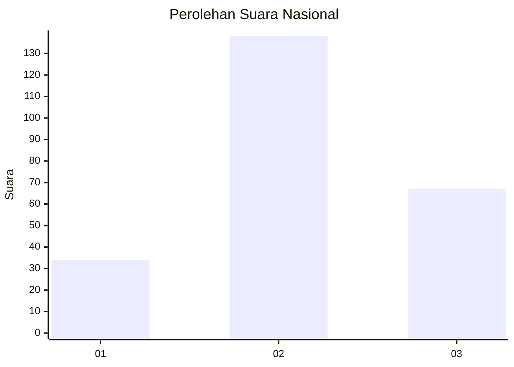
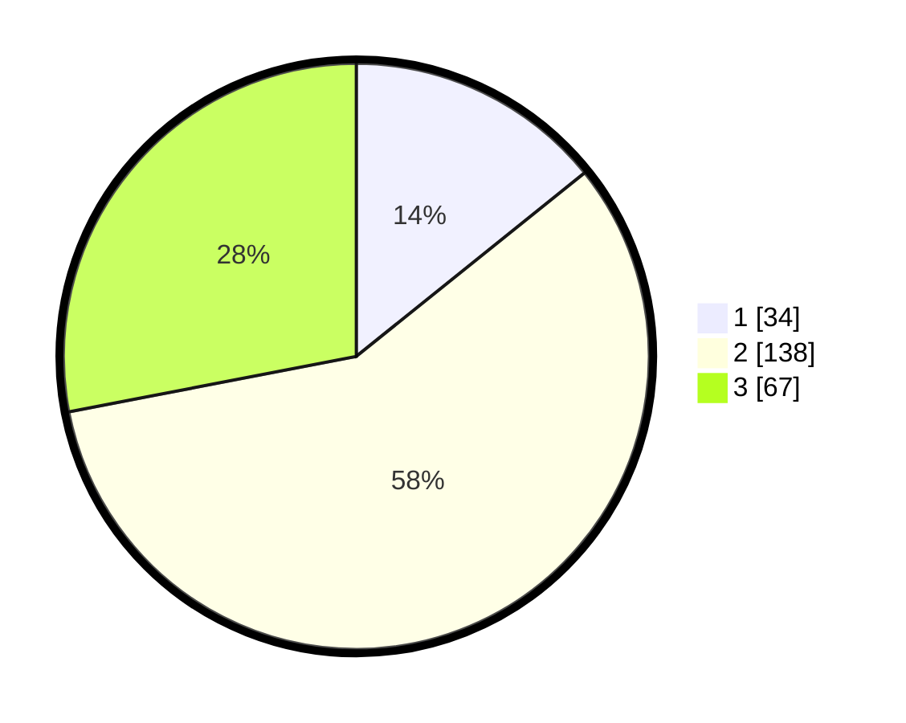

# Hasil

## Grafik

## Tabel

| No. | Nama Paslon    | Suara | Suara (raw) | Persentase |
|:--- |:-------------- | -----:| -----------:| ----------:|
| 1   | ANIES MUHAIMIN | 34    | [34][p-1]   | 14,23      |
| 2   | PRABOWO GIBRAN | 138   | [138][p-2]  | 57,74      |
| 3   | GANJAR MAHFUD  | 67    | [67][p-3]   | 28,03      |

[p-1]: https://github.com/gigit-pemilu/pemilu-2024/blob/main/pilpres/hitung-suara/sub/34-di-yogyakarta/sub/04-sleman/sub/15-turi/sub/2001-bangunkerto/sub/007-tps/sub/paslon-1.txt
[p-2]: https://github.com/gigit-pemilu/pemilu-2024/blob/main/pilpres/hitung-suara/sub/34-di-yogyakarta/sub/04-sleman/sub/15-turi/sub/2001-bangunkerto/sub/007-tps/sub/paslon-2.txt
[p-3]: https://github.com/gigit-pemilu/pemilu-2024/blob/main/pilpres/hitung-suara/sub/34-di-yogyakarta/sub/04-sleman/sub/15-turi/sub/2001-bangunkerto/sub/007-tps/sub/paslon-3.txt

## Foto C Plano

https://sirekap-obj-formc.kpu.go.id/2f8b/pemilu/ppwp/34/04/15/20/01/3404152001007-20240216-155051--fb6fc92d-eecd-4ff0-b297-7a71b3ecb5b4.jpg

https://sirekap-obj-formc.kpu.go.id/2f8b/pemilu/ppwp/34/04/15/20/01/3404152001007-20240216-155052--91e25f11-18f7-450a-a7ef-8dc2e922a5ce.jpg

https://sirekap-obj-formc.kpu.go.id/2f8b/pemilu/ppwp/34/04/15/20/01/3404152001007-20240216-155052--874f7dc9-e4e4-42b6-b033-dfbae1fecf24.jpg

## Metadata

| Key        | Value               |
| ---------- | ------------------- |
| Time Stamp | 2024-02-16 16:25:10 |

## DATA PEMILIH TETAP

Jumlah pemilih dalam DPT: **251**.
 * L: **120**.
 * P: **131**.

## DATA PENGGUNA HAK PILIH

Jumlah pengguna hak pilih dalam DPT: **233**.
 * L: **114**.
 * P: **119**.

Jumlah pengguna hak pilih dalam DPTb: **7**.
 * L: **3**.
 * P: **4**.

Jumlah pengguna hak pilih dalam DPK: **3**.
 * L: **3**.
 * P: **0**.

Jumlah pengguna hak pilih: **243**.
 * L: **120**.
 * P: **123**.

## JUMLAH SUARA SAH DAN TIDAK SAH

JUMLAH SELURUH SUARA SAH: **239**.

JUMLAH SUARA TIDAK SAH: **4**.

JUMLAH SELURUH SUARA SAH DAN SUARA TIDAK SAH: **243**.

