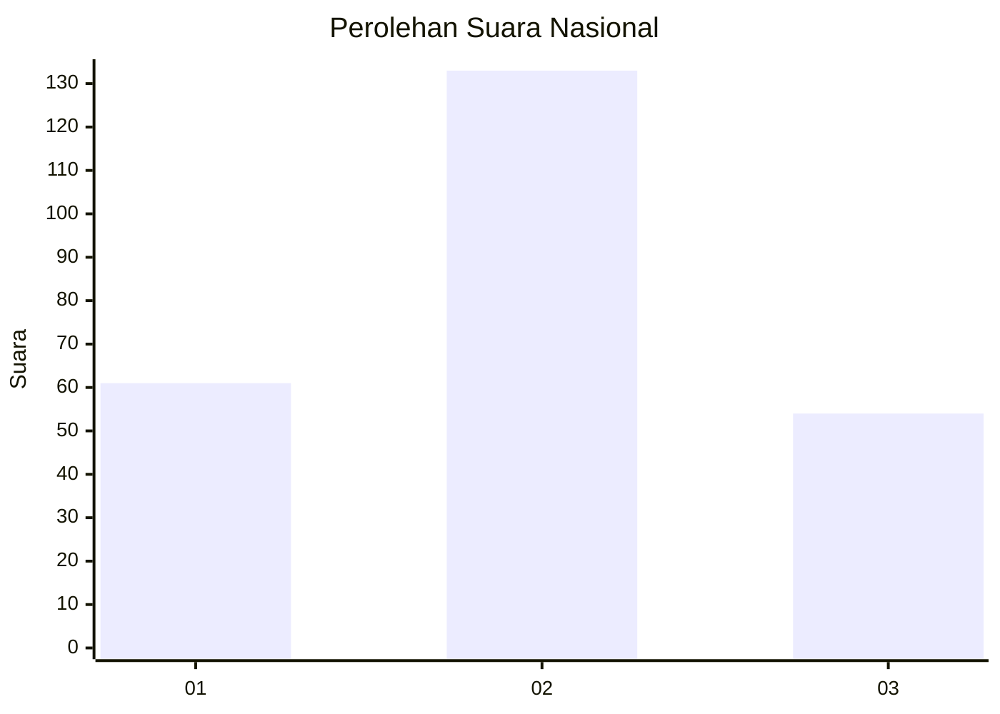
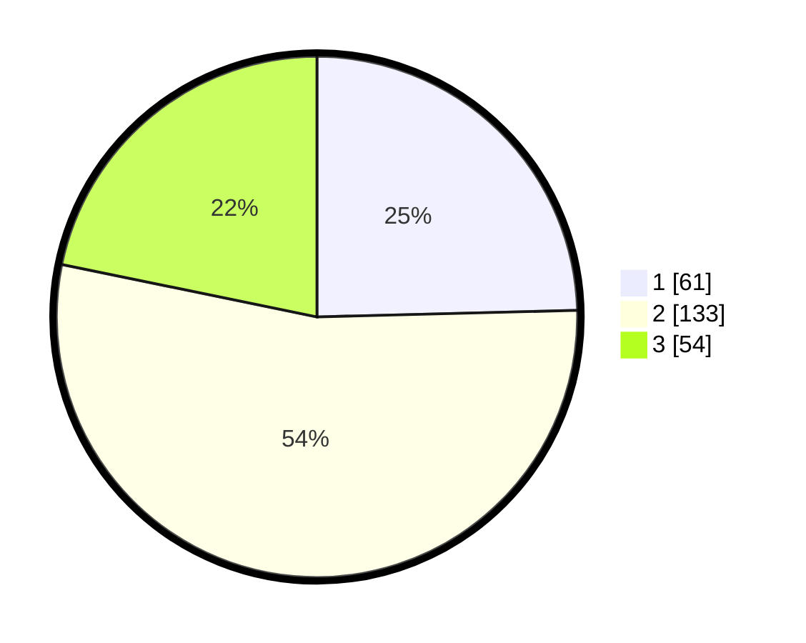

# Hasil

## Grafik

## Tabel

| No. | Nama Paslon    | Suara | Suara (raw) | Persentase |
|:--- |:-------------- | -----:| -----------:| ----------:|
| 1   | ANIES MUHAIMIN | 61    | [61][p-1]   | 24,60      |
| 2   | PRABOWO GIBRAN | 133   | [133][p-2]  | 53,63      |
| 3   | GANJAR MAHFUD  | 54    | [54][p-3]   | 21,77      |

[p-1]: https://github.com/gigit-pemilu/pemilu-2024/blob/main/pilpres/hitung-suara/sub/34-di-yogyakarta/sub/04-sleman/sub/15-turi/sub/2001-bangunkerto/sub/012-tps/sub/paslon-1.txt
[p-2]: https://github.com/gigit-pemilu/pemilu-2024/blob/main/pilpres/hitung-suara/sub/34-di-yogyakarta/sub/04-sleman/sub/15-turi/sub/2001-bangunkerto/sub/012-tps/sub/paslon-2.txt
[p-3]: https://github.com/gigit-pemilu/pemilu-2024/blob/main/pilpres/hitung-suara/sub/34-di-yogyakarta/sub/04-sleman/sub/15-turi/sub/2001-bangunkerto/sub/012-tps/sub/paslon-3.txt

## Foto C Plano

https://sirekap-obj-formc.kpu.go.id/0015/pemilu/ppwp/34/04/15/20/01/3404152001012-20240215-001703--59d715db-35e7-45e2-810b-bfad60f8ccfc.jpg

https://sirekap-obj-formc.kpu.go.id/0015/pemilu/ppwp/34/04/15/20/01/3404152001012-20240215-015829--5a52add3-9ac6-48d6-adb9-5eb6f8533165.jpg

https://sirekap-obj-formc.kpu.go.id/0015/pemilu/ppwp/34/04/15/20/01/3404152001012-20240215-015916--a5cc6219-b7b9-4f7c-841a-5994d7c375fa.jpg

## Metadata

| Key        | Value               |
| ---------- | ------------------- |
| Time Stamp | 2024-02-15 15:00:29 |

