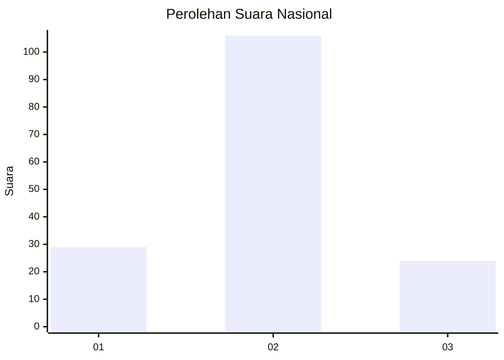
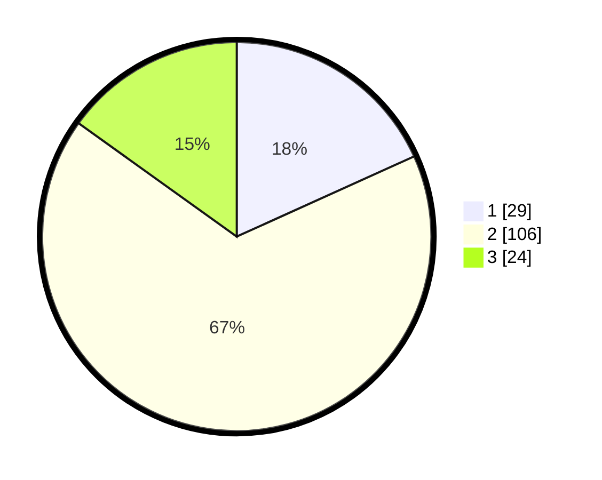

# Hasil

## Grafik

## Tabel

| No. | Nama Paslon    | Suara | Suara (raw) | Persentase |
|:--- |:-------------- | -----:| -----------:| ----------:|
| 1   | ANIES MUHAIMIN | 29    | [29][p-1]   | 18,24      |
| 2   | PRABOWO GIBRAN | 106   | [106][p-2]  | 66,67      |
| 3   | GANJAR MAHFUD  | 24    | [24][p-3]   | 15,09      |

[p-1]: https://github.com/gigit-pemilu/pemilu-2024/blob/main/pilpres/hitung-suara/sub/34-di-yogyakarta/sub/04-sleman/sub/15-turi/sub/2001-bangunkerto/sub/014-tps/sub/paslon-1.txt
[p-2]: https://github.com/gigit-pemilu/pemilu-2024/blob/main/pilpres/hitung-suara/sub/34-di-yogyakarta/sub/04-sleman/sub/15-turi/sub/2001-bangunkerto/sub/014-tps/sub/paslon-2.txt
[p-3]: https://github.com/gigit-pemilu/pemilu-2024/blob/main/pilpres/hitung-suara/sub/34-di-yogyakarta/sub/04-sleman/sub/15-turi/sub/2001-bangunkerto/sub/014-tps/sub/paslon-3.txt

## Foto C Plano

https://sirekap-obj-formc.kpu.go.id/34ea/pemilu/ppwp/34/04/15/20/01/3404152001014-20240214-193810--e5b5c4fe-4fa0-4d92-a634-5c5e3709f09c.jpg

https://sirekap-obj-formc.kpu.go.id/34ea/pemilu/ppwp/34/04/15/20/01/3404152001014-20240214-193829--5847f7a5-6a51-4fd6-a6d4-79fbad95c9d4.jpg

https://sirekap-obj-formc.kpu.go.id/34ea/pemilu/ppwp/34/04/15/20/01/3404152001014-20240214-215013--a8660c1f-c52a-4863-ae6c-a1662ca531e5.jpg

## Metadata

| Key        | Value               |
| ---------- | ------------------- |
| Time Stamp | 2024-02-15 12:00:28 |

