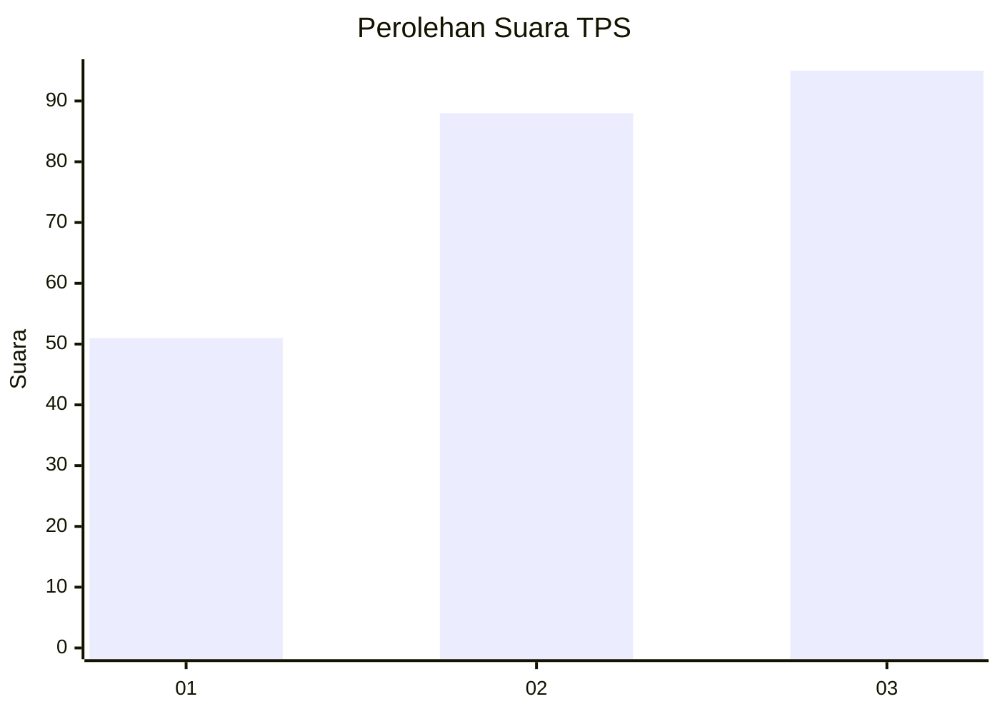
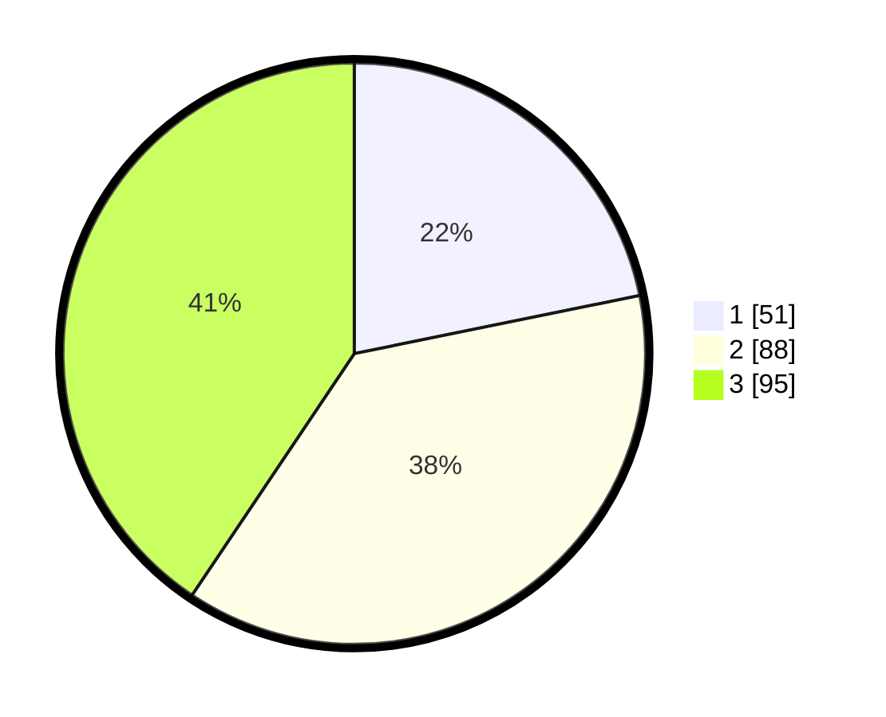

# Hasil

## Grafik

## Tabel

| No. | Nama Paslon    | Suara | Suara (raw) | Persentase |
|:--- |:-------------- | -----:| -----------:| ----------:|
| 1   | ANIES MUHAIMIN | 51    | [51][p-1]   | 21,79      |
| 2   | PRABOWO GIBRAN | 88    | [88][p-2]   | 37,61      |
| 3   | GANJAR MAHFUD  | 95    | [95][p-3]   | 40,60      |

[p-1]: https://github.com/gigit-pemilu/pemilu-2024-34-di-yogyakarta/blob/main/pilpres/hitung-suara/sub/34-di-yogyakarta/sub/04-sleman/sub/15-turi/sub/2001-bangunkerto/sub/017-tps/sub/paslon-1.txt
[p-2]: https://github.com/gigit-pemilu/pemilu-2024-34-di-yogyakarta/blob/main/pilpres/hitung-suara/sub/34-di-yogyakarta/sub/04-sleman/sub/15-turi/sub/2001-bangunkerto/sub/017-tps/sub/paslon-2.txt
[p-3]: https://github.com/gigit-pemilu/pemilu-2024-34-di-yogyakarta/blob/main/pilpres/hitung-suara/sub/34-di-yogyakarta/sub/04-sleman/sub/15-turi/sub/2001-bangunkerto/sub/017-tps/sub/paslon-3.txt

## Foto C Plano

https://sirekap-obj-formc.kpu.go.id/4958/pemilu/ppwp/34/04/15/20/01/3404152001017-20240214-155918--8c1e74b8-685a-4238-b843-618b9decd436.jpg

https://sirekap-obj-formc.kpu.go.id/4958/pemilu/ppwp/34/04/15/20/01/3404152001017-20240214-160107--7f8c6806-bd2a-45e4-adae-06c8376cda21.jpg

https://sirekap-obj-formc.kpu.go.id/4958/pemilu/ppwp/34/04/15/20/01/3404152001017-20240215-034056--f9108ba0-74c7-4f62-9bfc-ab43cb55195c.jpg

## Metadata

| Key        | Value               |
| ---------- | ------------------- |
| Time Stamp | 2024-02-15 15:30:25 |

