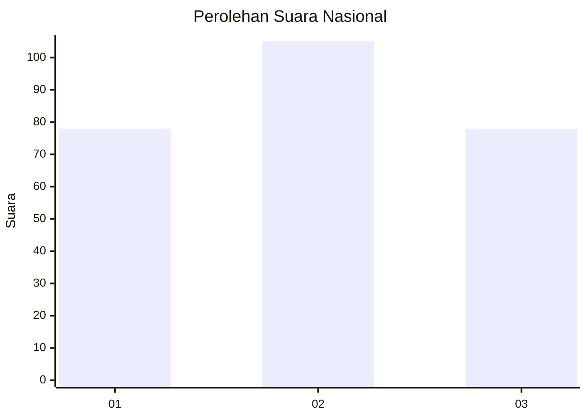
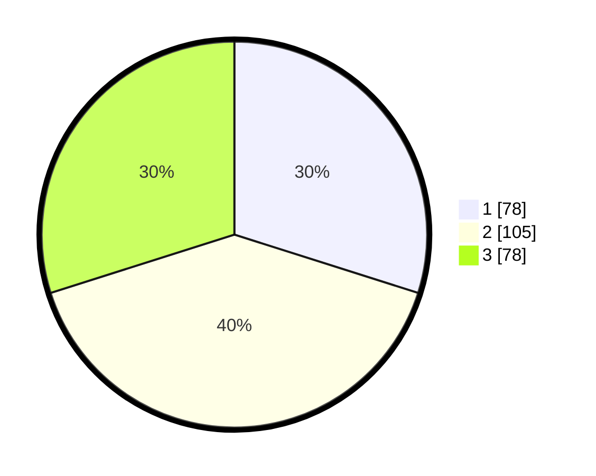

# Hasil

## Grafik

## Tabel

| No. | Nama Paslon    | Suara | Suara (raw) | Persentase |
|:--- |:-------------- | -----:| -----------:| ----------:|
| 1   | ANIES MUHAIMIN | 78    | [78][p-1]   | 29,89      |
| 2   | PRABOWO GIBRAN | 105   | [105][p-2]  | 40,23      |
| 3   | GANJAR MAHFUD  | 78    | [78][p-3]   | 29,89      |

[p-1]: https://github.com/gigit-pemilu/pemilu-2024/blob/main/pilpres/hitung-suara/sub/34-di-yogyakarta/sub/04-sleman/sub/15-turi/sub/2001-bangunkerto/sub/024-tps/sub/paslon-1.txt
[p-2]: https://github.com/gigit-pemilu/pemilu-2024/blob/main/pilpres/hitung-suara/sub/34-di-yogyakarta/sub/04-sleman/sub/15-turi/sub/2001-bangunkerto/sub/024-tps/sub/paslon-2.txt
[p-3]: https://github.com/gigit-pemilu/pemilu-2024/blob/main/pilpres/hitung-suara/sub/34-di-yogyakarta/sub/04-sleman/sub/15-turi/sub/2001-bangunkerto/sub/024-tps/sub/paslon-3.txt

## Foto C Plano

https://sirekap-obj-formc.kpu.go.id/7b70/pemilu/ppwp/34/04/15/20/01/3404152001024-20240215-175041--cffa38c7-23ff-4907-af89-e92c0f490300.jpg

https://sirekap-obj-formc.kpu.go.id/7b70/pemilu/ppwp/34/04/15/20/01/3404152001024-20240215-175141--57dff4e5-a94b-4f28-9042-79d45706a5a2.jpg

https://sirekap-obj-formc.kpu.go.id/7b70/pemilu/ppwp/34/04/15/20/01/3404152001024-20240215-215056--22eb3351-f0c6-4e61-b60d-c602203c8505.jpg

## Metadata

| Key        | Value               |
| ---------- | ------------------- |
| Time Stamp | 2024-02-15 22:00:27 |

