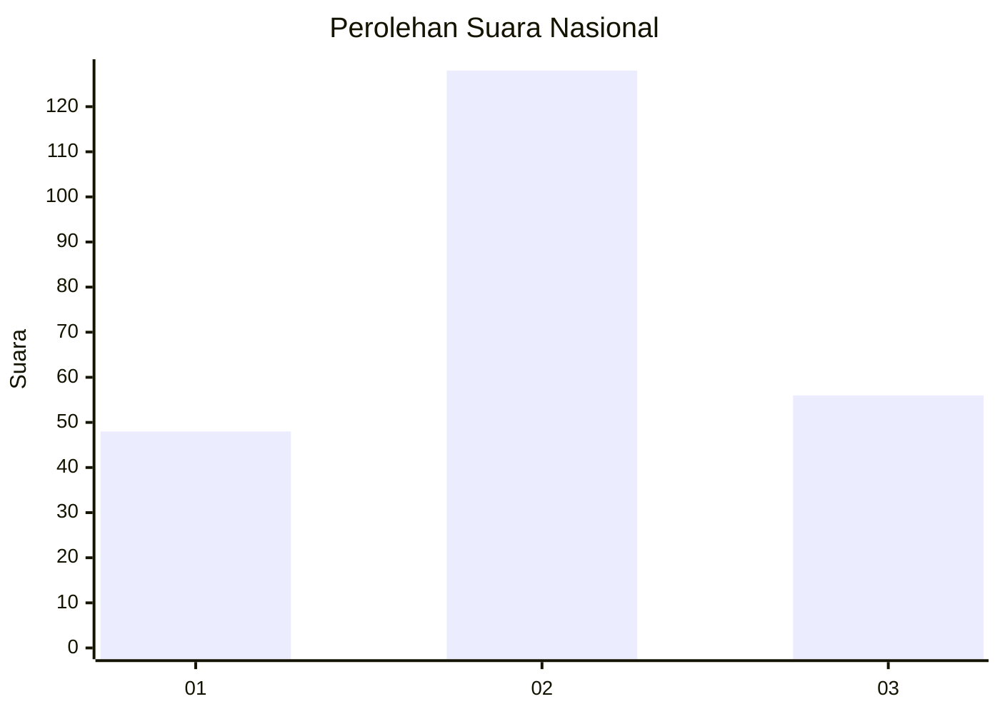
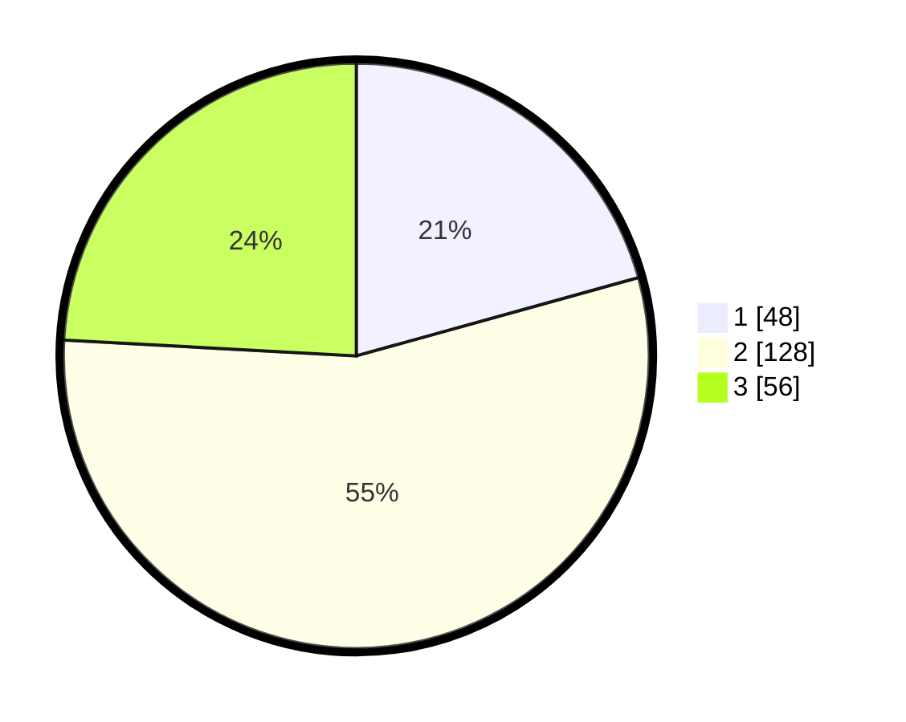

# Hasil

## Grafik

## Tabel

| No. | Nama Paslon    | Suara | Suara (raw) | Persentase |
|:--- |:-------------- | -----:| -----------:| ----------:|
| 1   | ANIES MUHAIMIN | 48    | [48][p-1]   | 20,69      |
| 2   | PRABOWO GIBRAN | 128   | [128][p-2]  | 55,17      |
| 3   | GANJAR MAHFUD  | 56    | [56][p-3]   | 24,14      |

[p-1]: https://github.com/gigit-pemilu/pemilu-2024/blob/main/pilpres/hitung-suara/sub/34-di-yogyakarta/sub/04-sleman/sub/15-turi/sub/2002-donokerto/sub/003-tps/sub/paslon-1.txt
[p-2]: https://github.com/gigit-pemilu/pemilu-2024/blob/main/pilpres/hitung-suara/sub/34-di-yogyakarta/sub/04-sleman/sub/15-turi/sub/2002-donokerto/sub/003-tps/sub/paslon-2.txt
[p-3]: https://github.com/gigit-pemilu/pemilu-2024/blob/main/pilpres/hitung-suara/sub/34-di-yogyakarta/sub/04-sleman/sub/15-turi/sub/2002-donokerto/sub/003-tps/sub/paslon-3.txt

## Foto C Plano

https://sirekap-obj-formc.kpu.go.id/f424/pemilu/ppwp/34/04/15/20/02/3404152002003-20240216-164702--862b8b6c-23c9-43b6-a023-b84a93bf80a3.jpg

https://sirekap-obj-formc.kpu.go.id/f424/pemilu/ppwp/34/04/15/20/02/3404152002003-20240216-164738--c7aac001-28a9-41e2-bceb-03770f611af4.jpg

https://sirekap-obj-formc.kpu.go.id/f424/pemilu/ppwp/34/04/15/20/02/3404152002003-20240216-164758--6155448a-b5ca-4355-a18f-4eacb31da1e1.jpg

## Metadata

| Key        | Value               |
| ---------- | ------------------- |
| Time Stamp | 2024-02-19 06:16:00 |

## DATA PEMILIH TETAP

Jumlah pemilih dalam DPT: **252**.
 * L: **123**.
 * P: **135**.

## DATA PENGGUNA HAK PILIH

Jumlah pengguna hak pilih dalam DPT: **228**.
 * L: **193**.
 * P: **125**.

Jumlah pengguna hak pilih dalam DPTb: **45**.
 * L: **704**.
 * P: **85**.

Jumlah pengguna hak pilih dalam DPK: **704**.
 * L: **873**.
 * P: **1**.

Jumlah pengguna hak pilih: **233**.
 * L: **505**.
 * P: **77**.

## JUMLAH SUARA SAH DAN TIDAK SAH

JUMLAH SELURUH SUARA SAH: **232**.

JUMLAH SUARA TIDAK SAH: **6**.

JUMLAH SELURUH SUARA SAH DAN SUARA TIDAK SAH: **238**.

