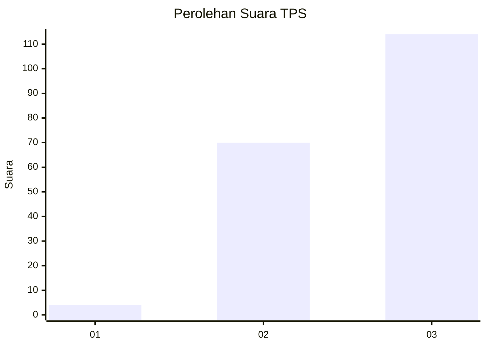
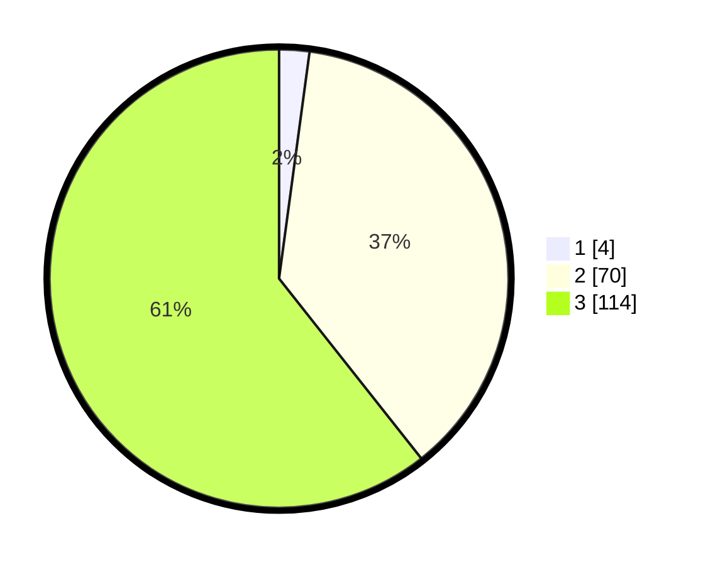

# Hasil

## Grafik

## Tabel

| No. | Nama Paslon    | Suara | Suara (raw) | Persentase |
|:--- |:-------------- | -----:| -----------:| ----------:|
| 1   | ANIES MUHAIMIN | 4     | [4][p-1]    | 2,13       |
| 2   | PRABOWO GIBRAN | 70    | [70][p-2]   | 37,23      |
| 3   | GANJAR MAHFUD  | 114   | [114][p-3]  | 60,64      |

[p-1]: https://github.com/gigit-pemilu/pemilu-2024-34-di-yogyakarta/blob/main/pilpres/hitung-suara/sub/34-di-yogyakarta/sub/04-sleman/sub/15-turi/sub/2002-donokerto/sub/004-tps/sub/paslon-1.txt
[p-2]: https://github.com/gigit-pemilu/pemilu-2024-34-di-yogyakarta/blob/main/pilpres/hitung-suara/sub/34-di-yogyakarta/sub/04-sleman/sub/15-turi/sub/2002-donokerto/sub/004-tps/sub/paslon-2.txt
[p-3]: https://github.com/gigit-pemilu/pemilu-2024-34-di-yogyakarta/blob/main/pilpres/hitung-suara/sub/34-di-yogyakarta/sub/04-sleman/sub/15-turi/sub/2002-donokerto/sub/004-tps/sub/paslon-3.txt

## Foto C Plano

https://sirekap-obj-formc.kpu.go.id/3335/pemilu/ppwp/34/04/15/20/02/3404152002004-20240214-214950--224ab52a-6815-4e86-ab2d-22b766d7fe55.jpg

https://sirekap-obj-formc.kpu.go.id/3335/pemilu/ppwp/34/04/15/20/02/3404152002004-20240214-215041--edba8e52-e2b4-4e51-9d61-9a485101614f.jpg

https://sirekap-obj-formc.kpu.go.id/3335/pemilu/ppwp/34/04/15/20/02/3404152002004-20240214-215137--d11f83b1-3a0c-4f8a-ba22-2db2ba0f57dd.jpg

## Metadata

| Key        | Value               |
| ---------- | ------------------- |
| Time Stamp | 2024-02-15 15:00:29 |

