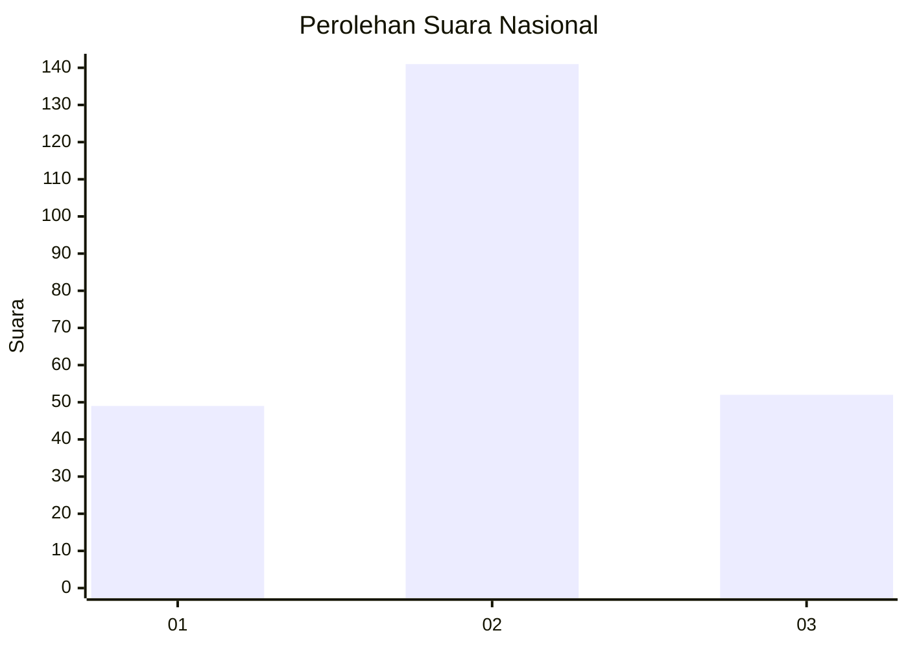
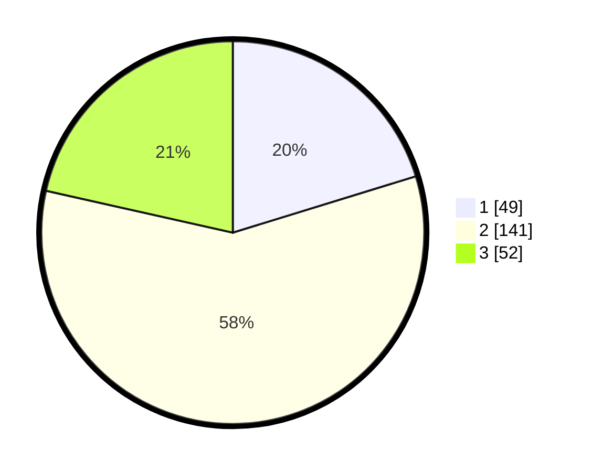

# Hasil

## Grafik

## Tabel

| No. | Nama Paslon    | Suara | Suara (raw) | Persentase |
|:--- |:-------------- | -----:| -----------:| ----------:|
| 1   | ANIES MUHAIMIN | 49    | [49][p-1]   | 20,25      |
| 2   | PRABOWO GIBRAN | 141   | [141][p-2]  | 58,26      |
| 3   | GANJAR MAHFUD  | 52    | [52][p-3]   | 21,49      |

[p-1]: https://github.com/gigit-pemilu/pemilu-2024/blob/main/pilpres/hitung-suara/sub/34-di-yogyakarta/sub/04-sleman/sub/15-turi/sub/2002-donokerto/sub/012-tps/sub/paslon-1.txt
[p-2]: https://github.com/gigit-pemilu/pemilu-2024/blob/main/pilpres/hitung-suara/sub/34-di-yogyakarta/sub/04-sleman/sub/15-turi/sub/2002-donokerto/sub/012-tps/sub/paslon-2.txt
[p-3]: https://github.com/gigit-pemilu/pemilu-2024/blob/main/pilpres/hitung-suara/sub/34-di-yogyakarta/sub/04-sleman/sub/15-turi/sub/2002-donokerto/sub/012-tps/sub/paslon-3.txt

## Foto C Plano

https://sirekap-obj-formc.kpu.go.id/bb32/pemilu/ppwp/34/04/15/20/02/3404152002012-20240214-230229--5919f8b8-92db-488a-b91e-14ff036ef427.jpg

https://sirekap-obj-formc.kpu.go.id/bb32/pemilu/ppwp/34/04/15/20/02/3404152002012-20240214-224528--1e803aed-dbbb-497b-9a17-c6ea9f39db8e.jpg

https://sirekap-obj-formc.kpu.go.id/bb32/pemilu/ppwp/34/04/15/20/02/3404152002012-20240214-225512--6158dab0-d82f-4a8f-a43c-c941cb706f48.jpg

## Metadata

| Key        | Value               |
| ---------- | ------------------- |
| Time Stamp | 2024-02-15 21:30:27 |

