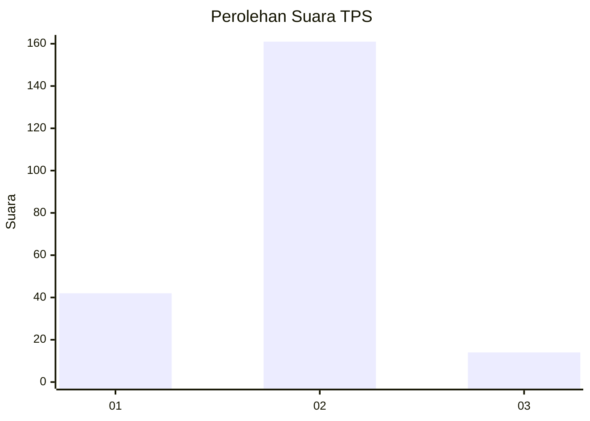
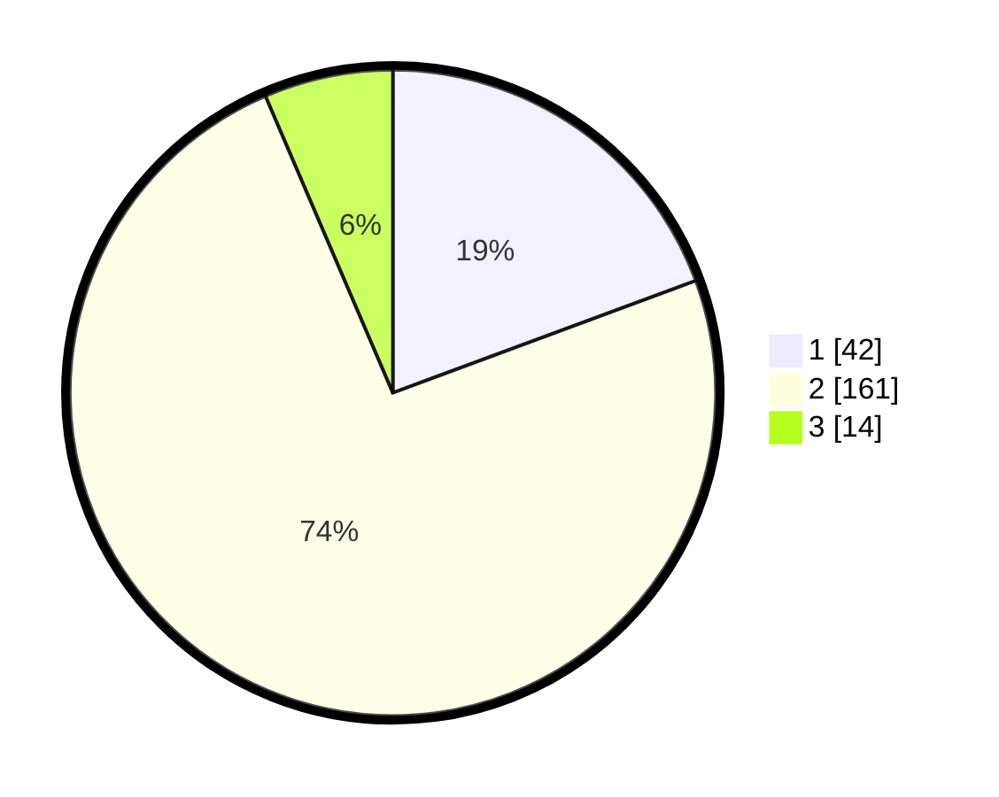

# Hasil

## Grafik

## Tabel

| No. | Nama Paslon    | Suara | Suara (raw) | Persentase |
|:--- |:-------------- | -----:| -----------:| ----------:|
| 1   | ANIES MUHAIMIN | 42    | [42][p-1]   | 19,35      |
| 2   | PRABOWO GIBRAN | 161   | [161][p-2]  | 74,19      |
| 3   | GANJAR MAHFUD  | 14    | [14][p-3]   | 6,45       |

[p-1]: https://github.com/gigit-pemilu/pemilu-2024-34-di-yogyakarta/blob/main/pilpres/hitung-suara/sub/34-di-yogyakarta/sub/04-sleman/sub/15-turi/sub/2002-donokerto/sub/014-tps/sub/paslon-1.txt
[p-2]: https://github.com/gigit-pemilu/pemilu-2024-34-di-yogyakarta/blob/main/pilpres/hitung-suara/sub/34-di-yogyakarta/sub/04-sleman/sub/15-turi/sub/2002-donokerto/sub/014-tps/sub/paslon-2.txt
[p-3]: https://github.com/gigit-pemilu/pemilu-2024-34-di-yogyakarta/blob/main/pilpres/hitung-suara/sub/34-di-yogyakarta/sub/04-sleman/sub/15-turi/sub/2002-donokerto/sub/014-tps/sub/paslon-3.txt

## Foto C Plano

https://sirekap-obj-formc.kpu.go.id/2d07/pemilu/ppwp/34/04/15/20/02/3404152002014-20240214-214830--5d966def-90ee-41da-ab1e-6360c306f71a.jpg

https://sirekap-obj-formc.kpu.go.id/2d07/pemilu/ppwp/34/04/15/20/02/3404152002014-20240214-235715--1e16fb39-86cf-491d-8133-2a7b93bb008e.jpg

https://sirekap-obj-formc.kpu.go.id/2d07/pemilu/ppwp/34/04/15/20/02/3404152002014-20240215-000300--694da447-5214-4d84-bf84-3f075c9224d2.jpg

## Metadata

| Key        | Value               |
| ---------- | ------------------- |
| Time Stamp | 2024-02-15 15:00:29 |

