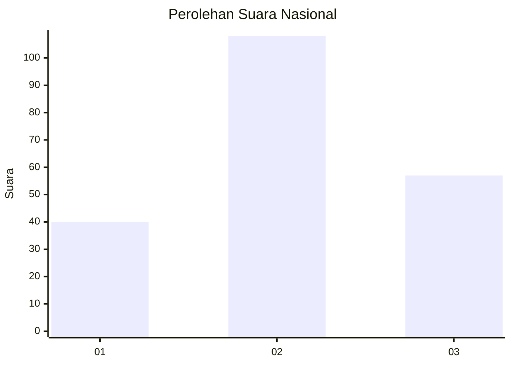
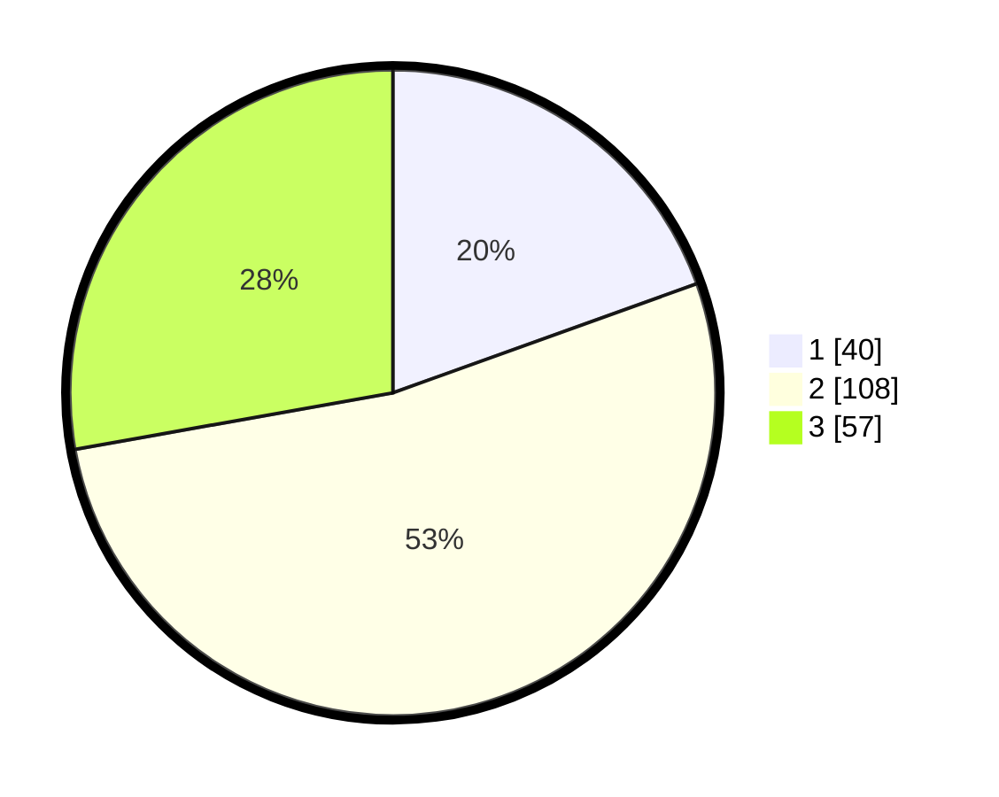

# Hasil

## Grafik

## Tabel

| No. | Nama Paslon    | Suara | Suara (raw) | Persentase |
|:--- |:-------------- | -----:| -----------:| ----------:|
| 1   | ANIES MUHAIMIN | 40    | [40][p-1]   | 19,51      |
| 2   | PRABOWO GIBRAN | 108   | [108][p-2]  | 52,68      |
| 3   | GANJAR MAHFUD  | 57    | [57][p-3]   | 27,80      |

[p-1]: https://github.com/gigit-pemilu/pemilu-2024/blob/main/pilpres/hitung-suara/sub/34-di-yogyakarta/sub/04-sleman/sub/15-turi/sub/2002-donokerto/sub/015-tps/sub/paslon-1.txt
[p-2]: https://github.com/gigit-pemilu/pemilu-2024/blob/main/pilpres/hitung-suara/sub/34-di-yogyakarta/sub/04-sleman/sub/15-turi/sub/2002-donokerto/sub/015-tps/sub/paslon-2.txt
[p-3]: https://github.com/gigit-pemilu/pemilu-2024/blob/main/pilpres/hitung-suara/sub/34-di-yogyakarta/sub/04-sleman/sub/15-turi/sub/2002-donokerto/sub/015-tps/sub/paslon-3.txt

## Foto C Plano

https://sirekap-obj-formc.kpu.go.id/3716/pemilu/ppwp/34/04/15/20/02/3404152002015-20240215-172342--22963b6f-344c-4a9e-9010-429a8a923c8e.jpg

https://sirekap-obj-formc.kpu.go.id/3716/pemilu/ppwp/34/04/15/20/02/3404152002015-20240215-052955--128873d2-68cb-40d4-b882-c9e0291aa099.jpg

https://sirekap-obj-formc.kpu.go.id/3716/pemilu/ppwp/34/04/15/20/02/3404152002015-20240215-053058--2eb0b8c1-51c9-4daa-9d25-51b35195b028.jpg

## Metadata

| Key        | Value               |
| ---------- | ------------------- |
| Time Stamp | 2024-02-15 20:00:44 |

