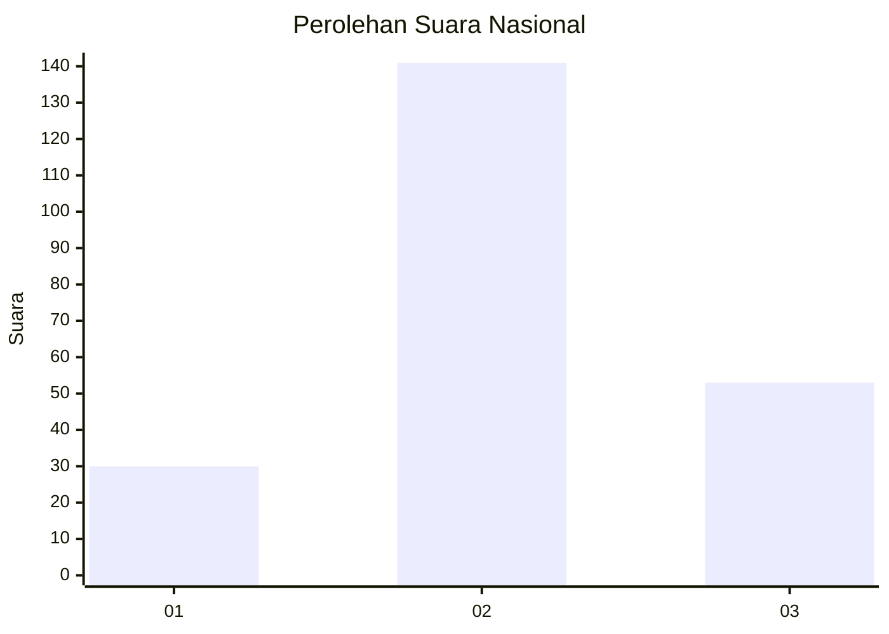
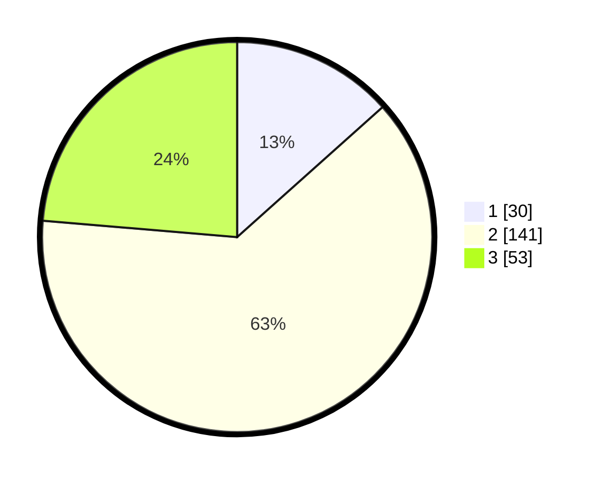

# Hasil

## Grafik

## Tabel

| No. | Nama Paslon    | Suara | Suara (raw) | Persentase |
|:--- |:-------------- | -----:| -----------:| ----------:|
| 1   | ANIES MUHAIMIN | 30    | [30][p-1]   | 13,39      |
| 2   | PRABOWO GIBRAN | 141   | [141][p-2]  | 62,95      |
| 3   | GANJAR MAHFUD  | 53    | [53][p-3]   | 23,66      |

[p-1]: https://github.com/gigit-pemilu/pemilu-2024/blob/main/pilpres/hitung-suara/sub/34-di-yogyakarta/sub/04-sleman/sub/15-turi/sub/2002-donokerto/sub/016-tps/sub/paslon-1.txt
[p-2]: https://github.com/gigit-pemilu/pemilu-2024/blob/main/pilpres/hitung-suara/sub/34-di-yogyakarta/sub/04-sleman/sub/15-turi/sub/2002-donokerto/sub/016-tps/sub/paslon-2.txt
[p-3]: https://github.com/gigit-pemilu/pemilu-2024/blob/main/pilpres/hitung-suara/sub/34-di-yogyakarta/sub/04-sleman/sub/15-turi/sub/2002-donokerto/sub/016-tps/sub/paslon-3.txt

## Foto C Plano

https://sirekap-obj-formc.kpu.go.id/27ef/pemilu/ppwp/34/04/15/20/02/3404152002016-20240214-210107--454e68a7-0538-433c-b5b1-c5f38490ee39.jpg

https://sirekap-obj-formc.kpu.go.id/27ef/pemilu/ppwp/34/04/15/20/02/3404152002016-20240214-210210--8ca57f88-4b5b-4606-85e8-cc7445d85539.jpg

https://sirekap-obj-formc.kpu.go.id/27ef/pemilu/ppwp/34/04/15/20/02/3404152002016-20240214-210303--45bedd9d-8ef9-427e-b08f-e6a7df2ad736.jpg

## Metadata

| Key        | Value               |
| ---------- | ------------------- |
| Time Stamp | 2024-02-15 15:00:29 |

