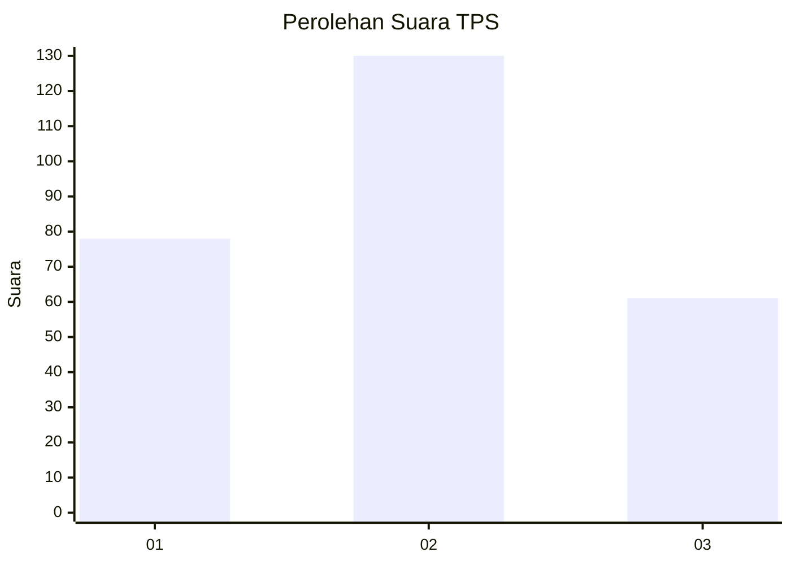
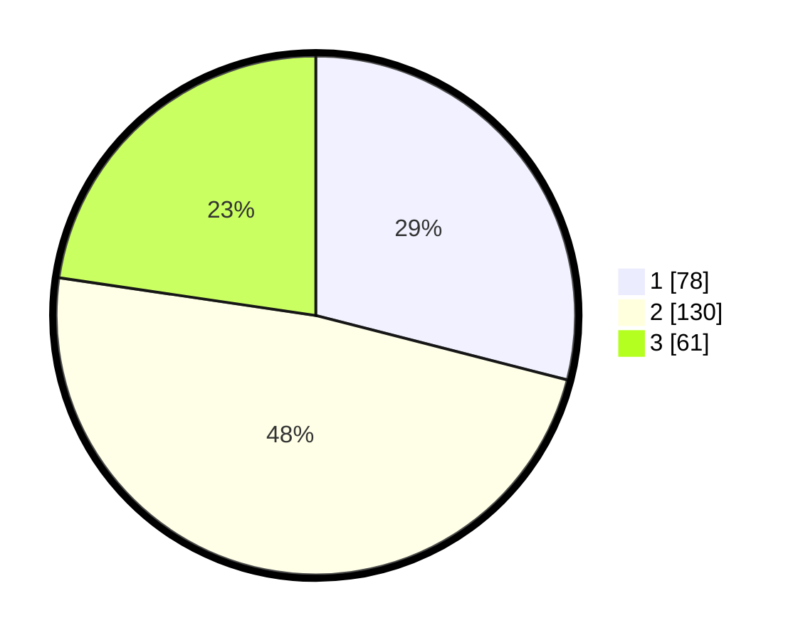

# Hasil

## Grafik

## Tabel

| No. | Nama Paslon    | Suara | Suara (raw) | Persentase |
|:--- |:-------------- | -----:| -----------:| ----------:|
| 1   | ANIES MUHAIMIN | 78    | [78][p-1]   | 29,00      |
| 2   | PRABOWO GIBRAN | 130   | [130][p-2]  | 48,33      |
| 3   | GANJAR MAHFUD  | 61    | [61][p-3]   | 22,68      |

[p-1]: https://github.com/gigit-pemilu/pemilu-2024-34-di-yogyakarta/blob/main/pilpres/hitung-suara/sub/34-di-yogyakarta/sub/04-sleman/sub/15-turi/sub/2002-donokerto/sub/019-tps/sub/paslon-1.txt
[p-2]: https://github.com/gigit-pemilu/pemilu-2024-34-di-yogyakarta/blob/main/pilpres/hitung-suara/sub/34-di-yogyakarta/sub/04-sleman/sub/15-turi/sub/2002-donokerto/sub/019-tps/sub/paslon-2.txt
[p-3]: https://github.com/gigit-pemilu/pemilu-2024-34-di-yogyakarta/blob/main/pilpres/hitung-suara/sub/34-di-yogyakarta/sub/04-sleman/sub/15-turi/sub/2002-donokerto/sub/019-tps/sub/paslon-3.txt

## Foto C Plano

https://sirekap-obj-formc.kpu.go.id/f5d6/pemilu/ppwp/34/04/15/20/02/3404152002019-20240214-235739--6839345a-0dea-448f-8ec0-df9db7d5d8a1.jpg

https://sirekap-obj-formc.kpu.go.id/f5d6/pemilu/ppwp/34/04/15/20/02/3404152002019-20240214-235958--bf23c346-d39d-4bb3-a08d-41d62f429ac3.jpg

https://sirekap-obj-formc.kpu.go.id/f5d6/pemilu/ppwp/34/04/15/20/02/3404152002019-20240215-000101--1a767128-7e56-4b3e-b77b-b57e106897c6.jpg

## Metadata

| Key        | Value               |
| ---------- | ------------------- |
| Time Stamp | 2024-02-15 15:00:29 |

